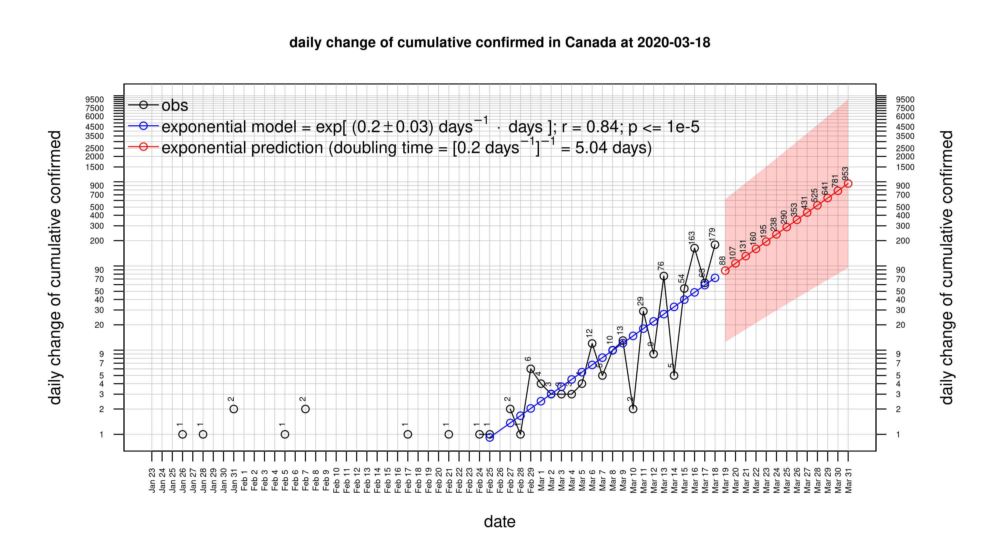
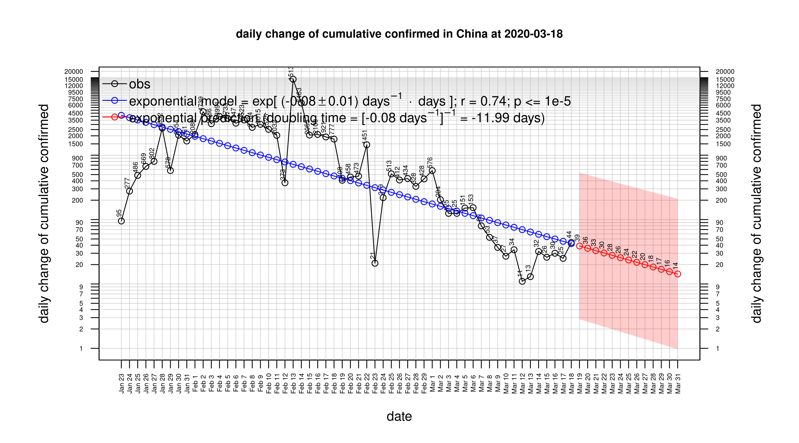
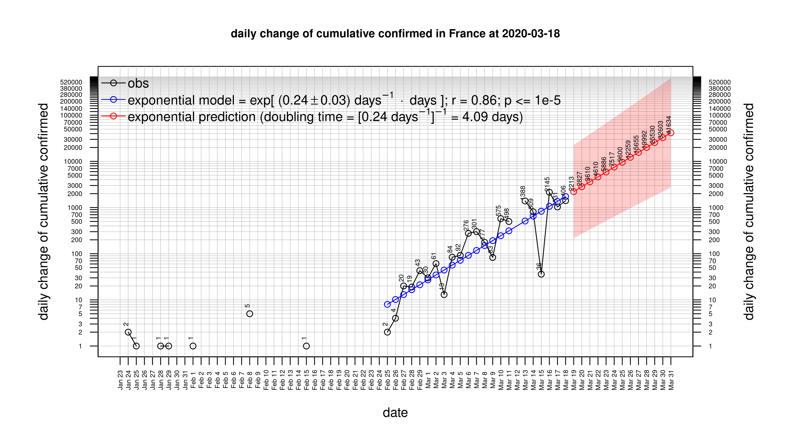
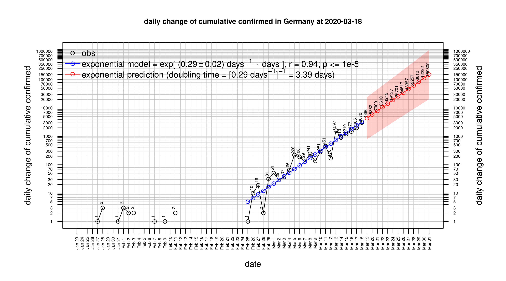
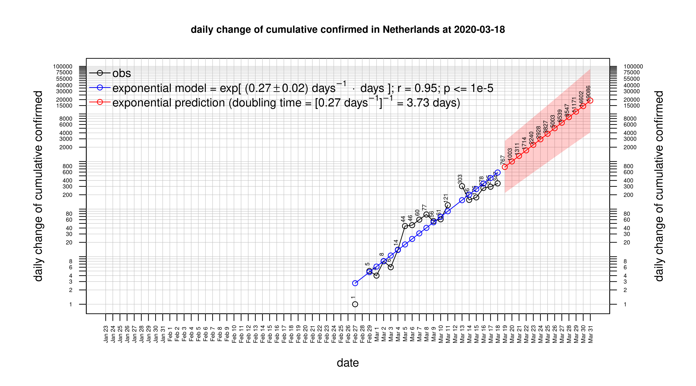
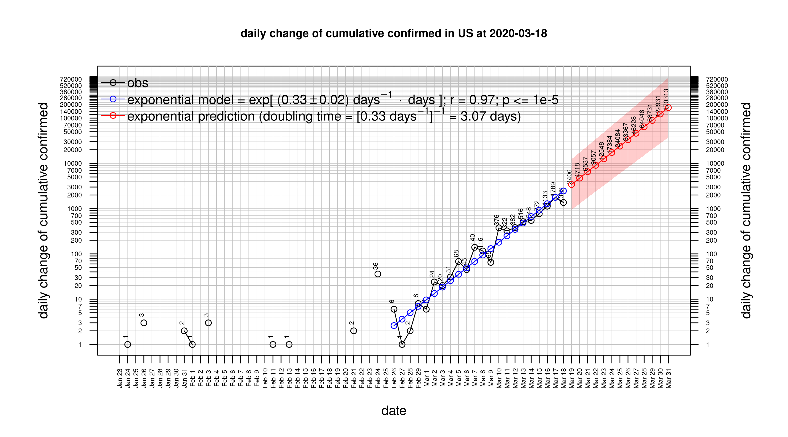
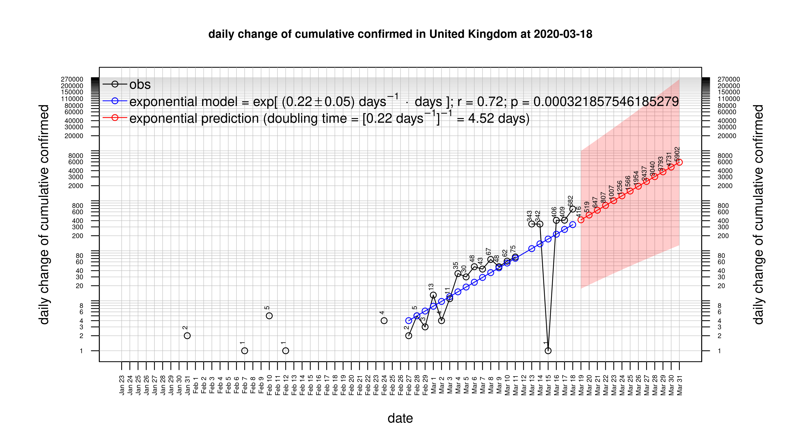

# CSSEGISandData/COVID-19 data

* [Canada](#Canada)
* [China](#China)
* [France](#France)
* [France](#France)
* [Germany](#Germany)
* [Italy](#Italy)
* [Netherlands](#Netherlands)
* [US](#US)
* [United Kingdom](#United-Kingdom)

# Canada
 

 

 

 

# China
 

 

 

 

# France
 

 

 

 

# France
 

 

 

 

# Germany
 

 

 

 

# Italy
 

 

 

 

# Netherlands
 

 

 

 

# US
 

 

 

 

# United Kingdom
 

 

 

 

