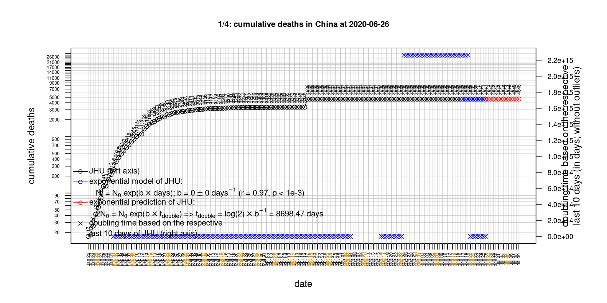
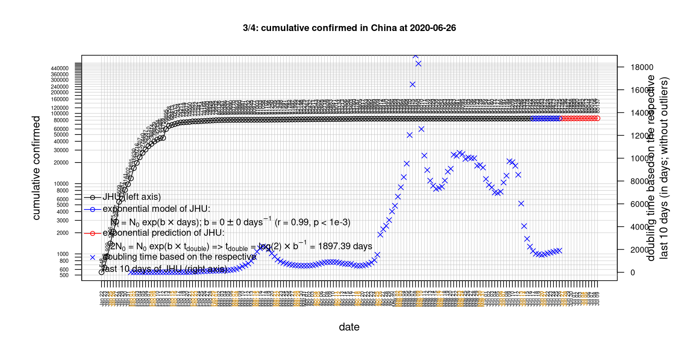
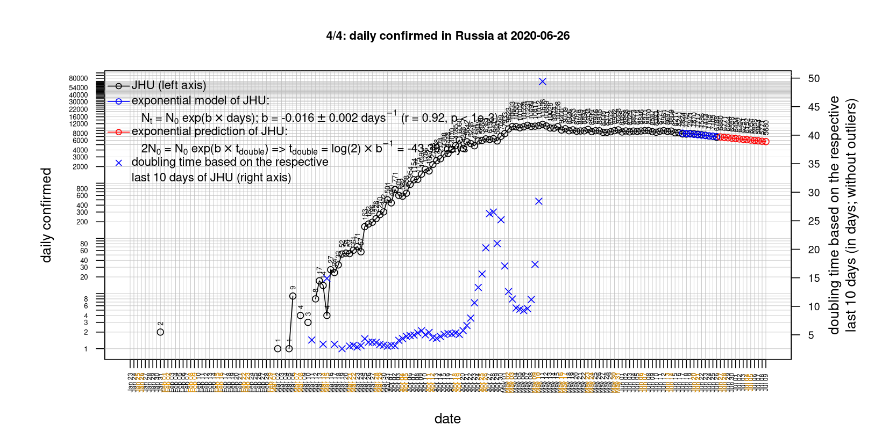
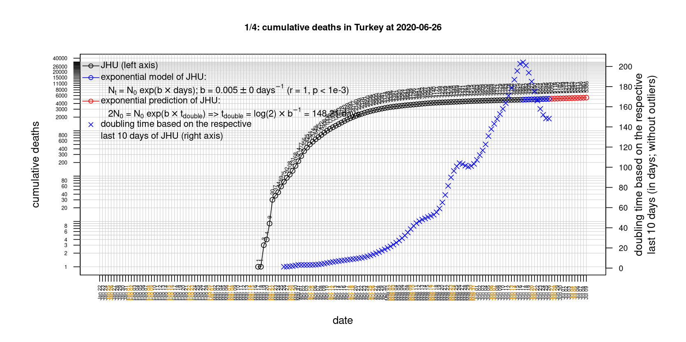

# International Covid-19 death predictions based on CSSEGISandData/COVID-19

  * upstream repo: https://github.com/CSSEGISandData/COVID-19  
  * time of last fetch of upstream repo: **2020-04-22 07:21:15 CET** (timestamp of file `.git/refs/remotes/upstream`)  
  * hash of last fetched commit of upstream repo: `db4efa2b362f56ee03b5fc5664330d7282c610b9` (`git rev-parse upstream/master`)  
  * last date of `COVID-19/csse_covid_19_data/time_series_covid19_*_global.csv` data: **2020-04-21**

# death rate evolution

# Select country

ordererd by time when cumulative number of deaths doubles (increasing)
country | cumulative number of deaths doubles in | period of estimation | rsq | p | cumulative deaths | cumulative confirmed
--- | --- | --- | --- | --- | --- | ---
[Russia](#Russia) | 4.84 days | 2020-04-12 to 2020-04-21 (10 days) | 1 | < 1e-3 | 456 | 52763
[Canada](#Canada) | 6.27 days | 2020-04-12 to 2020-04-21 (10 days) | 0.98 | < 1e-3 | 1908 | 39401
[Japan](#Japan) | 6.97 days | 2020-04-12 to 2020-04-21 (10 days) | 0.97 | < 1e-3 | 263 | 11135
[Hungary](#Hungary) | 8.09 days | 2020-04-12 to 2020-04-21 (10 days) | 0.99 | < 1e-3 | 213 | 2098
[US](#US) | 8.3 days | 2020-04-12 to 2020-04-21 (10 days) | 0.97 | < 1e-3 | 44845 | 823786
[Sweden](#Sweden) | 9.08 days | 2020-04-12 to 2020-04-21 (10 days) | 0.96 | < 1e-3 | 1765 | 15322
[Turkey](#Turkey) | 9.72 days | 2020-04-12 to 2020-04-21 (10 days) | 1 | < 1e-3 | 2259 | 95591
[Poland](#Poland) | 11.21 days | 2020-04-12 to 2020-04-21 (10 days) | 0.98 | < 1e-3 | 401 | 9856
[Germany](#Germany) | 11.75 days | 2020-04-12 to 2020-04-21 (10 days) | 0.96 | < 1e-3 | 5033 | 148291
[Belgium](#Belgium) | 11.86 days | 2020-04-12 to 2020-04-21 (10 days) | 0.97 | < 1e-3 | 5998 | 40956
[United Kingdom](#United-Kingdom) | 12.58 days | 2020-04-12 to 2020-04-21 (10 days) | 0.99 | < 1e-3 | 17378 | 130172
[Romania](#Romania) | 13.72 days | 2020-04-12 to 2020-04-21 (10 days) | 1 | < 1e-3 | 498 | 9242
[China](#China) | 14.01 days | 2020-04-12 to 2020-04-21 (10 days) | 0.76 | 0.001 | 4636 | 83853
[Portugal](#Portugal) | 15.15 days | 2020-04-12 to 2020-04-21 (10 days) | 0.99 | < 1e-3 | 762 | 21379
[France](#France) | 16.42 days | 2020-04-12 to 2020-04-21 (10 days) | 0.96 | < 1e-3 | 20829 | 159297
[Netherlands](#Netherlands) | 16.85 days | 2020-04-12 to 2020-04-21 (10 days) | 0.98 | < 1e-3 | 3929 | 34317
[Norway](#Norway) | 17.72 days | 2020-04-12 to 2020-04-21 (10 days) | 0.98 | < 1e-3 | 182 | 7191
[Austria](#Austria) | 19.11 days | 2020-04-12 to 2020-04-21 (10 days) | 0.99 | < 1e-3 | 491 | 14873
[Denmark](#Denmark) | 20.09 days | 2020-04-12 to 2020-04-21 (10 days) | 0.98 | < 1e-3 | 370 | 7891
[Switzerland](#Switzerland) | 21.21 days | 2020-04-12 to 2020-04-21 (10 days) | 0.99 | < 1e-3 | 1478 | 28063
[Spain](#Spain) | 29.31 days | 2020-04-12 to 2020-04-21 (10 days) | 0.98 | < 1e-3 | 21282 | 204178
[Italy](#Italy) | 29.38 days | 2020-04-12 to 2020-04-21 (10 days) | 0.99 | < 1e-3 | 24648 | 183957
[Iran](#Iran) | 37.74 days | 2020-04-12 to 2020-04-21 (10 days) | 1 | < 1e-3 | 5297 | 84802
[Australia](#Australia) | 50.41 days | 2020-04-12 to 2020-04-21 (10 days) | 0.91 | < 1e-3 | 67 | 6547
[Nepal](#Nepal) | NA | NA | NA | NA | 0 | 43

# Australia
[top](#Select-country)

 

 

 

 
 

# Austria
[top](#Select-country)

 

 

 

 
 

# Belgium
[top](#Select-country)

 

 

 

 
 

# Canada
[top](#Select-country)

 

 

 

 
 

# China
[top](#Select-country)

 

 

 

 
 

# Denmark
[top](#Select-country)

 

 

 

 
 

# France
[top](#Select-country)

 

 

 

 
 

# Germany
[top](#Select-country)

 

 

 

 
 

# Hungary
[top](#Select-country)

 

 

 

 
 

# Iran
[top](#Select-country)

 

 

 

 
 

# Italy
[top](#Select-country)

national responses:
1. 2020-03-04: https://www.theguardian.com/world/2020/mar/04/italy-orders-closure-of-schools-and-universities-due-to-coronavirus
2. 2020-03-09: https://www.bbc.co.uk/sport/51808683
3. 2020-03-11: https://www.washingtonpost.com/world/europe/merkel-coronavirus-germany/2020/03/11/e276252a-6399-11ea-8a8e-5c5336b32760_story.html

 

 

 

 
 

# Japan
[top](#Select-country)

 

 

 

 
 

# Nepal
[top](#Select-country)

 

 

 

 
 

# Netherlands
[top](#Select-country)

 

 

 

 
 

# Norway
[top](#Select-country)

 

 

 

 
 

# Poland
[top](#Select-country)

 

 

 

 
 

# Portugal
[top](#Select-country)

 

 

 

 
 

# Romania
[top](#Select-country)

 

 

 

 
 

# Russia
[top](#Select-country)

 

 

 

 
 

# Spain
[top](#Select-country)

 

 

 

 
 

# Sweden
[top](#Select-country)

 

 

 

 
 

# Switzerland
[top](#Select-country)

 

 

 

 
 

# Turkey
[top](#Select-country)

 

 

 

 
 

# US
[top](#Select-country)

 

 

 

 
 

# United Kingdom
[top](#Select-country)

 

 

 

 
 

