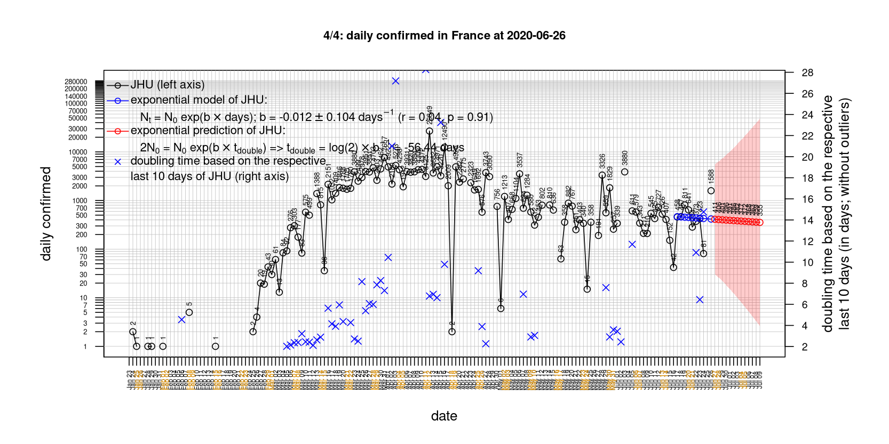
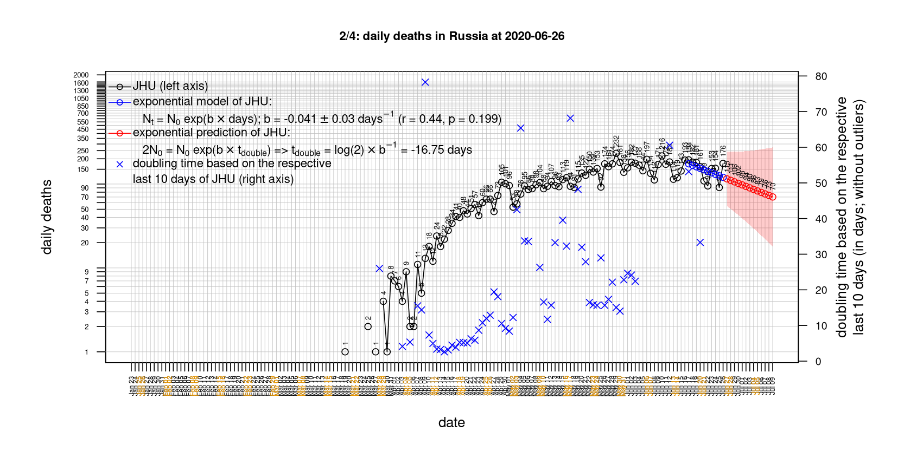

# covid death rates based on CSSEGISandData/COVID-19 data

forked from: https://github.com/CSSEGISandData/COVID-19
upstream hash: 0d2b104c946045db6a3874c97889c9f98d10ee0c
upstream time: 2020-03-21 01:54:22 CET

select country:

[1) Austria](#Austria) [2) Belgium](#Belgium) [3) Canada](#Canada) [4) China](#China) [5) Denmark](#Denmark) [6) France](#France) [7) Germany](#Germany) [8) Iran](#Iran) [9) Italy](#Italy) [10) Japan](#Japan) [11) Netherlands](#Netherlands) [12) Russia](#Russia) [13) Sweden](#Sweden) [14) Switzerland](#Switzerland) [15) US](#US) [16) United Kingdom](#United-Kingdom) 

# 1 Austria
 

 

 

 

 
 

# 2 Belgium
 

 

 

 

 
 

# 3 Canada
 

 

 

 

 
 

# 4 China
 

 

 

 

 
 

# 5 Denmark
 

 

 

 

 
 

# 6 France
 

 

 

 

 
 

# 7 Germany
 

 

 

 

 
 

# 8 Iran
 

 

 

 

 
 

# 9 Italy
 
national response 1 on 2020-03-04: https://www.theguardian.com/world/2020/mar/04/italy-orders-closure-of-schools-and-universities-due-to-coronavirus
 
national response 2 on 2020-03-09: https://www.bbc.co.uk/sport/51808683
 
national response 3 on 2020-03-11: https://www.washingtonpost.com/world/europe/merkel-coronavirus-germany/2020/03/11/e276252a-6399-11ea-8a8e-5c5336b32760_story.html
 

 

 

 

 
 

# 10 Japan
 

 

 

 

 
 

# 11 Netherlands
 

 

 

 

 
 

# 12 Russia
 

 

 

 

 
 

# 13 Sweden
 

 

 

 

 
 

# 14 Switzerland
 

 

 

 

 
 

# 15 US
 

 

 

 

 
 

# 16 United Kingdom
 

 

 

 

 
 

