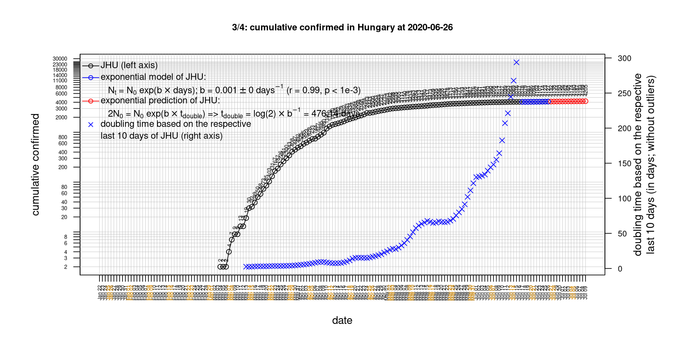

# International Covid-19 death predictions based on CSSEGISandData/COVID-19

  * upstream repo: https://github.com/CSSEGISandData/COVID-19  
  * time of last fetch of upstream repo: **2020-04-14 06:40:51 CET** (timestamp of file `.git/refs/remotes/upstream`)  
  * hash of last fetched commit of upstream repo: `a9fd32a9550b67a87c2839ce76ed73c54e92feab` (`git rev-parse upstream/master`)  
  * last date of `COVID-19/csse_covid_19_data/time_series_covid19_*_global.csv` data: **2020-04-13**

# death rate evolution

# Select country

ordererd by time when cumulative number of deaths doubles (increasing)
country | cumulative number of deaths doubles in | period of estimation | rsq | p | cumulative deaths | cumulative confirmed
--- | --- | --- | --- | --- | --- | ---
[Russia](#Russia) | 4.72 days | 2020-04-04 to 2020-04-13 (10 days) | 0.98 | < 1e-3 | 148 | 18328
[Hungary](#Hungary) | 4.74 days | 2020-04-04 to 2020-04-13 (10 days) | 0.99 | < 1e-3 | 109 | 1458
[Canada](#Canada) | 4.92 days | 2020-04-04 to 2020-04-13 (10 days) | 0.98 | < 1e-3 | 779 | 25679
[Belgium](#Belgium) | 5.37 days | 2020-04-04 to 2020-04-13 (10 days) | 0.99 | < 1e-3 | 3903 | 30589
[Poland](#Poland) | 5.46 days | 2020-04-04 to 2020-04-13 (10 days) | 0.97 | < 1e-3 | 245 | 6934
[US](#US) | 5.86 days | 2020-04-04 to 2020-04-13 (10 days) | 0.99 | < 1e-3 | 23529 | 580619
[United Kingdom](#United-Kingdom) | 6.24 days | 2020-04-04 to 2020-04-13 (10 days) | 0.99 | < 1e-3 | 11347 | 89570
[Sweden](#Sweden) | 6.29 days | 2020-04-04 to 2020-04-13 (10 days) | 0.91 | < 1e-3 | 919 | 10948
[Turkey](#Turkey) | 6.56 days | 2020-04-04 to 2020-04-13 (10 days) | 0.99 | < 1e-3 | 1296 | 61049
[Romania](#Romania) | 7.1 days | 2020-04-04 to 2020-04-13 (10 days) | 0.99 | < 1e-3 | 331 | 6633
[Germany](#Germany) | 7.73 days | 2020-04-04 to 2020-04-13 (10 days) | 0.96 | < 1e-3 | 3194 | 130072
[Norway](#Norway) | 8.12 days | 2020-04-04 to 2020-04-13 (10 days) | 0.96 | < 1e-3 | 134 | 6603
[France](#France) | 8.65 days | 2020-04-04 to 2020-04-13 (10 days) | 0.97 | < 1e-3 | 14986 | 137875
[Austria](#Austria) | 8.83 days | 2020-04-04 to 2020-04-13 (10 days) | 0.98 | < 1e-3 | 368 | 14041
[Portugal](#Portugal) | 8.89 days | 2020-04-04 to 2020-04-13 (10 days) | 1 | < 1e-3 | 535 | 16934
[Australia](#Australia) | 9.15 days | 2020-04-04 to 2020-04-13 (10 days) | 0.93 | < 1e-3 | 61 | 6351
[Denmark](#Denmark) | 10.98 days | 2020-04-04 to 2020-04-13 (10 days) | 0.99 | < 1e-3 | 285 | 6513
[Netherlands](#Netherlands) | 11.17 days | 2020-04-04 to 2020-04-13 (10 days) | 0.97 | < 1e-3 | 2833 | 26710
[Switzerland](#Switzerland) | 11.38 days | 2020-04-04 to 2020-04-13 (10 days) | 0.99 | < 1e-3 | 1138 | 25688
[Japan](#Japan) | 15.09 days | 2020-04-04 to 2020-04-13 (10 days) | 0.93 | < 1e-3 | 123 | 7370
[Spain](#Spain) | 15.73 days | 2020-04-04 to 2020-04-13 (10 days) | 0.99 | < 1e-3 | 17756 | 170099
[Italy](#Italy) | 21.58 days | 2020-04-04 to 2020-04-13 (10 days) | 1 | < 1e-3 | 20465 | 159516
[Iran](#Iran) | 22.29 days | 2020-04-04 to 2020-04-13 (10 days) | 0.99 | < 1e-3 | 4585 | 73303
[China](#China) | 1457.06 days | 2020-04-04 to 2020-04-13 (10 days) | 0.98 | < 1e-3 | 3345 | 83213
[Nepal](#Nepal) | NA | NA | NA | NA | 0 | 14

# Australia
[top](#Select-country)

 

 

 

 
 

# Austria
[top](#Select-country)

 

 

 

 
 

# Belgium
[top](#Select-country)

 

 

 

 
 

# Canada
[top](#Select-country)

 

 

 

 
 

# China
[top](#Select-country)

 

 

 

 
 

# Denmark
[top](#Select-country)

 

 

 

 
 

# France
[top](#Select-country)

 

 

 

 
 

# Germany
[top](#Select-country)

 

 

 

 
 

# Hungary
[top](#Select-country)

 

 

 

 
 

# Iran
[top](#Select-country)

 

 

 

 
 

# Italy
[top](#Select-country)

national responses:
1. 2020-03-04: https://www.theguardian.com/world/2020/mar/04/italy-orders-closure-of-schools-and-universities-due-to-coronavirus
2. 2020-03-09: https://www.bbc.co.uk/sport/51808683
3. 2020-03-11: https://www.washingtonpost.com/world/europe/merkel-coronavirus-germany/2020/03/11/e276252a-6399-11ea-8a8e-5c5336b32760_story.html

 

 

 

 
 

# Japan
[top](#Select-country)

 

 

 

 
 

# Nepal
[top](#Select-country)

 

 

 

 
 

# Netherlands
[top](#Select-country)

 

 

 

 
 

# Norway
[top](#Select-country)

 

 

 

 
 

# Poland
[top](#Select-country)

 

 

 

 
 

# Portugal
[top](#Select-country)

 

 

 

 
 

# Romania
[top](#Select-country)

 

 

 

 
 

# Russia
[top](#Select-country)

 

 

 

 
 

# Spain
[top](#Select-country)

 

 

 

 
 

# Sweden
[top](#Select-country)

 

 

 

 
 

# Switzerland
[top](#Select-country)

 

 

 

 
 

# Turkey
[top](#Select-country)

 

 

 

 
 

# US
[top](#Select-country)

 

 

 

 
 

# United Kingdom
[top](#Select-country)

 

 

 

 
 

