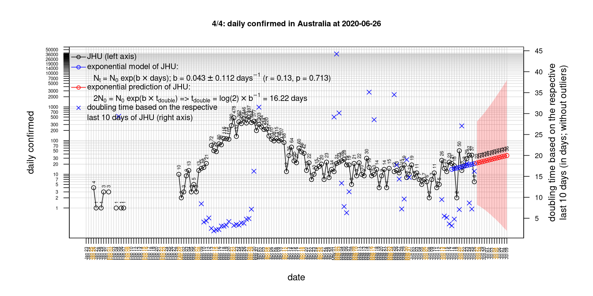

# International Covid-19 death predictions based on CSSEGISandData/COVID-19

  * upstream repo: https://github.com/CSSEGISandData/COVID-19  
  * time of last fetch of upstream repo: **2020-04-16 07:24:27 CET** (timestamp of file `.git/refs/remotes/upstream`)  
  * hash of last fetched commit of upstream repo: `7a2941d8d68a74242c4e5eb05dc7750ca494f61b` (`git rev-parse upstream/master`)  
  * last date of `COVID-19/csse_covid_19_data/time_series_covid19_*_global.csv` data: **2020-04-15**

# death rate evolution

# Select country

ordererd by time when cumulative number of deaths doubles (increasing)
country | cumulative number of deaths doubles in | period of estimation | rsq | p | cumulative deaths | cumulative confirmed
--- | --- | --- | --- | --- | --- | ---
[Russia](#Russia) | 4.32 days | 2020-04-06 to 2020-04-15 (10 days) | 1 | < 1e-3 | 198 | 24490
[Hungary](#Hungary) | 5.09 days | 2020-04-06 to 2020-04-15 (10 days) | 0.98 | < 1e-3 | 134 | 1579
[Canada](#Canada) | 5.62 days | 2020-04-06 to 2020-04-15 (10 days) | 0.99 | < 1e-3 | 1006 | 28208
[Belgium](#Belgium) | 6.37 days | 2020-04-06 to 2020-04-15 (10 days) | 0.97 | < 1e-3 | 4440 | 33573
[Poland](#Poland) | 6.73 days | 2020-04-06 to 2020-04-15 (10 days) | 0.97 | < 1e-3 | 286 | 7582
[US](#US) | 6.74 days | 2020-04-06 to 2020-04-15 (10 days) | 0.98 | < 1e-3 | 28326 | 636350
[United Kingdom](#United-Kingdom) | 7.2 days | 2020-04-06 to 2020-04-15 (10 days) | 0.98 | < 1e-3 | 12894 | 99483
[Turkey](#Turkey) | 7.37 days | 2020-04-06 to 2020-04-15 (10 days) | 0.99 | < 1e-3 | 1518 | 69392
[Sweden](#Sweden) | 8.12 days | 2020-04-06 to 2020-04-15 (10 days) | 0.91 | < 1e-3 | 1203 | 11927
[Romania](#Romania) | 8.4 days | 2020-04-06 to 2020-04-15 (10 days) | 0.98 | < 1e-3 | 372 | 7216
[Germany](#Germany) | 9.46 days | 2020-04-06 to 2020-04-15 (10 days) | 0.95 | < 1e-3 | 3804 | 134753
[Portugal](#Portugal) | 9.7 days | 2020-04-06 to 2020-04-15 (10 days) | 0.99 | < 1e-3 | 599 | 18091
[Norway](#Norway) | 10.2 days | 2020-04-06 to 2020-04-15 (10 days) | 0.95 | < 1e-3 | 150 | 6740
[France](#France) | 10.42 days | 2020-04-06 to 2020-04-15 (10 days) | 0.96 | < 1e-3 | 17188 | 134582
[Austria](#Austria) | 10.91 days | 2020-04-06 to 2020-04-15 (10 days) | 0.96 | < 1e-3 | 393 | 14336
[Japan](#Japan) | 11.71 days | 2020-04-06 to 2020-04-15 (10 days) | 0.89 | < 1e-3 | 146 | 8100
[Denmark](#Denmark) | 12.64 days | 2020-04-06 to 2020-04-15 (10 days) | 0.98 | < 1e-3 | 309 | 6876
[Netherlands](#Netherlands) | 13.27 days | 2020-04-06 to 2020-04-15 (10 days) | 0.97 | < 1e-3 | 3145 | 28316
[Switzerland](#Switzerland) | 13.39 days | 2020-04-06 to 2020-04-15 (10 days) | 0.98 | < 1e-3 | 1239 | 26336
[Australia](#Australia) | 14.54 days | 2020-04-06 to 2020-04-15 (10 days) | 0.92 | < 1e-3 | 63 | 6440
[Spain](#Spain) | 18.84 days | 2020-04-06 to 2020-04-15 (10 days) | 0.98 | < 1e-3 | 18708 | 177644
[Italy](#Italy) | 23.34 days | 2020-04-06 to 2020-04-15 (10 days) | 1 | < 1e-3 | 21645 | 165155
[Iran](#Iran) | 25.35 days | 2020-04-06 to 2020-04-15 (10 days) | 0.99 | < 1e-3 | 4777 | 76389
[China](#China) | 1705.57 days | 2020-04-06 to 2020-04-15 (10 days) | 0.96 | < 1e-3 | 3346 | 83356
[Nepal](#Nepal) | NA | NA | NA | NA | 0 | 16

# Australia
[top](#Select-country)

 

 

 

 
 

# Austria
[top](#Select-country)

 

 

 

 
 

# Belgium
[top](#Select-country)

 

 

 

 
 

# Canada
[top](#Select-country)

 

 

 

 
 

# China
[top](#Select-country)

 

 

 

 
 

# Denmark
[top](#Select-country)

 

 

 

 
 

# France
[top](#Select-country)

 

 

 

 
 

# Germany
[top](#Select-country)

 

 

 

 
 

# Hungary
[top](#Select-country)

 

 

 

 
 

# Iran
[top](#Select-country)

 

 

 

 
 

# Italy
[top](#Select-country)

national responses:
1. 2020-03-04: https://www.theguardian.com/world/2020/mar/04/italy-orders-closure-of-schools-and-universities-due-to-coronavirus
2. 2020-03-09: https://www.bbc.co.uk/sport/51808683
3. 2020-03-11: https://www.washingtonpost.com/world/europe/merkel-coronavirus-germany/2020/03/11/e276252a-6399-11ea-8a8e-5c5336b32760_story.html

 

 

 

 
 

# Japan
[top](#Select-country)

 

 

 

 
 

# Nepal
[top](#Select-country)

 

 

 

 
 

# Netherlands
[top](#Select-country)

 

 

 

 
 

# Norway
[top](#Select-country)

 

 

 

 
 

# Poland
[top](#Select-country)

 

 

 

 
 

# Portugal
[top](#Select-country)

 

 

 

 
 

# Romania
[top](#Select-country)

 

 

 

 
 

# Russia
[top](#Select-country)

 

 

 

 
 

# Spain
[top](#Select-country)

 

 

 

 
 

# Sweden
[top](#Select-country)

 

 

 

 
 

# Switzerland
[top](#Select-country)

 

 

 

 
 

# Turkey
[top](#Select-country)

 

 

 

 
 

# US
[top](#Select-country)

 

 

 

 
 

# United Kingdom
[top](#Select-country)

 

 

 

 
 

