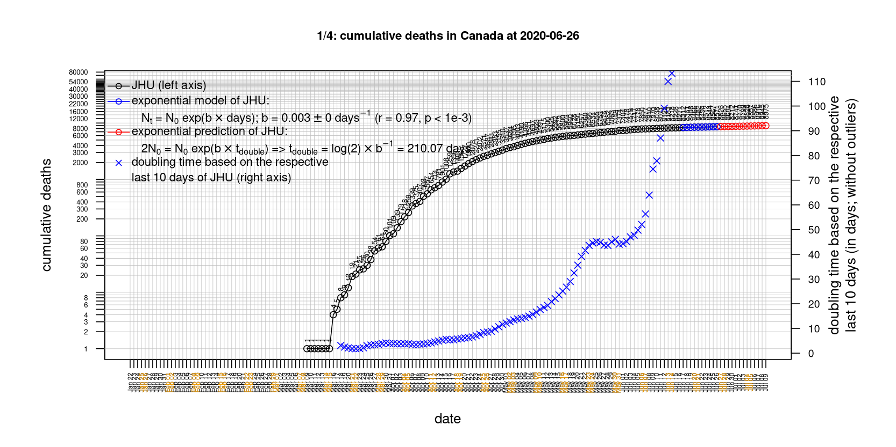
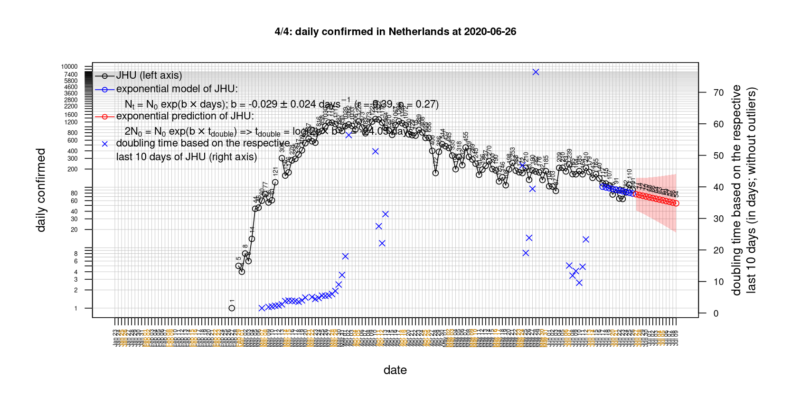
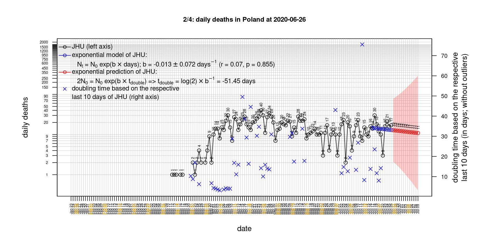

# International Covid-19 death predictions based on CSSEGISandData/COVID-19

  * upstream repo: https://github.com/CSSEGISandData/COVID-19  
  * time of last fetch of upstream repo: **2020-03-29 13:20:01 CET** (timestamp of file `.git/refs/remotes/upstream`)  
  * hash of last fetched commit of upstream repo: `63649e417fc6750faaec10a8a3826644aefc9fb6` (`git rev-parse upstream/master`)  
  * last date of `COVID-19/csse_covid_19_data/time_series_covid19_*_global.csv` data: **2020-03-28**

# Select country

ordererd by time when cumulative number of deaths doubles (increasing)
country | cumulative number of deaths doubles in | period of estimation | rsq | p | cumulative deaths | cumulative confirmed
--- | --- | --- | --- | --- | --- | ---
[Romania](#Romania) | 1.78 days | 2020-03-22 to 2020-03-28 (7 days) | 0.94 | < 1e-3 | 37 | 1452
[Portugal](#Portugal) | 1.87 days | 2020-03-19 to 2020-03-28 (10 days) | 0.97 | < 1e-3 | 100 | 5170
[Austria](#Austria) | 2.34 days | 2020-03-19 to 2020-03-28 (10 days) | 0.97 | < 1e-3 | 68 | 8271
[Belgium](#Belgium) | 2.35 days | 2020-03-19 to 2020-03-28 (10 days) | 0.97 | < 1e-3 | 353 | 9134
[Sweden](#Sweden) | 2.61 days | 2020-03-19 to 2020-03-28 (10 days) | 0.97 | < 1e-3 | 105 | 3447
[US](#US) | 2.63 days | 2020-03-19 to 2020-03-28 (10 days) | 1 | < 1e-3 | 2026 | 121478
[Denmark](#Denmark) | 2.68 days | 2020-03-19 to 2020-03-28 (10 days) | 0.97 | < 1e-3 | 65 | 2366
[Germany](#Germany) | 2.83 days | 2020-03-19 to 2020-03-28 (10 days) | 0.99 | < 1e-3 | 433 | 57695
[Netherlands](#Netherlands) | 2.97 days | 2020-03-19 to 2020-03-28 (10 days) | 1 | < 1e-3 | 640 | 9819
[France](#France) | 2.97 days | 2020-03-19 to 2020-03-28 (10 days) | 0.97 | < 1e-3 | 2317 | 38105
[Spain](#Spain) | 3.08 days | 2020-03-19 to 2020-03-28 (10 days) | 0.99 | < 1e-3 | 5982 | 73235
[United Kingdom](#United-Kingdom) | 3.32 days | 2020-03-19 to 2020-03-28 (10 days) | 0.99 | < 1e-3 | 1021 | 17312
[Switzerland](#Switzerland) | 3.47 days | 2020-03-19 to 2020-03-28 (10 days) | 0.98 | < 1e-3 | 264 | 14076
[Canada](#Canada) | 3.54 days | 2020-03-19 to 2020-03-28 (10 days) | 0.96 | < 1e-3 | 61 | 5576
[Russia](#Russia) | 3.69 days | 2020-03-19 to 2020-03-28 (10 days) | 0.77 | < 1e-3 | 4 | 1264
[Poland](#Poland) | 4.12 days | 2020-03-19 to 2020-03-28 (10 days) | 0.95 | < 1e-3 | 18 | 1638
[Norway](#Norway) | 4.88 days | 2020-03-19 to 2020-03-28 (10 days) | 0.93 | < 1e-3 | 23 | 4015
[Italy](#Italy) | 5.97 days | 2020-03-19 to 2020-03-28 (10 days) | 0.99 | < 1e-3 | 10023 | 92472
[Australia](#Australia) | 7.34 days | 2020-03-19 to 2020-03-28 (10 days) | 0.83 | < 1e-3 | 14 | 3640
[Iran](#Iran) | 9.45 days | 2020-03-19 to 2020-03-28 (10 days) | 0.99 | < 1e-3 | 2517 | 35408
[Japan](#Japan) | 11.67 days | 2020-03-19 to 2020-03-28 (10 days) | 0.94 | < 1e-3 | 52 | 1693
[China](#China) | 393.8 days | 2020-03-19 to 2020-03-28 (10 days) | 0.97 | < 1e-3 | 3299 | 81999
[Nepal](#Nepal) | NA | NA | NA | NA | 0 | 5

# Australia
[top](#Select-country)

 

 

 

 
 

# Austria
[top](#Select-country)

 

 

 

 
 

# Belgium
[top](#Select-country)

 

 

 

 
 

# Canada
[top](#Select-country)

 

 

 

 
 

# China
[top](#Select-country)

 

 

 

 
 

# Denmark
[top](#Select-country)

 

 

 

 
 

# France
[top](#Select-country)

 

 

 

 
 

# Germany
[top](#Select-country)

 

 

 

 
 

# Iran
[top](#Select-country)

 

 

 

 
 

# Italy
[top](#Select-country)

national responses:
1. 2020-03-04: https://www.theguardian.com/world/2020/mar/04/italy-orders-closure-of-schools-and-universities-due-to-coronavirus
2. 2020-03-09: https://www.bbc.co.uk/sport/51808683
3. 2020-03-11: https://www.washingtonpost.com/world/europe/merkel-coronavirus-germany/2020/03/11/e276252a-6399-11ea-8a8e-5c5336b32760_story.html

 

 

 

 
 

# Japan
[top](#Select-country)

 

 

 

 
 

# Nepal
[top](#Select-country)

 

 

 

 
 

# Netherlands
[top](#Select-country)

 

 

 

 
 

# Norway
[top](#Select-country)

 

 

 

 
 

# Poland
[top](#Select-country)

 

 

 

 
 

# Portugal
[top](#Select-country)

 

 

 

 
 

# Romania
[top](#Select-country)

 

 

 

 
 

# Russia
[top](#Select-country)

 

 

 

 
 

# Spain
[top](#Select-country)

 

 

 

 
 

# Sweden
[top](#Select-country)

 

 

 

 
 

# Switzerland
[top](#Select-country)

 

 

 

 
 

# US
[top](#Select-country)

 

 

 

 
 

# United Kingdom
[top](#Select-country)

 

 

 

 
 

