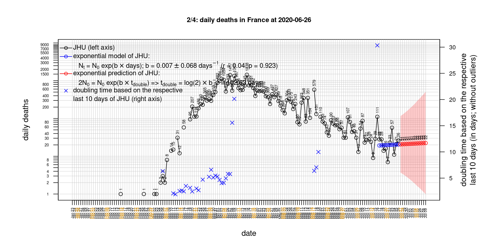
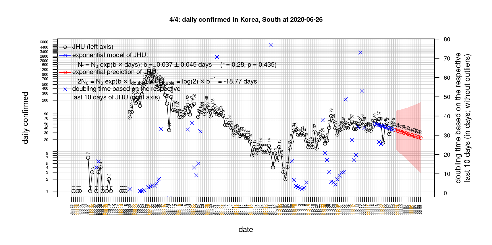

# International Covid-19 death predictions based on CSSEGISandData/COVID-19

  * upstream repo: https://github.com/CSSEGISandData/COVID-19  
  * time of last fetch of upstream repo: **2020-05-07 07:25:35 CET** (timestamp of file `.git/refs/remotes/upstream`)  
  * hash of last fetched commit of upstream repo: `ecb26cf5569b29bae62df343f302d708a1a0bc23` (`git rev-parse upstream/master`)  
  * last date of `COVID-19/csse_covid_19_data/time_series_covid19_*_global.csv` data: **2020-05-06**

# death rate evolution

# Select country

ordererd by time when cumulative number of deaths doubles (increasing)
country | cumulative number of deaths doubles in | period of estimation | rsq | p | cumulative deaths | cumulative confirmed
--- | --- | --- | --- | --- | --- | ---
[Russia](#Russia) | 9.7 days | 2020-04-27 to 2020-05-06 (10 days) | 0.98 | < 1e-3 | 1537 | 165929
[Canada](#Canada) | 14.5 days | 2020-04-27 to 2020-05-06 (10 days) | 1 | < 1e-3 | 4366 | 64694
[Japan](#Japan) | 15.38 days | 2020-04-27 to 2020-05-06 (10 days) | 0.98 | < 1e-3 | 556 | 15253
[Romania](#Romania) | 20.77 days | 2020-04-27 to 2020-05-06 (10 days) | 1 | < 1e-3 | 864 | 14107
[Hungary](#Hungary) | 21.96 days | 2020-04-27 to 2020-05-06 (10 days) | 1 | < 1e-3 | 373 | 3111
[US](#US) | 24.68 days | 2020-04-27 to 2020-05-06 (10 days) | 0.98 | < 1e-3 | 73431 | 1228603
[Poland](#Poland) | 25.94 days | 2020-04-27 to 2020-05-06 (10 days) | 0.97 | < 1e-3 | 733 | 14740
[Sweden](#Sweden) | 26.23 days | 2020-04-27 to 2020-05-06 (10 days) | 0.96 | < 1e-3 | 2941 | 23918
[Turkey](#Turkey) | 29.69 days | 2020-04-27 to 2020-05-06 (10 days) | 0.99 | < 1e-3 | 3584 | 131744
[United Kingdom](#United-Kingdom) | 31.55 days | 2020-04-27 to 2020-05-06 (10 days) | 0.97 | < 1e-3 | 30150 | 202359
[Denmark](#Denmark) | 34.32 days | 2020-04-27 to 2020-05-06 (10 days) | 0.99 | < 1e-3 | 506 | 10136
[Portugal](#Portugal) | 39.02 days | 2020-04-27 to 2020-05-06 (10 days) | 0.99 | < 1e-3 | 1089 | 26182
[Germany](#Germany) | 41.25 days | 2020-04-27 to 2020-05-06 (10 days) | 0.96 | < 1e-3 | 7275 | 168162
[Netherlands](#Netherlands) | 42.51 days | 2020-04-27 to 2020-05-06 (10 days) | 0.97 | < 1e-3 | 5221 | 41518
[Australia](#Australia) | 48.72 days | 2020-04-27 to 2020-05-06 (10 days) | 0.82 | < 1e-3 | 97 | 6894
[Belgium](#Belgium) | 49.34 days | 2020-04-27 to 2020-05-06 (10 days) | 0.97 | < 1e-3 | 8339 | 50781
[Iran](#Iran) | 63.86 days | 2020-04-27 to 2020-05-06 (10 days) | 1 | < 1e-3 | 6418 | 101650
[France](#France) | 65.25 days | 2020-04-27 to 2020-05-06 (10 days) | 0.98 | < 1e-3 | 25812 | 174224
[Italy](#Italy) | 67.13 days | 2020-04-27 to 2020-05-06 (10 days) | 0.99 | < 1e-3 | 29684 | 214457
[Spain](#Spain) | 67.24 days | 2020-04-27 to 2020-05-06 (10 days) | 0.98 | < 1e-3 | 25857 | 220325
[Austria](#Austria) | 70.95 days | 2020-04-27 to 2020-05-06 (10 days) | 0.88 | < 1e-3 | 608 | 15684
[Switzerland](#Switzerland) | 84.52 days | 2020-04-27 to 2020-05-06 (10 days) | 0.95 | < 1e-3 | 1805 | 30060
[Norway](#Norway) | 119.75 days | 2020-04-27 to 2020-05-06 (10 days) | 0.97 | < 1e-3 | 216 | 7996
[Korea, South](#Korea,-South) | 131.26 days | 2020-04-27 to 2020-05-06 (10 days) | 0.99 | < 1e-3 | 256 | 10810
[China](#China) | NA | NA | NA | NA | 4637 | 83970
[Nepal](#Nepal) | NA | NA | NA | NA | 0 | 99

# Australia
[top](#Select-country)

 

 

 

 
 

# Austria
[top](#Select-country)

 

 

 

 
 

# Belgium
[top](#Select-country)

 

 

 

 
 

# Canada
[top](#Select-country)

 

 

 

 
 

# China
[top](#Select-country)

 

 

 

 
 

# Denmark
[top](#Select-country)

 

 

 

 
 

# France
[top](#Select-country)

 

 

 

 
 

# Germany
[top](#Select-country)

 

 

 

 
 

# Hungary
[top](#Select-country)

 

 

 

 
 

# Iran
[top](#Select-country)

 

 

 

 
 

# Italy
[top](#Select-country)

national responses:
1. 2020-03-04: https://www.theguardian.com/world/2020/mar/04/italy-orders-closure-of-schools-and-universities-due-to-coronavirus
2. 2020-03-09: https://www.bbc.co.uk/sport/51808683
3. 2020-03-11: https://www.washingtonpost.com/world/europe/merkel-coronavirus-germany/2020/03/11/e276252a-6399-11ea-8a8e-5c5336b32760_story.html

 

 

 

 
 

# Japan
[top](#Select-country)

 

 

 

 
 

# Korea, South
[top](#Select-country)

 

 

 

 
 

# Nepal
[top](#Select-country)

 

 

 

 
 

# Netherlands
[top](#Select-country)

 

 

 

 
 

# Norway
[top](#Select-country)

 

 

 

 
 

# Poland
[top](#Select-country)

 

 

 

 
 

# Portugal
[top](#Select-country)

 

 

 

 
 

# Romania
[top](#Select-country)

 

 

 

 
 

# Russia
[top](#Select-country)

 

 

 

 
 

# Spain
[top](#Select-country)

 

 

 

 
 

# Sweden
[top](#Select-country)

 

 

 

 
 

# Switzerland
[top](#Select-country)

 

 

 

 
 

# Turkey
[top](#Select-country)

 

 

 

 
 

# US
[top](#Select-country)

 

 

 

 
 

# United Kingdom
[top](#Select-country)

 

 

 

 
 

