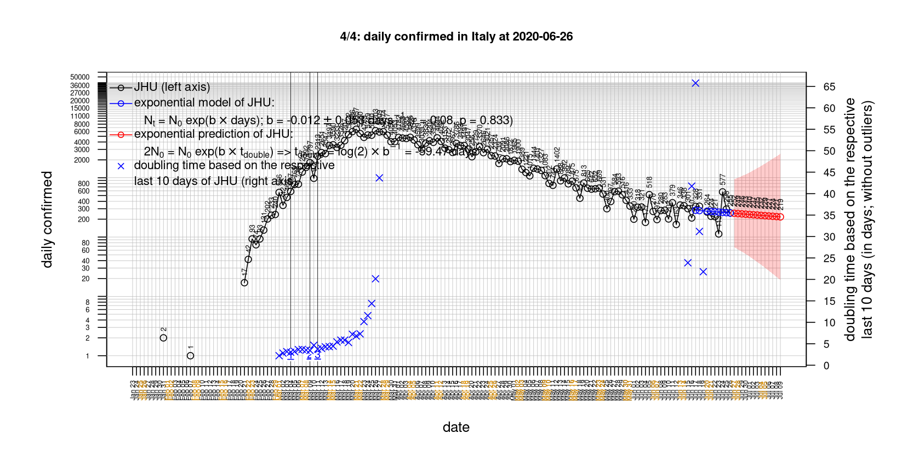
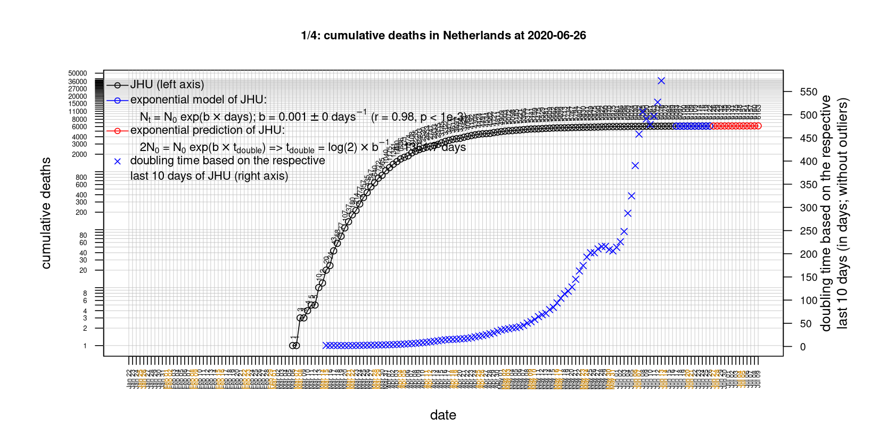
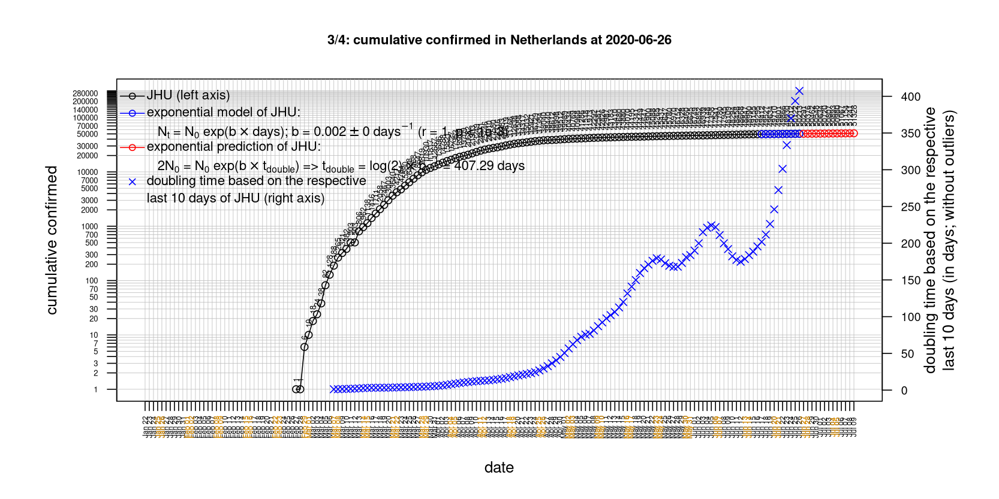

# International Covid-19 death predictions based on CSSEGISandData/COVID-19

  * upstream repo: https://github.com/CSSEGISandData/COVID-19  
  * time of last fetch of upstream repo: **2020-06-23 09:57:18 CET** (timestamp of file `.git/refs/remotes/upstream`)  
  * hash of last fetched commit of upstream repo: `d258831104d82e4be78b3b99d8f8605e87b39eae` (`git rev-parse upstream/master`)  
  * last date of `COVID-19/csse_covid_19_data/time_series_covid19_*_global.csv` data: **2020-06-22**

# death rate evolution

# Select country

ordererd by time when cumulative number of deaths doubles (increasing)
country | cumulative number of deaths doubles in | period of estimation | rsq | p | cumulative deaths | cumulative confirmed
--- | --- | --- | --- | --- | --- | ---
[Australia](#Australia) | -4524459228840985 days | 2020-06-13 to 2020-06-22 (10 days) | 0.52 | 0.122 | 102 | 7492
[Nepal](#Nepal) | 23.77 days | 2020-06-13 to 2020-06-22 (10 days) | 0.92 | < 1e-3 | 23 | 9561
[Brazil](#Brazil) | 31.5 days | 2020-06-13 to 2020-06-22 (10 days) | 0.99 | < 1e-3 | 51271 | 1106470
[Russia](#Russia) | 31.85 days | 2020-06-13 to 2020-06-22 (10 days) | 0.99 | < 1e-3 | 8196 | 591465
[Iran](#Iran) | 57.15 days | 2020-06-13 to 2020-06-22 (10 days) | 1 | < 1e-3 | 9742 | 207525
[Poland](#Poland) | 58.8 days | 2020-06-13 to 2020-06-22 (10 days) | 0.98 | < 1e-3 | 1359 | 32227
[Romania](#Romania) | 69.46 days | 2020-06-13 to 2020-06-22 (10 days) | 1 | < 1e-3 | 1523 | 24291
[Sweden](#Sweden) | 104.1 days | 2020-06-13 to 2020-06-22 (10 days) | 0.91 | < 1e-3 | 5122 | 58932
[Spain](#Spain) | 111.38 days | 2020-06-13 to 2020-06-22 (10 days) | 0.73 | 0.002 | 28324 | 246504
[US](#US) | 135.42 days | 2020-06-13 to 2020-06-22 (10 days) | 0.99 | < 1e-3 | 120402 | 2312302
[Canada](#Canada) | 151.53 days | 2020-06-13 to 2020-06-22 (10 days) | 0.98 | < 1e-3 | 8494 | 103418
[Turkey](#Turkey) | 166.14 days | 2020-06-13 to 2020-06-22 (10 days) | 1 | < 1e-3 | 4974 | 188897
[Japan](#Japan) | 171.15 days | 2020-06-13 to 2020-06-22 (10 days) | 0.9 | < 1e-3 | 955 | 17820
[United Kingdom](#United-Kingdom) | 227.16 days | 2020-06-13 to 2020-06-22 (10 days) | 0.96 | < 1e-3 | 42731 | 306761
[Austria](#Austria) | 279.18 days | 2020-06-13 to 2020-06-22 (10 days) | 0.88 | < 1e-3 | 690 | 17380
[Hungary](#Hungary) | 296.85 days | 2020-06-13 to 2020-06-22 (10 days) | 0.96 | < 1e-3 | 572 | 4102
[Norway](#Norway) | 328.66 days | 2020-06-13 to 2020-06-22 (10 days) | 0.72 | 0.002 | 248 | 8751
[Germany](#Germany) | 444.43 days | 2020-06-13 to 2020-06-22 (10 days) | 0.94 | < 1e-3 | 8899 | 191768
[Korea, South](#Korea,-South) | 455.63 days | 2020-06-13 to 2020-06-22 (10 days) | 0.84 | < 1e-3 | 281 | 12484
[Portugal](#Portugal) | 504.98 days | 2020-06-13 to 2020-06-22 (10 days) | 0.96 | < 1e-3 | 1534 | 39392
[Italy](#Italy) | 566.98 days | 2020-06-13 to 2020-06-22 (10 days) | 0.99 | < 1e-3 | 34657 | 238720
[Switzerland](#Switzerland) | 587.61 days | 2020-06-13 to 2020-06-22 (10 days) | 0.68 | 0.003 | 1956 | 31310
[France](#France) | 644.74 days | 2020-06-13 to 2020-06-22 (10 days) | 0.9 | < 1e-3 | 29666 | 197381
[Denmark](#Denmark) | 815.75 days | 2020-06-13 to 2020-06-22 (10 days) | 0.89 | < 1e-3 | 602 | 12727
[Netherlands](#Netherlands) | 1038.62 days | 2020-06-13 to 2020-06-22 (10 days) | 0.98 | < 1e-3 | 6109 | 49866
[Belgium](#Belgium) | 1129.14 days | 2020-06-13 to 2020-06-22 (10 days) | 0.94 | < 1e-3 | 9696 | 60550
[China](#China) | 25262 days | 2020-06-13 to 2020-06-22 (10 days) | 0.64 | 0.006 | 4639 | 84624

# Australia
[top](#Select-country)

 

 

 

 
 

# Austria
[top](#Select-country)

 

 

 

 
 

# Belgium
[top](#Select-country)

 

 

 

 
 

# Brazil
[top](#Select-country)

 

 

 

 
 

# Canada
[top](#Select-country)

 

 

 

 
 

# China
[top](#Select-country)

 

 

 

 
 

# Denmark
[top](#Select-country)

 

 

 

 
 

# France
[top](#Select-country)

 

 

 

 
 

# Germany
[top](#Select-country)

 

 

 

 

 
 

# Hungary
[top](#Select-country)

 

 

 

 
 

# Iran
[top](#Select-country)

 

 

 

 
 

# Italy
[top](#Select-country)

national responses:
1. 2020-03-04: https://www.theguardian.com/world/2020/mar/04/italy-orders-closure-of-schools-and-universities-due-to-coronavirus
2. 2020-03-09: https://www.bbc.co.uk/sport/51808683
3. 2020-03-11: https://www.washingtonpost.com/world/europe/merkel-coronavirus-germany/2020/03/11/e276252a-6399-11ea-8a8e-5c5336b32760_story.html

 

 

 

 
 

# Japan
[top](#Select-country)

 

 

 

 
 

# Korea, South
[top](#Select-country)

 

 

 

 
 

# Nepal
[top](#Select-country)

 

 

 

 
 

# Netherlands
[top](#Select-country)

 

 

 

 
 

# Norway
[top](#Select-country)

 

 

 

 
 

# Poland
[top](#Select-country)

 

 

 

 
 

# Portugal
[top](#Select-country)

 

 

 

 
 

# Romania
[top](#Select-country)

 

 

 

 
 

# Russia
[top](#Select-country)

 

 

 

 
 

# Spain
[top](#Select-country)

 

 

 

 
 

# Sweden
[top](#Select-country)

 

 

 

 
 

# Switzerland
[top](#Select-country)

 

 

 

 
 

# Turkey
[top](#Select-country)

 

 

 

 
 

# US
[top](#Select-country)

 

 

 

 
 

# United Kingdom
[top](#Select-country)

 

 

 

 
 

