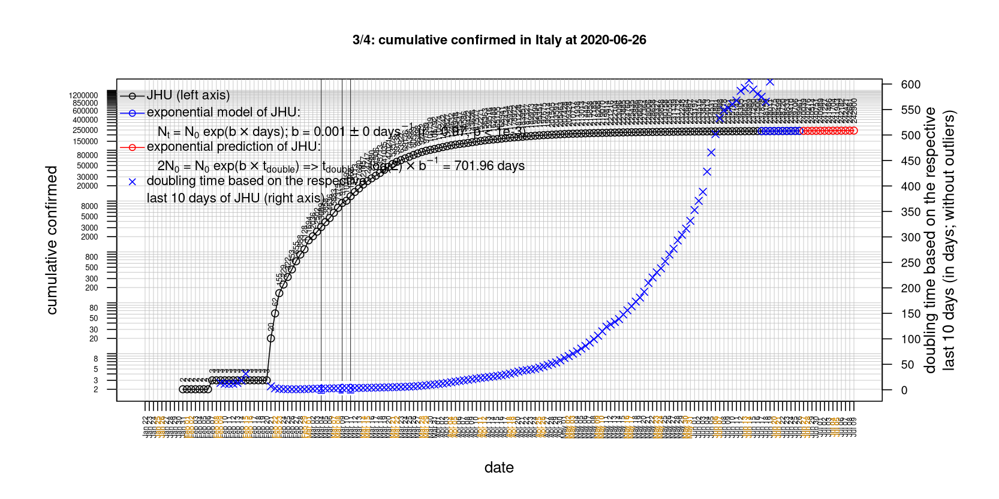

# International Covid-19 death predictions based on CSSEGISandData/COVID-19

  * upstream repo: https://github.com/CSSEGISandData/COVID-19  
  * time of last fetch of upstream repo: **2020-04-06 06:37:18 CET** (timestamp of file `.git/refs/remotes/upstream`)  
  * hash of last fetched commit of upstream repo: `865c933c0f33f8ccaf4fddc45a13abdbe87036ee` (`git rev-parse upstream/master`)  
  * last date of `COVID-19/csse_covid_19_data/time_series_covid19_*_global.csv` data: **2020-04-05**

# death rate evolution

# Select country

ordererd by time when cumulative number of deaths doubles (increasing)
country | cumulative number of deaths doubles in | period of estimation | rsq | p | cumulative deaths | cumulative confirmed
--- | --- | --- | --- | --- | --- | ---
[Russia](#Russia) | 2.31 days | 2020-03-27 to 2020-04-05 (10 days) | 0.95 | < 1e-3 | 45 | 5389
[Turkey](#Turkey) | 3.21 days | 2020-03-27 to 2020-04-05 (10 days) | 0.99 | < 1e-3 | 574 | 27069
[United Kingdom](#United-Kingdom) | 3.29 days | 2020-03-27 to 2020-04-05 (10 days) | 1 | < 1e-3 | 4943 | 48436
[Poland](#Poland) | 3.34 days | 2020-03-27 to 2020-04-05 (10 days) | 0.99 | < 1e-3 | 94 | 4102
[US](#US) | 3.39 days | 2020-03-27 to 2020-04-05 (10 days) | 1 | < 1e-3 | 9619 | 337072
[Romania](#Romania) | 3.47 days | 2020-03-27 to 2020-04-05 (10 days) | 0.95 | < 1e-3 | 151 | 3864
[Belgium](#Belgium) | 3.74 days | 2020-03-27 to 2020-04-05 (10 days) | 0.98 | < 1e-3 | 1447 | 19691
[Canada](#Canada) | 3.82 days | 2020-03-27 to 2020-04-05 (10 days) | 0.99 | < 1e-3 | 259 | 15756
[Sweden](#Sweden) | 3.9 days | 2020-03-27 to 2020-04-05 (10 days) | 0.96 | < 1e-3 | 401 | 6830
[Germany](#Germany) | 4.03 days | 2020-03-27 to 2020-04-05 (10 days) | 0.99 | < 1e-3 | 1584 | 100123
[France](#France) | 4.18 days | 2020-03-27 to 2020-04-05 (10 days) | 0.99 | < 1e-3 | 8093 | 93773
[Norway](#Norway) | 4.66 days | 2020-03-27 to 2020-04-05 (10 days) | 0.99 | < 1e-3 | 71 | 5687
[Portugal](#Portugal) | 4.76 days | 2020-03-27 to 2020-04-05 (10 days) | 0.98 | < 1e-3 | 295 | 11278
[Hungary](#Hungary) | 4.93 days | 2020-03-27 to 2020-04-05 (10 days) | 0.99 | < 1e-3 | 34 | 733
[Austria](#Austria) | 4.98 days | 2020-03-27 to 2020-04-05 (10 days) | 0.95 | < 1e-3 | 204 | 12051
[Denmark](#Denmark) | 5.13 days | 2020-03-27 to 2020-04-05 (10 days) | 0.99 | < 1e-3 | 179 | 4561
[Netherlands](#Netherlands) | 5.21 days | 2020-03-27 to 2020-04-05 (10 days) | 0.99 | < 1e-3 | 1771 | 17953
[Switzerland](#Switzerland) | 5.35 days | 2020-03-27 to 2020-04-05 (10 days) | 0.99 | < 1e-3 | 715 | 21100
[Australia](#Australia) | 6.29 days | 2020-03-27 to 2020-04-05 (10 days) | 0.98 | < 1e-3 | 35 | 5687
[Spain](#Spain) | 6.97 days | 2020-03-27 to 2020-04-05 (10 days) | 0.98 | < 1e-3 | 12641 | 131646
[Italy](#Italy) | 11.3 days | 2020-03-27 to 2020-04-05 (10 days) | 0.99 | < 1e-3 | 15887 | 128948
[Japan](#Japan) | 14.26 days | 2020-03-27 to 2020-04-05 (10 days) | 0.89 | < 1e-3 | 77 | 3139
[Iran](#Iran) | 15.22 days | 2020-03-27 to 2020-04-05 (10 days) | 1 | < 1e-3 | 3603 | 58226
[China](#China) | 534.67 days | 2020-03-27 to 2020-04-05 (10 days) | 0.99 | < 1e-3 | 3333 | 82602
[Nepal](#Nepal) | NA | NA | NA | NA | 0 | 9

# Australia
[top](#Select-country)

 

 

 

 
 

# Austria
[top](#Select-country)

 

 

 

 
 

# Belgium
[top](#Select-country)

 

 

 

 
 

# Canada
[top](#Select-country)

 

 

 

 
 

# China
[top](#Select-country)

 

 

 

 
 

# Denmark
[top](#Select-country)

 

 

 

 
 

# France
[top](#Select-country)

 

 

 

 
 

# Germany
[top](#Select-country)

 

 

 

 
 

# Hungary
[top](#Select-country)

 

 

 

 
 

# Iran
[top](#Select-country)

 

 

 

 
 

# Italy
[top](#Select-country)

national responses:
1. 2020-03-04: https://www.theguardian.com/world/2020/mar/04/italy-orders-closure-of-schools-and-universities-due-to-coronavirus
2. 2020-03-09: https://www.bbc.co.uk/sport/51808683
3. 2020-03-11: https://www.washingtonpost.com/world/europe/merkel-coronavirus-germany/2020/03/11/e276252a-6399-11ea-8a8e-5c5336b32760_story.html

 

 

 

 
 

# Japan
[top](#Select-country)

 

 

 

 
 

# Nepal
[top](#Select-country)

 

 

 

 
 

# Netherlands
[top](#Select-country)

 

 

 

 
 

# Norway
[top](#Select-country)

 

 

 

 
 

# Poland
[top](#Select-country)

 

 

 

 
 

# Portugal
[top](#Select-country)

 

 

 

 
 

# Romania
[top](#Select-country)

 

 

 

 
 

# Russia
[top](#Select-country)

 

 

 

 
 

# Spain
[top](#Select-country)

 

 

 

 
 

# Sweden
[top](#Select-country)

 

 

 

 
 

# Switzerland
[top](#Select-country)

 

 

 

 
 

# Turkey
[top](#Select-country)

 

 

 

 
 

# US
[top](#Select-country)

 

 

 

 
 

# United Kingdom
[top](#Select-country)

 

 

 

 
 

