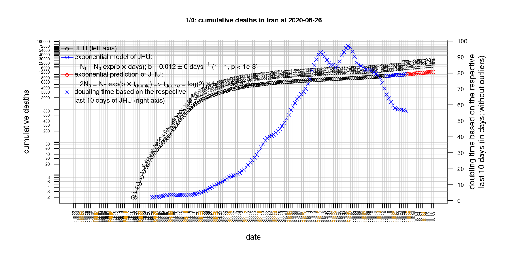
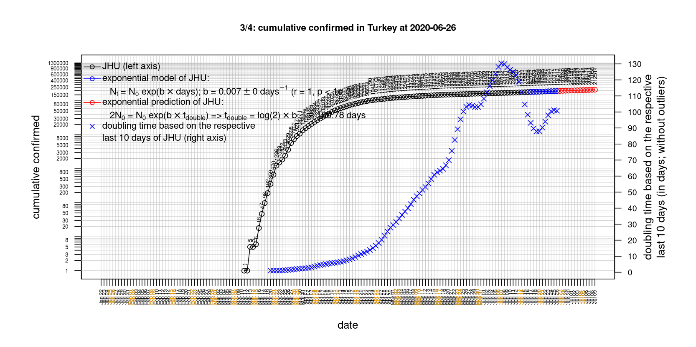

# International Covid-19 death predictions based on CSSEGISandData/COVID-19

  * upstream repo: https://github.com/CSSEGISandData/COVID-19  
  * time of last fetch of upstream repo: **2020-04-20 07:37:54 CET** (timestamp of file `.git/refs/remotes/upstream`)  
  * hash of last fetched commit of upstream repo: `708bf2159f9d6370b48c4192f8166dcb9523a929` (`git rev-parse upstream/master`)  
  * last date of `COVID-19/csse_covid_19_data/time_series_covid19_*_global.csv` data: **2020-04-19**

# death rate evolution

# Select country

ordererd by time when cumulative number of deaths doubles (increasing)
country | cumulative number of deaths doubles in | period of estimation | rsq | p | cumulative deaths | cumulative confirmed
--- | --- | --- | --- | --- | --- | ---
[Russia](#Russia) | 4.59 days | 2020-04-10 to 2020-04-19 (10 days) | 1 | < 1e-3 | 361 | 42853
[Canada](#Canada) | 5.91 days | 2020-04-10 to 2020-04-19 (10 days) | 0.99 | < 1e-3 | 1563 | 35632
[Japan](#Japan) | 6.56 days | 2020-04-10 to 2020-04-19 (10 days) | 0.98 | < 1e-3 | 236 | 10797
[Hungary](#Hungary) | 7.07 days | 2020-04-10 to 2020-04-19 (10 days) | 0.99 | < 1e-3 | 189 | 1916
[US](#US) | 7.54 days | 2020-04-10 to 2020-04-19 (10 days) | 0.99 | < 1e-3 | 40661 | 759086
[Turkey](#Turkey) | 8.95 days | 2020-04-10 to 2020-04-19 (10 days) | 1 | < 1e-3 | 2017 | 86306
[Poland](#Poland) | 9.23 days | 2020-04-10 to 2020-04-19 (10 days) | 0.98 | < 1e-3 | 360 | 9287
[Sweden](#Sweden) | 9.26 days | 2020-04-10 to 2020-04-19 (10 days) | 0.95 | < 1e-3 | 1540 | 14385
[Belgium](#Belgium) | 9.83 days | 2020-04-10 to 2020-04-19 (10 days) | 0.99 | < 1e-3 | 5683 | 38496
[Germany](#Germany) | 10.74 days | 2020-04-10 to 2020-04-19 (10 days) | 0.97 | < 1e-3 | 4586 | 145184
[United Kingdom](#United-Kingdom) | 10.76 days | 2020-04-10 to 2020-04-19 (10 days) | 0.99 | < 1e-3 | 16095 | 121172
[Romania](#Romania) | 12.59 days | 2020-04-10 to 2020-04-19 (10 days) | 0.99 | < 1e-3 | 451 | 8746
[Portugal](#Portugal) | 12.73 days | 2020-04-10 to 2020-04-19 (10 days) | 0.99 | < 1e-3 | 714 | 20206
[France](#France) | 14.51 days | 2020-04-10 to 2020-04-19 (10 days) | 0.99 | < 1e-3 | 19744 | 154097
[Netherlands](#Netherlands) | 15.61 days | 2020-04-10 to 2020-04-19 (10 days) | 0.99 | < 1e-3 | 3697 | 32838
[Norway](#Norway) | 15.77 days | 2020-04-10 to 2020-04-19 (10 days) | 0.97 | < 1e-3 | 165 | 7078
[China](#China) | 16.63 days | 2020-04-10 to 2020-04-19 (10 days) | 0.64 | 0.006 | 4636 | 83805
[Denmark](#Denmark) | 17.09 days | 2020-04-10 to 2020-04-19 (10 days) | 0.99 | < 1e-3 | 355 | 7580
[Austria](#Austria) | 17.76 days | 2020-04-10 to 2020-04-19 (10 days) | 0.99 | < 1e-3 | 452 | 14749
[Switzerland](#Switzerland) | 18.36 days | 2020-04-10 to 2020-04-19 (10 days) | 0.99 | < 1e-3 | 1393 | 27740
[Spain](#Spain) | 25.3 days | 2020-04-10 to 2020-04-19 (10 days) | 0.99 | < 1e-3 | 20453 | 198674
[Italy](#Italy) | 27.12 days | 2020-04-10 to 2020-04-19 (10 days) | 1 | < 1e-3 | 23660 | 178972
[Australia](#Australia) | 31.23 days | 2020-04-10 to 2020-04-19 (10 days) | 0.93 | < 1e-3 | 67 | 6547
[Iran](#Iran) | 33.33 days | 2020-04-10 to 2020-04-19 (10 days) | 0.99 | < 1e-3 | 5118 | 82211
[Nepal](#Nepal) | NA | NA | NA | NA | 0 | 31

# Australia
[top](#Select-country)

 

 

 

 
 

# Austria
[top](#Select-country)

 

 

 

 
 

# Belgium
[top](#Select-country)

 

 

 

 
 

# Canada
[top](#Select-country)

 

 

 

 
 

# China
[top](#Select-country)

 

 

 

 
 

# Denmark
[top](#Select-country)

 

 

 

 
 

# France
[top](#Select-country)

 

 

 

 
 

# Germany
[top](#Select-country)

 

 

 

 
 

# Hungary
[top](#Select-country)

 

 

 

 
 

# Iran
[top](#Select-country)

 

 

 

 
 

# Italy
[top](#Select-country)

national responses:
1. 2020-03-04: https://www.theguardian.com/world/2020/mar/04/italy-orders-closure-of-schools-and-universities-due-to-coronavirus
2. 2020-03-09: https://www.bbc.co.uk/sport/51808683
3. 2020-03-11: https://www.washingtonpost.com/world/europe/merkel-coronavirus-germany/2020/03/11/e276252a-6399-11ea-8a8e-5c5336b32760_story.html

 

 

 

 
 

# Japan
[top](#Select-country)

 

 

 

 
 

# Nepal
[top](#Select-country)

 

 

 

 
 

# Netherlands
[top](#Select-country)

 

 

 

 
 

# Norway
[top](#Select-country)

 

 

 

 
 

# Poland
[top](#Select-country)

 

 

 

 
 

# Portugal
[top](#Select-country)

 

 

 

 
 

# Romania
[top](#Select-country)

 

 

 

 
 

# Russia
[top](#Select-country)

 

 

 

 
 

# Spain
[top](#Select-country)

 

 

 

 
 

# Sweden
[top](#Select-country)

 

 

 

 
 

# Switzerland
[top](#Select-country)

 

 

 

 
 

# Turkey
[top](#Select-country)

 

 

 

 
 

# US
[top](#Select-country)

 

 

 

 
 

# United Kingdom
[top](#Select-country)

 

 

 

 
 

