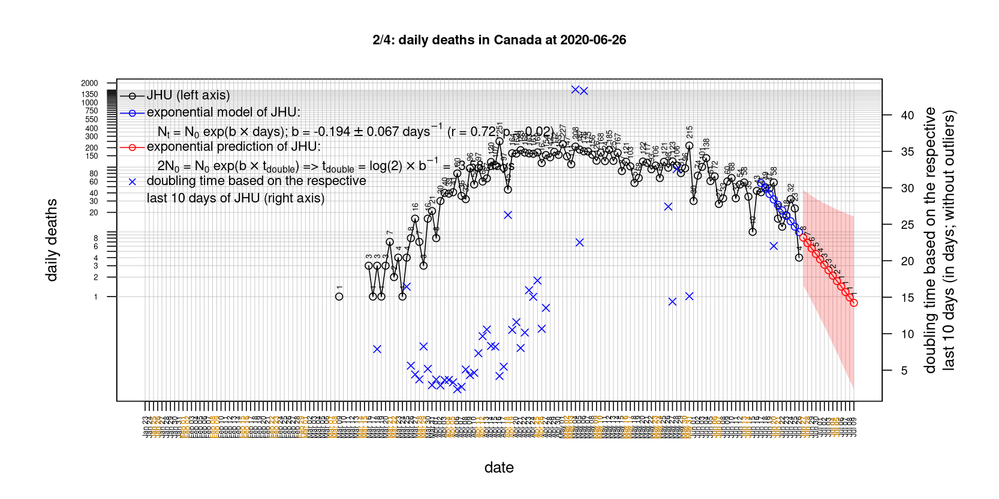
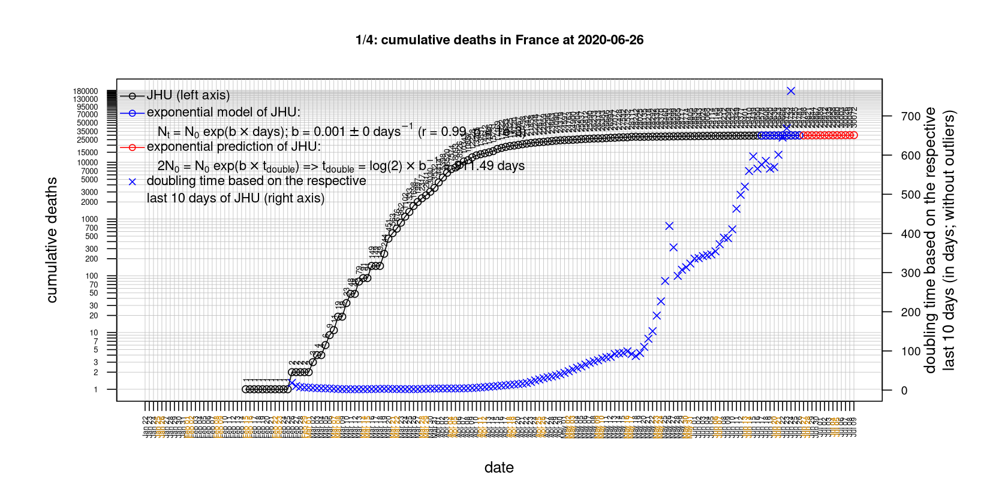
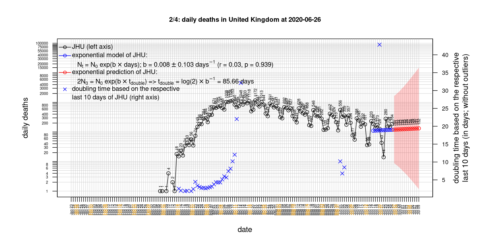

# International Covid-19 death predictions based on CSSEGISandData/COVID-19

  * upstream repo: https://github.com/CSSEGISandData/COVID-19  
  * time of last fetch of upstream repo: **2020-06-16 17:51:05 CET** (timestamp of file `.git/refs/remotes/upstream`)  
  * hash of last fetched commit of upstream repo: `299275df4e60160c24f1589c71be1adb5d7642b1` (`git rev-parse upstream/master`)  
  * last date of `COVID-19/csse_covid_19_data/time_series_covid19_*_global.csv` data: **2020-06-15**

# death rate evolution

# Select country

ordererd by time when cumulative number of deaths doubles (increasing)
country | cumulative number of deaths doubles in | period of estimation | rsq | p | cumulative deaths | cumulative confirmed
--- | --- | --- | --- | --- | --- | ---
[Australia](#Australia) | -4524459228844573 days | 2020-06-06 to 2020-06-15 (10 days) | 0.52 | 0.122 | 102 | 7347
[Nepal](#Nepal) | 15.2 days | 2020-06-06 to 2020-06-15 (10 days) | 0.94 | < 1e-3 | 19 | 6211
[Russia](#Russia) | 28.01 days | 2020-06-06 to 2020-06-15 (10 days) | 0.99 | < 1e-3 | 7081 | 536484
[Brazil](#Brazil) | 28.5 days | 2020-06-06 to 2020-06-15 (10 days) | 0.99 | < 1e-3 | 43959 | 888271
[Poland](#Poland) | 67.48 days | 2020-06-06 to 2020-06-15 (10 days) | 0.98 | < 1e-3 | 1256 | 29788
[Iran](#Iran) | 73.98 days | 2020-06-06 to 2020-06-15 (10 days) | 1 | < 1e-3 | 8950 | 189876
[Romania](#Romania) | 84.98 days | 2020-06-06 to 2020-06-15 (10 days) | 0.99 | < 1e-3 | 1427 | 22165
[US](#US) | 107.11 days | 2020-06-06 to 2020-06-15 (10 days) | 0.99 | < 1e-3 | 116127 | 2114026
[Sweden](#Sweden) | 110.29 days | 2020-06-06 to 2020-06-15 (10 days) | 0.95 | < 1e-3 | 4891 | 52383
[Canada](#Canada) | 120.2 days | 2020-06-06 to 2020-06-15 (10 days) | 0.99 | < 1e-3 | 8228 | 100763
[United Kingdom](#United-Kingdom) | 175.54 days | 2020-06-06 to 2020-06-15 (10 days) | 0.97 | < 1e-3 | 41821 | 298315
[Hungary](#Hungary) | 183.06 days | 2020-06-06 to 2020-06-15 (10 days) | 0.98 | < 1e-3 | 563 | 4076
[Turkey](#Turkey) | 195.49 days | 2020-06-06 to 2020-06-15 (10 days) | 1 | < 1e-3 | 4825 | 179831
[Portugal](#Portugal) | 198.92 days | 2020-06-06 to 2020-06-15 (10 days) | 0.99 | < 1e-3 | 1520 | 37036
[Norway](#Norway) | 301.81 days | 2020-06-06 to 2020-06-15 (10 days) | 0.83 | < 1e-3 | 242 | 8647
[Korea, South](#Korea,-South) | 342.34 days | 2020-06-06 to 2020-06-15 (10 days) | 0.87 | < 1e-3 | 278 | 12155
[Germany](#Germany) | 374.63 days | 2020-06-06 to 2020-06-15 (10 days) | 0.95 | < 1e-3 | 8807 | 187682
[Denmark](#Denmark) | 380.98 days | 2020-06-06 to 2020-06-15 (10 days) | 0.88 | < 1e-3 | 598 | 12417
[Italy](#Italy) | 385.38 days | 2020-06-06 to 2020-06-15 (10 days) | 0.99 | < 1e-3 | 34371 | 237290
[Japan](#Japan) | 434.04 days | 2020-06-06 to 2020-06-15 (10 days) | 0.97 | < 1e-3 | 929 | 17439
[France](#France) | 596.57 days | 2020-06-06 to 2020-06-15 (10 days) | 0.94 | < 1e-3 | 29439 | 194305
[Switzerland](#Switzerland) | 598.24 days | 2020-06-06 to 2020-06-15 (10 days) | 0.79 | < 1e-3 | 1939 | 31131
[Austria](#Austria) | 622.24 days | 2020-06-06 to 2020-06-15 (10 days) | 0.9 | < 1e-3 | 678 | 17135
[Netherlands](#Netherlands) | 640.76 days | 2020-06-06 to 2020-06-15 (10 days) | 0.96 | < 1e-3 | 6084 | 49155
[Belgium](#Belgium) | 755.42 days | 2020-06-06 to 2020-06-15 (10 days) | 0.97 | < 1e-3 | 9661 | 60100
[Spain](#Spain) | 344829.75 days | 2020-06-06 to 2020-06-15 (10 days) | 0.27 | 0.122 | 27136 | 244109
[China](#China) | 2262229614422286 days | 2020-06-06 to 2020-06-15 (10 days) | 0.52 | 0.122 | 4638 | 84378

# Australia
[top](#Select-country)

 

 

 

 
 

# Austria
[top](#Select-country)

 

 

 

 
 

# Belgium
[top](#Select-country)

 

 

 

 
 

# Brazil
[top](#Select-country)

 

 

 

 
 

# Canada
[top](#Select-country)

 

 

 

 
 

# China
[top](#Select-country)

 

 

 

 
 

# Denmark
[top](#Select-country)

 

 

 

 
 

# France
[top](#Select-country)

 

 

 

 
 

# Germany
[top](#Select-country)

 

 

 

 

 
 

# Hungary
[top](#Select-country)

 

 

 

 
 

# Iran
[top](#Select-country)

 

 

 

 
 

# Italy
[top](#Select-country)

national responses:
1. 2020-03-04: https://www.theguardian.com/world/2020/mar/04/italy-orders-closure-of-schools-and-universities-due-to-coronavirus
2. 2020-03-09: https://www.bbc.co.uk/sport/51808683
3. 2020-03-11: https://www.washingtonpost.com/world/europe/merkel-coronavirus-germany/2020/03/11/e276252a-6399-11ea-8a8e-5c5336b32760_story.html

 

 

 

 
 

# Japan
[top](#Select-country)

 

 

 

 
 

# Korea, South
[top](#Select-country)

 

 

 

 
 

# Nepal
[top](#Select-country)

 

 

 

 
 

# Netherlands
[top](#Select-country)

 

 

 

 
 

# Norway
[top](#Select-country)

 

 

 

 
 

# Poland
[top](#Select-country)

 

 

 

 
 

# Portugal
[top](#Select-country)

 

 

 

 
 

# Romania
[top](#Select-country)

 

 

 

 
 

# Russia
[top](#Select-country)

 

 

 

 
 

# Spain
[top](#Select-country)

 

 

 

 
 

# Sweden
[top](#Select-country)

 

 

 

 
 

# Switzerland
[top](#Select-country)

 

 

 

 
 

# Turkey
[top](#Select-country)

 

 

 

 
 

# US
[top](#Select-country)

 

 

 

 
 

# United Kingdom
[top](#Select-country)

 

 

 

 
 

