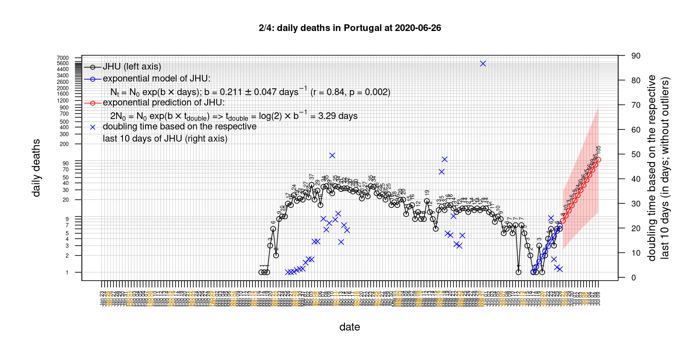
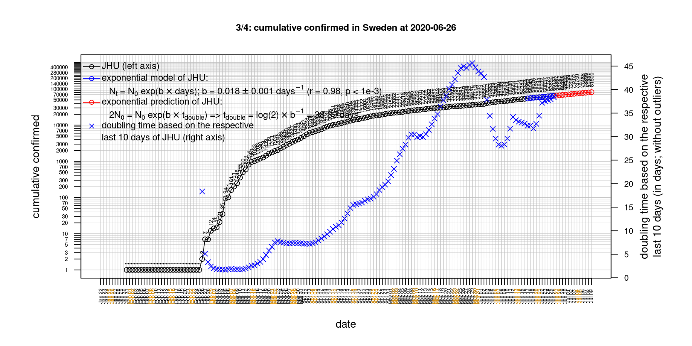

# International Covid-19 death predictions based on CSSEGISandData/COVID-19

  * upstream repo: https://github.com/CSSEGISandData/COVID-19  
  * time of last fetch of upstream repo: **2020-03-30 08:04:16 CET** (timestamp of file `.git/refs/remotes/upstream`)  
  * hash of last fetched commit of upstream repo: `a4ccce6f44b175d304ad18fb88fe479bc76b2584` (`git rev-parse upstream/master`)  
  * last date of `COVID-19/csse_covid_19_data/time_series_covid19_*_global.csv` data: **2020-03-29**

# death rate evolution

# Select country

ordererd by time when cumulative number of deaths doubles (increasing)
country | cumulative number of deaths doubles in | period of estimation | rsq | p | cumulative deaths | cumulative confirmed
--- | --- | --- | --- | --- | --- | ---
[Romania](#Romania) | 1.95 days | 2020-03-22 to 2020-03-29 (8 days) | 0.93 | < 1e-3 | 43 | 1815
[Portugal](#Portugal) | 2.14 days | 2020-03-20 to 2020-03-29 (10 days) | 0.98 | < 1e-3 | 119 | 5962
[Austria](#Austria) | 2.38 days | 2020-03-20 to 2020-03-29 (10 days) | 0.97 | < 1e-3 | 86 | 8788
[Belgium](#Belgium) | 2.62 days | 2020-03-20 to 2020-03-29 (10 days) | 0.99 | < 1e-3 | 431 | 10836
[US](#US) | 2.64 days | 2020-03-20 to 2020-03-29 (10 days) | 1 | < 1e-3 | 2467 | 140886
[Sweden](#Sweden) | 2.79 days | 2020-03-20 to 2020-03-29 (10 days) | 0.95 | < 1e-3 | 110 | 3700
[Russia](#Russia) | 2.88 days | 2020-03-20 to 2020-03-29 (10 days) | 0.85 | < 1e-3 | 8 | 1534
[Germany](#Germany) | 2.92 days | 2020-03-20 to 2020-03-29 (10 days) | 1 | < 1e-3 | 533 | 62095
[Denmark](#Denmark) | 2.96 days | 2020-03-20 to 2020-03-29 (10 days) | 0.97 | < 1e-3 | 72 | 2564
[Netherlands](#Netherlands) | 3.13 days | 2020-03-20 to 2020-03-29 (10 days) | 1 | < 1e-3 | 772 | 10930
[Spain](#Spain) | 3.3 days | 2020-03-20 to 2020-03-29 (10 days) | 0.99 | < 1e-3 | 6803 | 80110
[United Kingdom](#United-Kingdom) | 3.32 days | 2020-03-20 to 2020-03-29 (10 days) | 0.99 | < 1e-3 | 1231 | 19780
[France](#France) | 3.43 days | 2020-03-20 to 2020-03-29 (10 days) | 0.99 | < 1e-3 | 2611 | 40708
[Switzerland](#Switzerland) | 3.79 days | 2020-03-20 to 2020-03-29 (10 days) | 0.98 | < 1e-3 | 300 | 14829
[Canada](#Canada) | 3.9 days | 2020-03-20 to 2020-03-29 (10 days) | 0.97 | < 1e-3 | 64 | 6280
[Poland](#Poland) | 3.96 days | 2020-03-20 to 2020-03-29 (10 days) | 0.97 | < 1e-3 | 22 | 1862
[Norway](#Norway) | 4.41 days | 2020-03-20 to 2020-03-29 (10 days) | 0.96 | < 1e-3 | 25 | 4284
[Italy](#Italy) | 6.53 days | 2020-03-20 to 2020-03-29 (10 days) | 0.99 | < 1e-3 | 10779 | 97689
[Australia](#Australia) | 6.63 days | 2020-03-20 to 2020-03-29 (10 days) | 0.86 | < 1e-3 | 16 | 3984
[Iran](#Iran) | 10.13 days | 2020-03-20 to 2020-03-29 (10 days) | 1 | < 1e-3 | 2640 | 38309
[Japan](#Japan) | 13.49 days | 2020-03-20 to 2020-03-29 (10 days) | 0.95 | < 1e-3 | 54 | 1866
[China](#China) | 414.92 days | 2020-03-20 to 2020-03-29 (10 days) | 0.97 | < 1e-3 | 3304 | 82122
[Nepal](#Nepal) | NA | NA | NA | NA | 0 | 5

# Australia
[top](#Select-country)

 

 

 

 
 

# Austria
[top](#Select-country)

 

 

 

 
 

# Belgium
[top](#Select-country)

 

 

 

 
 

# Canada
[top](#Select-country)

 

 

 

 
 

# China
[top](#Select-country)

 

 

 

 
 

# Denmark
[top](#Select-country)

 

 

 

 
 

# France
[top](#Select-country)

 

 

 

 
 

# Germany
[top](#Select-country)

 

 

 

 
 

# Iran
[top](#Select-country)

 

 

 

 
 

# Italy
[top](#Select-country)

national responses:
1. 2020-03-04: https://www.theguardian.com/world/2020/mar/04/italy-orders-closure-of-schools-and-universities-due-to-coronavirus
2. 2020-03-09: https://www.bbc.co.uk/sport/51808683
3. 2020-03-11: https://www.washingtonpost.com/world/europe/merkel-coronavirus-germany/2020/03/11/e276252a-6399-11ea-8a8e-5c5336b32760_story.html

 

 

 

 
 

# Japan
[top](#Select-country)

 

 

 

 
 

# Nepal
[top](#Select-country)

 

 

 

 
 

# Netherlands
[top](#Select-country)

 

 

 

 
 

# Norway
[top](#Select-country)

 

 

 

 
 

# Poland
[top](#Select-country)

 

 

 

 
 

# Portugal
[top](#Select-country)

 

 

 

 
 

# Romania
[top](#Select-country)

 

 

 

 
 

# Russia
[top](#Select-country)

 

 

 

 
 

# Spain
[top](#Select-country)

 

 

 

 
 

# Sweden
[top](#Select-country)

 

 

 

 
 

# Switzerland
[top](#Select-country)

 

 

 

 
 

# US
[top](#Select-country)

 

 

 

 
 

# United Kingdom
[top](#Select-country)

 

 

 

 
 

