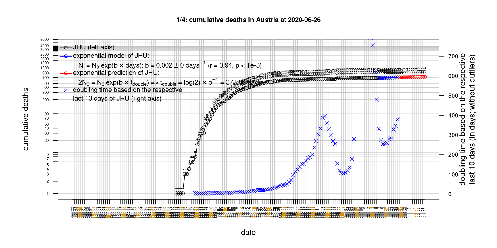
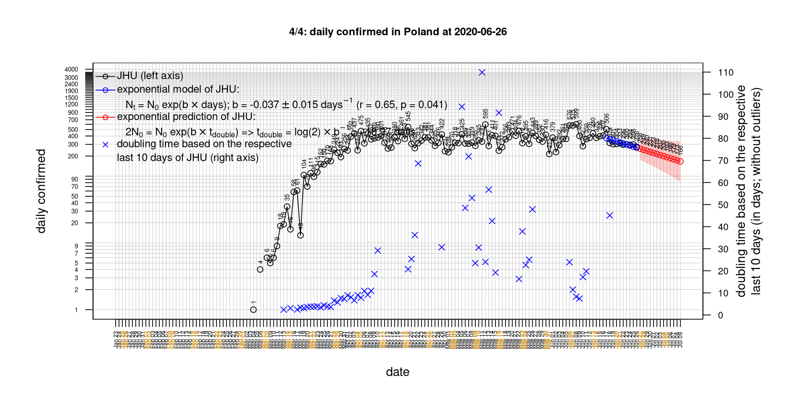
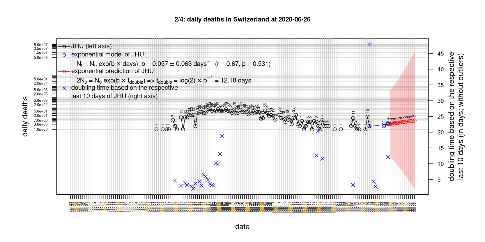

# International Covid-19 death predictions based on CSSEGISandData/COVID-19

  * upstream repo: https://github.com/CSSEGISandData/COVID-19  
  * time of last fetch of upstream repo: **2020-04-04 14:38:32 CET** (timestamp of file `.git/refs/remotes/upstream`)  
  * hash of last fetched commit of upstream repo: `817c2bd1f419d553c11a7d3e126827746b903dec` (`git rev-parse upstream/master`)  
  * last date of `COVID-19/csse_covid_19_data/time_series_covid19_*_global.csv` data: **2020-04-03**

# death rate evolution

# Select country

ordererd by time when cumulative number of deaths doubles (increasing)
country | cumulative number of deaths doubles in | period of estimation | rsq | p | cumulative deaths | cumulative confirmed
--- | --- | --- | --- | --- | --- | ---
[Russia](#Russia) | 2.23 days | 2020-03-25 to 2020-04-03 (10 days) | 0.96 | < 1e-3 | 34 | 4149
[Romania](#Romania) | 2.94 days | 2020-03-25 to 2020-04-03 (10 days) | 0.99 | < 1e-3 | 133 | 3183
[United Kingdom](#United-Kingdom) | 3.07 days | 2020-03-25 to 2020-04-03 (10 days) | 1 | < 1e-3 | 3611 | 38689
[US](#US) | 3.1 days | 2020-03-25 to 2020-04-03 (10 days) | 1 | < 1e-3 | 7087 | 275586
[Turkey](#Turkey) | 3.13 days | 2020-03-25 to 2020-04-03 (10 days) | 1 | < 1e-3 | 425 | 20921
[Belgium](#Belgium) | 3.27 days | 2020-03-25 to 2020-04-03 (10 days) | 1 | < 1e-3 | 1143 | 16770
[Germany](#Germany) | 3.44 days | 2020-03-25 to 2020-04-03 (10 days) | 0.99 | < 1e-3 | 1275 | 91159
[Sweden](#Sweden) | 3.63 days | 2020-03-25 to 2020-04-03 (10 days) | 0.97 | < 1e-3 | 358 | 6131
[Poland](#Poland) | 3.74 days | 2020-03-25 to 2020-04-03 (10 days) | 0.96 | < 1e-3 | 71 | 3383
[Portugal](#Portugal) | 3.75 days | 2020-03-25 to 2020-04-03 (10 days) | 0.97 | < 1e-3 | 246 | 9886
[Austria](#Austria) | 3.76 days | 2020-03-25 to 2020-04-03 (10 days) | 0.95 | < 1e-3 | 168 | 11524
[Canada](#Canada) | 3.76 days | 2020-03-25 to 2020-04-03 (10 days) | 0.98 | < 1e-3 | 179 | 12437
[Norway](#Norway) | 4.1 days | 2020-03-25 to 2020-04-03 (10 days) | 0.99 | < 1e-3 | 59 | 5370
[France](#France) | 4.19 days | 2020-03-25 to 2020-04-03 (10 days) | 0.99 | < 1e-3 | 6520 | 65202
[Netherlands](#Netherlands) | 4.38 days | 2020-03-25 to 2020-04-03 (10 days) | 0.99 | < 1e-3 | 1490 | 15821
[Denmark](#Denmark) | 4.6 days | 2020-03-25 to 2020-04-03 (10 days) | 0.98 | < 1e-3 | 139 | 3946
[Switzerland](#Switzerland) | 4.61 days | 2020-03-25 to 2020-04-03 (10 days) | 0.99 | < 1e-3 | 591 | 19606
[Spain](#Spain) | 5.63 days | 2020-03-25 to 2020-04-03 (10 days) | 0.98 | < 1e-3 | 11198 | 119199
[Australia](#Australia) | 6.17 days | 2020-03-25 to 2020-04-03 (10 days) | 0.92 | < 1e-3 | 28 | 5330
[Hungary](#Hungary) | 6.17 days | 2020-03-25 to 2020-04-03 (10 days) | 0.95 | < 1e-3 | 26 | 623
[Italy](#Italy) | 9.32 days | 2020-03-25 to 2020-04-03 (10 days) | 0.99 | < 1e-3 | 14681 | 119827
[Iran](#Iran) | 13.84 days | 2020-03-25 to 2020-04-03 (10 days) | 0.99 | < 1e-3 | 3294 | 53183
[Japan](#Japan) | 19.24 days | 2020-03-25 to 2020-04-03 (10 days) | 0.97 | < 1e-3 | 63 | 2617
[China](#China) | 525.11 days | 2020-03-25 to 2020-04-03 (10 days) | 0.99 | < 1e-3 | 3326 | 82511
[Nepal](#Nepal) | NA | NA | NA | NA | 0 | 6

# Australia
[top](#Select-country)

 

 

 

 
 

# Austria
[top](#Select-country)

 

 

 

 
 

# Belgium
[top](#Select-country)

 

 

 

 
 

# Canada
[top](#Select-country)

 

 

 

 
 

# China
[top](#Select-country)

 

 

 

 
 

# Denmark
[top](#Select-country)

 

 

 

 
 

# France
[top](#Select-country)

 

 

 

 
 

# Germany
[top](#Select-country)

 

 

 

 
 

# Hungary
[top](#Select-country)

 

 

 

 
 

# Iran
[top](#Select-country)

 

 

 

 
 

# Italy
[top](#Select-country)

national responses:
1. 2020-03-04: https://www.theguardian.com/world/2020/mar/04/italy-orders-closure-of-schools-and-universities-due-to-coronavirus
2. 2020-03-09: https://www.bbc.co.uk/sport/51808683
3. 2020-03-11: https://www.washingtonpost.com/world/europe/merkel-coronavirus-germany/2020/03/11/e276252a-6399-11ea-8a8e-5c5336b32760_story.html

 

 

 

 
 

# Japan
[top](#Select-country)

 

 

 

 
 

# Nepal
[top](#Select-country)

 

 

 

 
 

# Netherlands
[top](#Select-country)

 

 

 

 
 

# Norway
[top](#Select-country)

 

 

 

 
 

# Poland
[top](#Select-country)

 

 

 

 
 

# Portugal
[top](#Select-country)

 

 

 

 
 

# Romania
[top](#Select-country)

 

 

 

 
 

# Russia
[top](#Select-country)

 

 

 

 
 

# Spain
[top](#Select-country)

 

 

 

 
 

# Sweden
[top](#Select-country)

 

 

 

 
 

# Switzerland
[top](#Select-country)

 

 

 

 
 

# Turkey
[top](#Select-country)

 

 

 

 
 

# US
[top](#Select-country)

 

 

 

 
 

# United Kingdom
[top](#Select-country)

 

 

 

 
 

