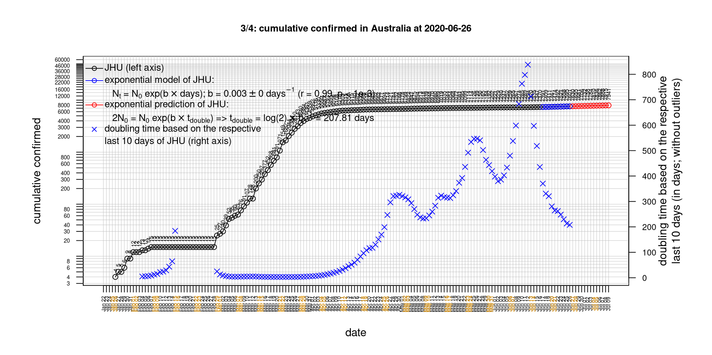
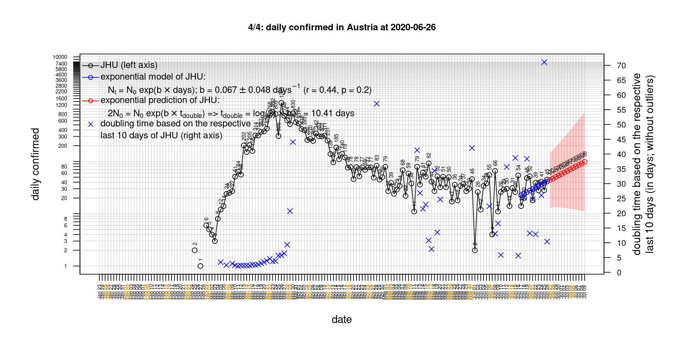
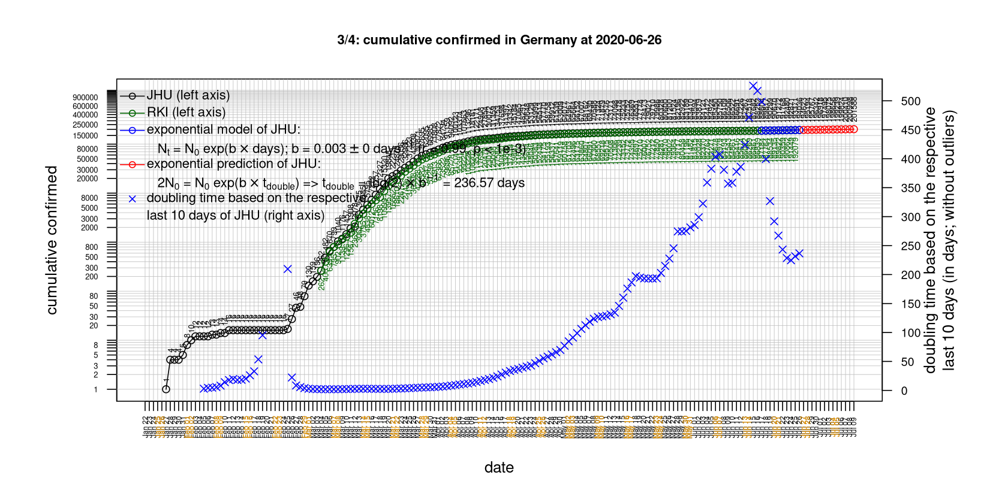
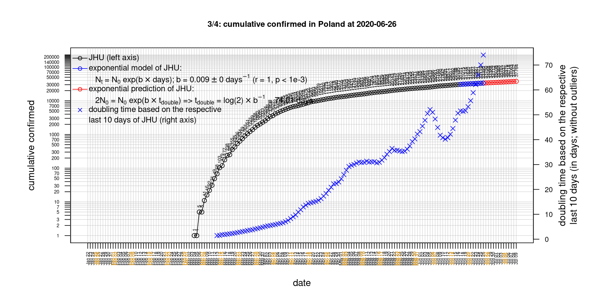

# International Covid-19 death predictions based on CSSEGISandData/COVID-19

  * upstream repo: https://github.com/CSSEGISandData/COVID-19  
  * time of last fetch of upstream repo: **2020-06-17 07:33:14 CET** (timestamp of file `.git/refs/remotes/upstream`)  
  * hash of last fetched commit of upstream repo: `e2feec895383e9d350d830df0294e5404f1791e1` (`git rev-parse upstream/master`)  
  * last date of `COVID-19/csse_covid_19_data/time_series_covid19_*_global.csv` data: **2020-06-16**

# death rate evolution

# Select country

ordererd by time when cumulative number of deaths doubles (increasing)
country | cumulative number of deaths doubles in | period of estimation | rsq | p | cumulative deaths | cumulative confirmed
--- | --- | --- | --- | --- | --- | ---
[Australia](#Australia) | -4524459228844573 days | 2020-06-07 to 2020-06-16 (10 days) | 0.52 | 0.122 | 102 | 7370
[Nepal](#Nepal) | 15.57 days | 2020-06-07 to 2020-06-16 (10 days) | 0.93 | < 1e-3 | 19 | 6591
[Russia](#Russia) | 28.45 days | 2020-06-07 to 2020-06-16 (10 days) | 0.99 | < 1e-3 | 7274 | 544725
[Brazil](#Brazil) | 28.8 days | 2020-06-07 to 2020-06-16 (10 days) | 0.98 | < 1e-3 | 45241 | 923189
[Poland](#Poland) | 66.55 days | 2020-06-07 to 2020-06-16 (10 days) | 0.98 | < 1e-3 | 1272 | 30195
[Iran](#Iran) | 70.41 days | 2020-06-07 to 2020-06-16 (10 days) | 0.99 | < 1e-3 | 9065 | 192439
[Romania](#Romania) | 81.32 days | 2020-06-07 to 2020-06-16 (10 days) | 0.99 | < 1e-3 | 1437 | 22415
[US](#US) | 108.55 days | 2020-06-07 to 2020-06-16 (10 days) | 0.98 | < 1e-3 | 116963 | 2137731
[Sweden](#Sweden) | 110.6 days | 2020-06-07 to 2020-06-16 (10 days) | 0.95 | < 1e-3 | 4939 | 53323
[Canada](#Canada) | 123.15 days | 2020-06-07 to 2020-06-16 (10 days) | 0.98 | < 1e-3 | 8271 | 101087
[Hungary](#Hungary) | 175.5 days | 2020-06-07 to 2020-06-16 (10 days) | 0.98 | < 1e-3 | 565 | 4077
[United Kingdom](#United-Kingdom) | 176.84 days | 2020-06-07 to 2020-06-16 (10 days) | 0.97 | < 1e-3 | 42054 | 299600
[Turkey](#Turkey) | 202.61 days | 2020-06-07 to 2020-06-16 (10 days) | 1 | < 1e-3 | 4842 | 181298
[Portugal](#Portugal) | 213.91 days | 2020-06-07 to 2020-06-16 (10 days) | 0.98 | < 1e-3 | 1522 | 37336
[Norway](#Norway) | 339.26 days | 2020-06-07 to 2020-06-16 (10 days) | 0.76 | < 1e-3 | 242 | 8660
[Korea, South](#Korea,-South) | 350.78 days | 2020-06-07 to 2020-06-16 (10 days) | 0.86 | < 1e-3 | 279 | 12198
[Japan](#Japan) | 394.71 days | 2020-06-07 to 2020-06-16 (10 days) | 0.94 | < 1e-3 | 934 | 17484
[Germany](#Germany) | 407.37 days | 2020-06-07 to 2020-06-16 (10 days) | 0.94 | < 1e-3 | 8820 | 188252
[Italy](#Italy) | 410.03 days | 2020-06-07 to 2020-06-16 (10 days) | 0.98 | < 1e-3 | 34405 | 237500
[Denmark](#Denmark) | 456.16 days | 2020-06-07 to 2020-06-16 (10 days) | 0.88 | < 1e-3 | 598 | 12450
[Austria](#Austria) | 479.97 days | 2020-06-07 to 2020-06-16 (10 days) | 0.93 | < 1e-3 | 681 | 17189
[Switzerland](#Switzerland) | 507.77 days | 2020-06-07 to 2020-06-16 (10 days) | 0.78 | < 1e-3 | 1954 | 31154
[France](#France) | 565.32 days | 2020-06-07 to 2020-06-16 (10 days) | 0.94 | < 1e-3 | 29550 | 194347
[Netherlands](#Netherlands) | 660.18 days | 2020-06-07 to 2020-06-16 (10 days) | 0.95 | < 1e-3 | 6089 | 49295
[Belgium](#Belgium) | 881.3 days | 2020-06-07 to 2020-06-16 (10 days) | 0.96 | < 1e-3 | 9663 | 60155
[China](#China) | 2262229614422286 days | 2020-06-07 to 2020-06-16 (10 days) | 0.52 | 0.122 | 4638 | 84422
[Spain](#Spain) | NA | NA | NA | NA | 27136 | 244328

# Australia
[top](#Select-country)

 

 

 

 
 

# Austria
[top](#Select-country)

 

 

 

 
 

# Belgium
[top](#Select-country)

 

 

 

 
 

# Brazil
[top](#Select-country)

 

 

 

 
 

# Canada
[top](#Select-country)

 

 

 

 
 

# China
[top](#Select-country)

 

 

 

 
 

# Denmark
[top](#Select-country)

 

 

 

 
 

# France
[top](#Select-country)

 

 

 

 
 

# Germany
[top](#Select-country)

 

 

 

 

 
 

# Hungary
[top](#Select-country)

 

 

 

 
 

# Iran
[top](#Select-country)

 

 

 

 
 

# Italy
[top](#Select-country)

national responses:
1. 2020-03-04: https://www.theguardian.com/world/2020/mar/04/italy-orders-closure-of-schools-and-universities-due-to-coronavirus
2. 2020-03-09: https://www.bbc.co.uk/sport/51808683
3. 2020-03-11: https://www.washingtonpost.com/world/europe/merkel-coronavirus-germany/2020/03/11/e276252a-6399-11ea-8a8e-5c5336b32760_story.html

 

 

 

 
 

# Japan
[top](#Select-country)

 

 

 

 
 

# Korea, South
[top](#Select-country)

 

 

 

 
 

# Nepal
[top](#Select-country)

 

 

 

 
 

# Netherlands
[top](#Select-country)

 

 

 

 
 

# Norway
[top](#Select-country)

 

 

 

 
 

# Poland
[top](#Select-country)

 

 

 

 
 

# Portugal
[top](#Select-country)

 

 

 

 
 

# Romania
[top](#Select-country)

 

 

 

 
 

# Russia
[top](#Select-country)

 

 

 

 
 

# Spain
[top](#Select-country)

 

 

 

 
 

# Sweden
[top](#Select-country)

 

 

 

 
 

# Switzerland
[top](#Select-country)

 

 

 

 
 

# Turkey
[top](#Select-country)

 

 

 

 
 

# US
[top](#Select-country)

 

 

 

 
 

# United Kingdom
[top](#Select-country)

 

 

 

 
 

