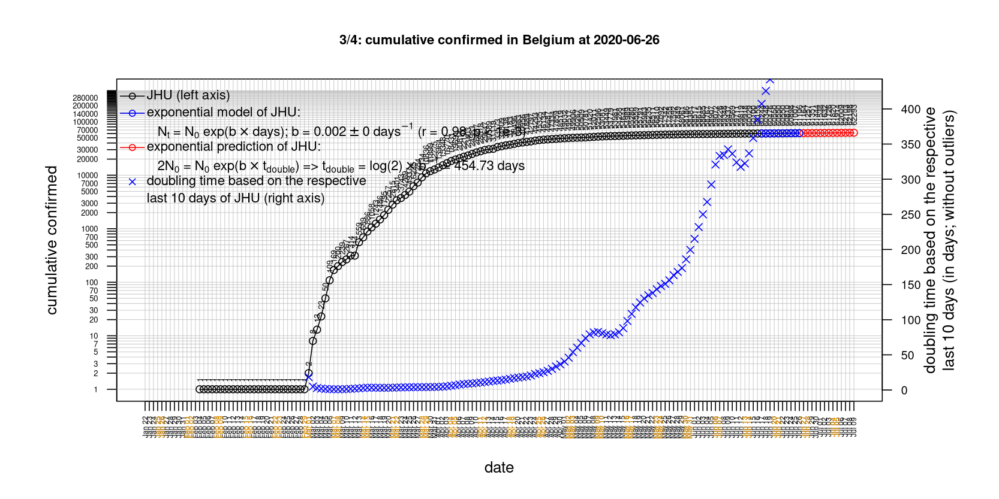
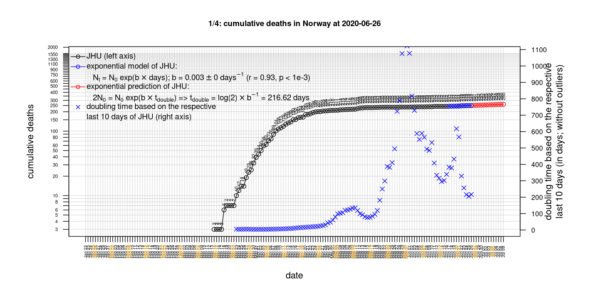
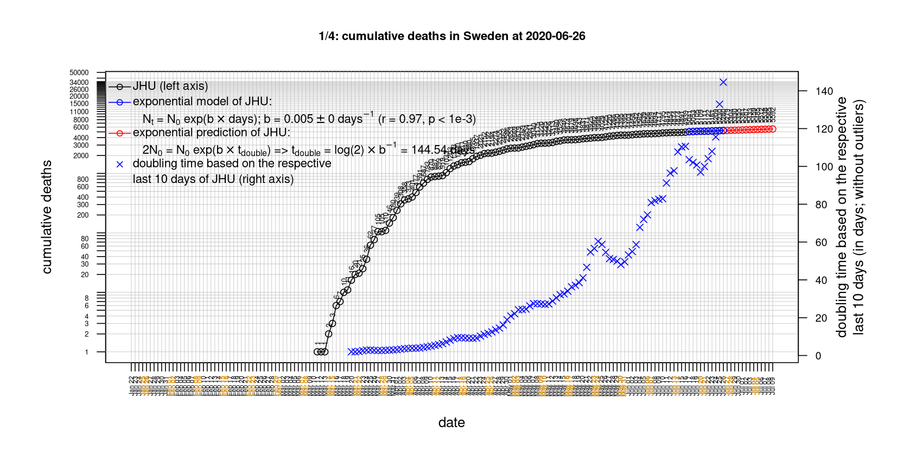

# International Covid-19 death predictions based on CSSEGISandData/COVID-19

  * upstream repo: https://github.com/CSSEGISandData/COVID-19  
  * time of last fetch of upstream repo: **2020-04-28 07:15:00 CET** (timestamp of file `.git/refs/remotes/upstream`)  
  * hash of last fetched commit of upstream repo: `bda67e3db0e8dca4540297633d431a8021c035c8` (`git rev-parse upstream/master`)  
  * last date of `COVID-19/csse_covid_19_data/time_series_covid19_*_global.csv` data: **2020-04-27**

# death rate evolution

# Select country

ordererd by time when cumulative number of deaths doubles (increasing)
country | cumulative number of deaths doubles in | period of estimation | rsq | p | cumulative deaths | cumulative confirmed
--- | --- | --- | --- | --- | --- | ---
[Russia](#Russia) | 6.71 days | 2020-04-18 to 2020-04-27 (10 days) | 0.99 | < 1e-3 | 794 | 87147
[Canada](#Canada) | 8.87 days | 2020-04-18 to 2020-04-27 (10 days) | 0.98 | < 1e-3 | 2841 | 49616
[Japan](#Japan) | 10.19 days | 2020-04-18 to 2020-04-27 (10 days) | 0.96 | < 1e-3 | 385 | 14153
[Poland](#Poland) | 12.16 days | 2020-04-18 to 2020-04-27 (10 days) | 0.99 | < 1e-3 | 562 | 11902
[Hungary](#Hungary) | 12.72 days | 2020-04-18 to 2020-04-27 (10 days) | 0.97 | < 1e-3 | 280 | 2583
[Sweden](#Sweden) | 13.57 days | 2020-04-18 to 2020-04-27 (10 days) | 0.94 | < 1e-3 | 2274 | 18926
[Turkey](#Turkey) | 14.66 days | 2020-04-18 to 2020-04-27 (10 days) | 0.99 | < 1e-3 | 2900 | 112261
[Romania](#Romania) | 15.1 days | 2020-04-18 to 2020-04-27 (10 days) | 0.99 | < 1e-3 | 641 | 11339
[US](#US) | 15.81 days | 2020-04-18 to 2020-04-27 (10 days) | 0.98 | < 1e-3 | 56259 | 988197
[Germany](#Germany) | 18.69 days | 2020-04-18 to 2020-04-27 (10 days) | 0.98 | < 1e-3 | 6126 | 158758
[United Kingdom](#United-Kingdom) | 18.98 days | 2020-04-18 to 2020-04-27 (10 days) | 0.99 | < 1e-3 | 21157 | 158348
[Portugal](#Portugal) | 20.29 days | 2020-04-18 to 2020-04-27 (10 days) | 1 | < 1e-3 | 928 | 24027
[Belgium](#Belgium) | 21.67 days | 2020-04-18 to 2020-04-27 (10 days) | 0.99 | < 1e-3 | 7207 | 46687
[Australia](#Australia) | 23.25 days | 2020-04-18 to 2020-04-27 (10 days) | 0.86 | < 1e-3 | 83 | 6721
[Netherlands](#Netherlands) | 25.32 days | 2020-04-18 to 2020-04-27 (10 days) | 0.98 | < 1e-3 | 4534 | 38440
[Norway](#Norway) | 27.11 days | 2020-04-18 to 2020-04-27 (10 days) | 0.92 | < 1e-3 | 205 | 7599
[Austria](#Austria) | 27.82 days | 2020-04-18 to 2020-04-27 (10 days) | 0.94 | < 1e-3 | 549 | 15274
[Denmark](#Denmark) | 28.05 days | 2020-04-18 to 2020-04-27 (10 days) | 0.99 | < 1e-3 | 427 | 8896
[Switzerland](#Switzerland) | 31.88 days | 2020-04-18 to 2020-04-27 (10 days) | 0.98 | < 1e-3 | 1665 | 29164
[France](#France) | 32.73 days | 2020-04-18 to 2020-04-27 (10 days) | 0.99 | < 1e-3 | 23327 | 165963
[Spain](#Spain) | 38.4 days | 2020-04-18 to 2020-04-27 (10 days) | 0.99 | < 1e-3 | 23521 | 229422
[Italy](#Italy) | 40.8 days | 2020-04-18 to 2020-04-27 (10 days) | 0.99 | < 1e-3 | 26977 | 199414
[Iran](#Iran) | 43.46 days | 2020-04-18 to 2020-04-27 (10 days) | 1 | < 1e-3 | 5806 | 91472
[China](#China) | 33142.07 days | 2020-04-18 to 2020-04-27 (10 days) | 0.48 | 0.025 | 4637 | 83918
[Nepal](#Nepal) | NA | NA | NA | NA | 0 | 52

# Australia
[top](#Select-country)

 

 

 

 
 

# Austria
[top](#Select-country)

 

 

 

 
 

# Belgium
[top](#Select-country)

 

 

 

 
 

# Canada
[top](#Select-country)

 

 

 

 
 

# China
[top](#Select-country)

 

 

 

 
 

# Denmark
[top](#Select-country)

 

 

 

 
 

# France
[top](#Select-country)

 

 

 

 
 

# Germany
[top](#Select-country)

 

 

 

 
 

# Hungary
[top](#Select-country)

 

 

 

 
 

# Iran
[top](#Select-country)

 

 

 

 
 

# Italy
[top](#Select-country)

national responses:
1. 2020-03-04: https://www.theguardian.com/world/2020/mar/04/italy-orders-closure-of-schools-and-universities-due-to-coronavirus
2. 2020-03-09: https://www.bbc.co.uk/sport/51808683
3. 2020-03-11: https://www.washingtonpost.com/world/europe/merkel-coronavirus-germany/2020/03/11/e276252a-6399-11ea-8a8e-5c5336b32760_story.html

 

 

 

 
 

# Japan
[top](#Select-country)

 

 

 

 
 

# Nepal
[top](#Select-country)

 

 

 

 
 

# Netherlands
[top](#Select-country)

 

 

 

 
 

# Norway
[top](#Select-country)

 

 

 

 
 

# Poland
[top](#Select-country)

 

 

 

 
 

# Portugal
[top](#Select-country)

 

 

 

 
 

# Romania
[top](#Select-country)

 

 

 

 
 

# Russia
[top](#Select-country)

 

 

 

 
 

# Spain
[top](#Select-country)

 

 

 

 
 

# Sweden
[top](#Select-country)

 

 

 

 
 

# Switzerland
[top](#Select-country)

 

 

 

 
 

# Turkey
[top](#Select-country)

 

 

 

 
 

# US
[top](#Select-country)

 

 

 

 
 

# United Kingdom
[top](#Select-country)

 

 

 

 
 

