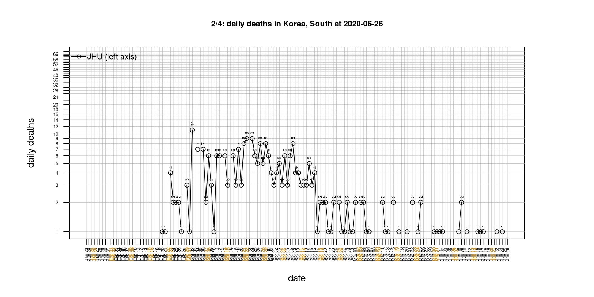

# International Covid-19 death predictions based on CSSEGISandData/COVID-19

  * upstream repo: https://github.com/CSSEGISandData/COVID-19  
  * time of last fetch of upstream repo: **2020-05-20 07:35:59 CET** (timestamp of file `.git/refs/remotes/upstream`)  
  * hash of last fetched commit of upstream repo: `1b3fbc5c112ab3fb0ec8cd3ea5f54610df800782` (`git rev-parse upstream/master`)  
  * last date of `COVID-19/csse_covid_19_data/time_series_covid19_*_global.csv` data: **2020-05-19**

# death rate evolution

# Select country

ordererd by time when cumulative number of deaths doubles (increasing)
country | cumulative number of deaths doubles in | period of estimation | rsq | p | cumulative deaths | cumulative confirmed
--- | --- | --- | --- | --- | --- | ---
[Brazil](#Brazil) | 13.05 days | 2020-05-10 to 2020-05-19 (10 days) | 0.99 | < 1e-3 | 17983 | 271885
[Russia](#Russia) | 15.86 days | 2020-05-10 to 2020-05-19 (10 days) | 1 | < 1e-3 | 2837 | 299941
[Japan](#Japan) | 29.38 days | 2020-05-10 to 2020-05-19 (10 days) | 0.98 | < 1e-3 | 768 | 16367
[Canada](#Canada) | 32.45 days | 2020-05-10 to 2020-05-19 (10 days) | 0.97 | < 1e-3 | 6028 | 80493
[Poland](#Poland) | 35.43 days | 2020-05-10 to 2020-05-19 (10 days) | 0.96 | < 1e-3 | 948 | 19268
[Romania](#Romania) | 36.75 days | 2020-05-10 to 2020-05-19 (10 days) | 0.98 | < 1e-3 | 1137 | 17191
[Sweden](#Sweden) | 38.53 days | 2020-05-10 to 2020-05-19 (10 days) | 0.92 | < 1e-3 | 3743 | 30799
[US](#US) | 42.44 days | 2020-05-10 to 2020-05-19 (10 days) | 0.98 | < 1e-3 | 91921 | 1528568
[Hungary](#Hungary) | 52.22 days | 2020-05-10 to 2020-05-19 (10 days) | 0.99 | < 1e-3 | 467 | 3556
[Turkey](#Turkey) | 59.13 days | 2020-05-10 to 2020-05-19 (10 days) | 0.99 | < 1e-3 | 4199 | 151615
[United Kingdom](#United-Kingdom) | 59.59 days | 2020-05-10 to 2020-05-19 (10 days) | 0.98 | < 1e-3 | 35422 | 250138
[Portugal](#Portugal) | 68.62 days | 2020-05-10 to 2020-05-19 (10 days) | 0.99 | < 1e-3 | 1247 | 29432
[Iran](#Iran) | 90.33 days | 2020-05-10 to 2020-05-19 (10 days) | 1 | < 1e-3 | 7119 | 124603
[France](#France) | 94.75 days | 2020-05-10 to 2020-05-19 (10 days) | 0.94 | < 1e-3 | 28025 | 180933
[Germany](#Germany) | 107.05 days | 2020-05-10 to 2020-05-19 (10 days) | 0.93 | < 1e-3 | 8081 | 177778
[Belgium](#Belgium) | 117.2 days | 2020-05-10 to 2020-05-19 (10 days) | 0.98 | < 1e-3 | 9108 | 55791
[Italy](#Italy) | 117.44 days | 2020-05-10 to 2020-05-19 (10 days) | 0.99 | < 1e-3 | 32169 | 226699
[Norway](#Norway) | 119.2 days | 2020-05-10 to 2020-05-19 (10 days) | 0.74 | 0.001 | 233 | 8267
[Netherlands](#Netherlands) | 119.32 days | 2020-05-10 to 2020-05-19 (10 days) | 0.96 | < 1e-3 | 5734 | 44449
[Spain](#Spain) | 142.17 days | 2020-05-10 to 2020-05-19 (10 days) | 0.96 | < 1e-3 | 27778 | 232037
[Denmark](#Denmark) | 142.43 days | 2020-05-10 to 2020-05-19 (10 days) | 0.91 | < 1e-3 | 551 | 11242
[Switzerland](#Switzerland) | 233.8 days | 2020-05-10 to 2020-05-19 (10 days) | 0.85 | < 1e-3 | 1891 | 30618
[Korea, South](#Korea,-South) | 236.09 days | 2020-05-10 to 2020-05-19 (10 days) | 0.92 | < 1e-3 | 263 | 11110
[Australia](#Australia) | 244.51 days | 2020-05-10 to 2020-05-19 (10 days) | 0.84 | < 1e-3 | 100 | 7072
[Austria](#Austria) | 302.93 days | 2020-05-10 to 2020-05-19 (10 days) | 0.94 | < 1e-3 | 632 | 16321
[China](#China) | 22099.48 days | 2020-05-10 to 2020-05-19 (10 days) | 0.73 | 0.002 | 4638 | 84063
[Nepal](#Nepal) | NA | NA | NA | NA | 2 | 402

# Australia
[top](#Select-country)

 

 

 

 
 

# Austria
[top](#Select-country)

 

 

 

 
 

# Belgium
[top](#Select-country)

 

 

 

 
 

# Brazil
[top](#Select-country)

 

 

 

 
 

# Canada
[top](#Select-country)

 

 

 

 
 

# China
[top](#Select-country)

 

 

 

 
 

# Denmark
[top](#Select-country)

 

 

 

 
 

# France
[top](#Select-country)

 

 

 

 
 

# Germany
[top](#Select-country)

 

 

 

 

 
 

# Hungary
[top](#Select-country)

 

 

 

 
 

# Iran
[top](#Select-country)

 

 

 

 
 

# Italy
[top](#Select-country)

national responses:
1. 2020-03-04: https://www.theguardian.com/world/2020/mar/04/italy-orders-closure-of-schools-and-universities-due-to-coronavirus
2. 2020-03-09: https://www.bbc.co.uk/sport/51808683
3. 2020-03-11: https://www.washingtonpost.com/world/europe/merkel-coronavirus-germany/2020/03/11/e276252a-6399-11ea-8a8e-5c5336b32760_story.html

 

 

 

 
 

# Japan
[top](#Select-country)

 

 

 

 
 

# Korea, South
[top](#Select-country)

 

 

 

 
 

# Nepal
[top](#Select-country)

 

 

 

 
 

# Netherlands
[top](#Select-country)

 

 

 

 
 

# Norway
[top](#Select-country)

 

 

 

 
 

# Poland
[top](#Select-country)

 

 

 

 
 

# Portugal
[top](#Select-country)

 

 

 

 
 

# Romania
[top](#Select-country)

 

 

 

 
 

# Russia
[top](#Select-country)

 

 

 

 
 

# Spain
[top](#Select-country)

 

 

 

 
 

# Sweden
[top](#Select-country)

 

 

 

 
 

# Switzerland
[top](#Select-country)

 

 

 

 
 

# Turkey
[top](#Select-country)

 

 

 

 
 

# US
[top](#Select-country)

 

 

 

 
 

# United Kingdom
[top](#Select-country)

 

 

 

 
 

