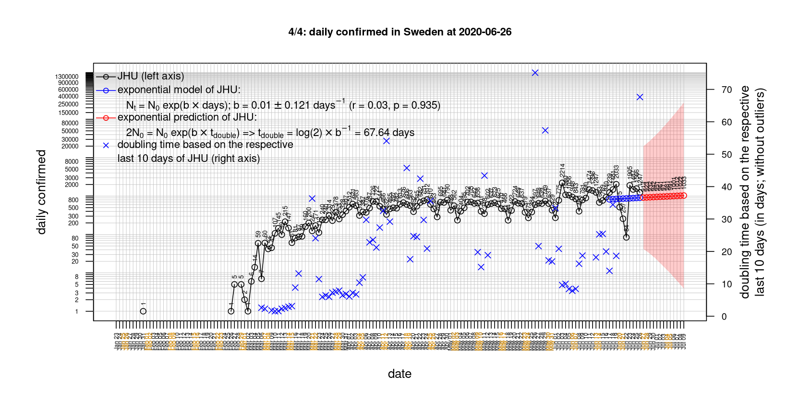

# International Covid-19 death predictions based on CSSEGISandData/COVID-19

  * upstream repo: https://github.com/CSSEGISandData/COVID-19  
  * time of last fetch of upstream repo: **2020-04-11 20:01:41 CET** (timestamp of file `.git/refs/remotes/upstream`)  
  * hash of last fetched commit of upstream repo: `6e3f6284d4add1e2eba68609c1e763c99f95112f` (`git rev-parse upstream/master`)  
  * last date of `COVID-19/csse_covid_19_data/time_series_covid19_*_global.csv` data: **2020-04-10**

# death rate evolution

# Select country

ordererd by time when cumulative number of deaths doubles (increasing)
country | cumulative number of deaths doubles in | period of estimation | rsq | p | cumulative deaths | cumulative confirmed
--- | --- | --- | --- | --- | --- | ---
[Canada](#Canada) | 3.85 days | 2020-04-01 to 2020-04-10 (10 days) | 0.98 | < 1e-3 | 557 | 22059
[Poland](#Poland) | 4.34 days | 2020-04-01 to 2020-04-10 (10 days) | 0.98 | < 1e-3 | 181 | 5955
[Hungary](#Hungary) | 4.5 days | 2020-04-01 to 2020-04-10 (10 days) | 0.99 | < 1e-3 | 77 | 1190
[US](#US) | 4.68 days | 2020-04-01 to 2020-04-10 (10 days) | 0.99 | < 1e-3 | 18586 | 496535
[United Kingdom](#United-Kingdom) | 4.84 days | 2020-04-01 to 2020-04-10 (10 days) | 0.98 | < 1e-3 | 8974 | 74605
[Sweden](#Sweden) | 4.96 days | 2020-04-01 to 2020-04-10 (10 days) | 0.98 | < 1e-3 | 870 | 9685
[Belgium](#Belgium) | 4.99 days | 2020-04-01 to 2020-04-10 (10 days) | 1 | < 1e-3 | 3019 | 26667
[Russia](#Russia) | 5.01 days | 2020-04-01 to 2020-04-10 (10 days) | 0.98 | < 1e-3 | 94 | 11917
[Turkey](#Turkey) | 5.05 days | 2020-04-01 to 2020-04-10 (10 days) | 0.98 | < 1e-3 | 1006 | 47029
[Germany](#Germany) | 5.69 days | 2020-04-01 to 2020-04-10 (10 days) | 0.99 | < 1e-3 | 2767 | 122171
[France](#France) | 5.72 days | 2020-04-01 to 2020-04-10 (10 days) | 0.96 | < 1e-3 | 13215 | 125931
[Romania](#Romania) | 6.14 days | 2020-04-01 to 2020-04-10 (10 days) | 0.99 | < 1e-3 | 270 | 5467
[Australia](#Australia) | 6.19 days | 2020-04-01 to 2020-04-10 (10 days) | 0.97 | < 1e-3 | 54 | 6215
[Norway](#Norway) | 6.45 days | 2020-04-01 to 2020-04-10 (10 days) | 0.99 | < 1e-3 | 113 | 6314
[Denmark](#Denmark) | 7.44 days | 2020-04-01 to 2020-04-10 (10 days) | 0.97 | < 1e-3 | 247 | 6014
[Portugal](#Portugal) | 7.47 days | 2020-04-01 to 2020-04-10 (10 days) | 0.99 | < 1e-3 | 435 | 15472
[Austria](#Austria) | 7.77 days | 2020-04-01 to 2020-04-10 (10 days) | 1 | < 1e-3 | 319 | 13555
[Netherlands](#Netherlands) | 8.29 days | 2020-04-01 to 2020-04-10 (10 days) | 0.99 | < 1e-3 | 2520 | 23249
[Switzerland](#Switzerland) | 8.64 days | 2020-04-01 to 2020-04-10 (10 days) | 0.99 | < 1e-3 | 1002 | 24551
[Japan](#Japan) | 10.93 days | 2020-04-01 to 2020-04-10 (10 days) | 0.94 | < 1e-3 | 99 | 5530
[Spain](#Spain) | 11.94 days | 2020-04-01 to 2020-04-10 (10 days) | 0.98 | < 1e-3 | 16081 | 158273
[Italy](#Italy) | 17.76 days | 2020-04-01 to 2020-04-10 (10 days) | 0.99 | < 1e-3 | 18849 | 147577
[Iran](#Iran) | 18.53 days | 2020-04-01 to 2020-04-10 (10 days) | 0.99 | < 1e-3 | 4232 | 68192
[China](#China) | 935.58 days | 2020-04-01 to 2020-04-10 (10 days) | 0.92 | < 1e-3 | 3340 | 82941
[Nepal](#Nepal) | NA | NA | NA | NA | 0 | 9

# Australia
[top](#Select-country)

 

 

 

 
 

# Austria
[top](#Select-country)

 

 

 

 
 

# Belgium
[top](#Select-country)

 

 

 

 
 

# Canada
[top](#Select-country)

 

 

 

 
 

# China
[top](#Select-country)

 

 

 

 
 

# Denmark
[top](#Select-country)

 

 

 

 
 

# France
[top](#Select-country)

 

 

 

 
 

# Germany
[top](#Select-country)

 

 

 

 
 

# Hungary
[top](#Select-country)

 

 

 

 
 

# Iran
[top](#Select-country)

 

 

 

 
 

# Italy
[top](#Select-country)

national responses:
1. 2020-03-04: https://www.theguardian.com/world/2020/mar/04/italy-orders-closure-of-schools-and-universities-due-to-coronavirus
2. 2020-03-09: https://www.bbc.co.uk/sport/51808683
3. 2020-03-11: https://www.washingtonpost.com/world/europe/merkel-coronavirus-germany/2020/03/11/e276252a-6399-11ea-8a8e-5c5336b32760_story.html

 

 

 

 
 

# Japan
[top](#Select-country)

 

 

 

 
 

# Nepal
[top](#Select-country)

 

 

 

 
 

# Netherlands
[top](#Select-country)

 

 

 

 
 

# Norway
[top](#Select-country)

 

 

 

 
 

# Poland
[top](#Select-country)

 

 

 

 
 

# Portugal
[top](#Select-country)

 

 

 

 
 

# Romania
[top](#Select-country)

 

 

 

 
 

# Russia
[top](#Select-country)

 

 

 

 
 

# Spain
[top](#Select-country)

 

 

 

 
 

# Sweden
[top](#Select-country)

 

 

 

 
 

# Switzerland
[top](#Select-country)

 

 

 

 
 

# Turkey
[top](#Select-country)

 

 

 

 
 

# US
[top](#Select-country)

 

 

 

 
 

# United Kingdom
[top](#Select-country)

 

 

 

 
 

