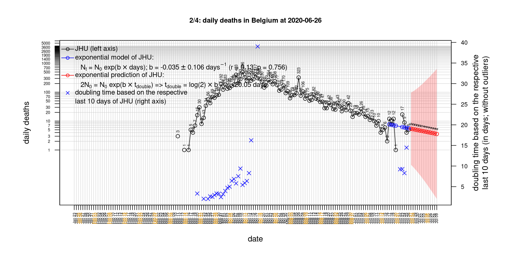
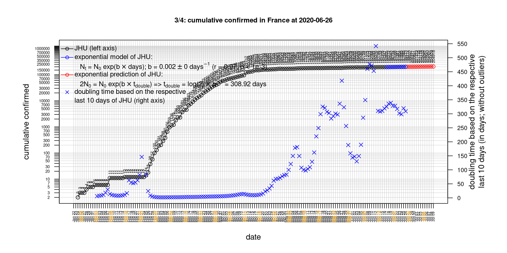

# International Covid-19 death predictions based on CSSEGISandData/COVID-19

  * upstream repo: https://github.com/CSSEGISandData/COVID-19  
  * time of last fetch of upstream repo: **2020-04-10 14:33:48 CET** (timestamp of file `.git/refs/remotes/upstream`)  
  * hash of last fetched commit of upstream repo: `130954a27f7d6a36acbfacbb2fcf807f98dd0d7f` (`git rev-parse upstream/master`)  
  * last date of `COVID-19/csse_covid_19_data/time_series_covid19_*_global.csv` data: **2020-04-09**

# death rate evolution

# Select country

ordererd by time when cumulative number of deaths doubles (increasing)
country | cumulative number of deaths doubles in | period of estimation | rsq | p | cumulative deaths | cumulative confirmed
--- | --- | --- | --- | --- | --- | ---
[Canada](#Canada) | 3.72 days | 2020-03-31 to 2020-04-09 (10 days) | 0.99 | < 1e-3 | 503 | 20654
[Poland](#Poland) | 3.86 days | 2020-03-31 to 2020-04-09 (10 days) | 0.99 | < 1e-3 | 174 | 5575
[United Kingdom](#United-Kingdom) | 4.36 days | 2020-03-31 to 2020-04-09 (10 days) | 0.98 | < 1e-3 | 7993 | 65872
[US](#US) | 4.38 days | 2020-03-31 to 2020-04-09 (10 days) | 0.99 | < 1e-3 | 16478 | 461437
[Turkey](#Turkey) | 4.49 days | 2020-03-31 to 2020-04-09 (10 days) | 0.97 | < 1e-3 | 908 | 42282
[Hungary](#Hungary) | 4.5 days | 2020-03-31 to 2020-04-09 (10 days) | 0.99 | < 1e-3 | 66 | 980
[Sweden](#Sweden) | 4.59 days | 2020-03-31 to 2020-04-09 (10 days) | 0.97 | < 1e-3 | 793 | 9141
[Russia](#Russia) | 4.66 days | 2020-03-31 to 2020-04-09 (10 days) | 0.96 | < 1e-3 | 76 | 10131
[Belgium](#Belgium) | 4.95 days | 2020-03-31 to 2020-04-09 (10 days) | 0.99 | < 1e-3 | 2523 | 24983
[France](#France) | 5.11 days | 2020-03-31 to 2020-04-09 (10 days) | 0.96 | < 1e-3 | 12228 | 118781
[Germany](#Germany) | 5.29 days | 2020-03-31 to 2020-04-09 (10 days) | 0.99 | < 1e-3 | 2607 | 118181
[Australia](#Australia) | 5.67 days | 2020-03-31 to 2020-04-09 (10 days) | 0.99 | < 1e-3 | 51 | 6108
[Romania](#Romania) | 5.83 days | 2020-03-31 to 2020-04-09 (10 days) | 0.98 | < 1e-3 | 248 | 5202
[Norway](#Norway) | 6.1 days | 2020-03-31 to 2020-04-09 (10 days) | 0.99 | < 1e-3 | 108 | 6211
[Denmark](#Denmark) | 6.57 days | 2020-03-31 to 2020-04-09 (10 days) | 0.97 | < 1e-3 | 237 | 5830
[Portugal](#Portugal) | 6.84 days | 2020-03-31 to 2020-04-09 (10 days) | 0.99 | < 1e-3 | 409 | 13956
[Netherlands](#Netherlands) | 7.57 days | 2020-03-31 to 2020-04-09 (10 days) | 0.99 | < 1e-3 | 2403 | 21903
[Austria](#Austria) | 7.65 days | 2020-03-31 to 2020-04-09 (10 days) | 1 | < 1e-3 | 295 | 13244
[Switzerland](#Switzerland) | 8.01 days | 2020-03-31 to 2020-04-09 (10 days) | 0.99 | < 1e-3 | 948 | 24051
[Japan](#Japan) | 10.44 days | 2020-03-31 to 2020-04-09 (10 days) | 0.95 | < 1e-3 | 94 | 4667
[Spain](#Spain) | 10.68 days | 2020-03-31 to 2020-04-09 (10 days) | 0.98 | < 1e-3 | 15447 | 153222
[Italy](#Italy) | 16.42 days | 2020-03-31 to 2020-04-09 (10 days) | 0.99 | < 1e-3 | 18279 | 143626
[Iran](#Iran) | 17.59 days | 2020-03-31 to 2020-04-09 (10 days) | 1 | < 1e-3 | 4110 | 66220
[China](#China) | 742.88 days | 2020-03-31 to 2020-04-09 (10 days) | 0.91 | < 1e-3 | 3339 | 82883
[Nepal](#Nepal) | NA | NA | NA | NA | 0 | 9

# Australia
[top](#Select-country)

 

 

 

 
 

# Austria
[top](#Select-country)

 

 

 

 
 

# Belgium
[top](#Select-country)

 

 

 

 
 

# Canada
[top](#Select-country)

 

 

 

 
 

# China
[top](#Select-country)

 

 

 

 
 

# Denmark
[top](#Select-country)

 

 

 

 
 

# France
[top](#Select-country)

 

 

 

 
 

# Germany
[top](#Select-country)

 

 

 

 
 

# Hungary
[top](#Select-country)

 

 

 

 
 

# Iran
[top](#Select-country)

 

 

 

 
 

# Italy
[top](#Select-country)

national responses:
1. 2020-03-04: https://www.theguardian.com/world/2020/mar/04/italy-orders-closure-of-schools-and-universities-due-to-coronavirus
2. 2020-03-09: https://www.bbc.co.uk/sport/51808683
3. 2020-03-11: https://www.washingtonpost.com/world/europe/merkel-coronavirus-germany/2020/03/11/e276252a-6399-11ea-8a8e-5c5336b32760_story.html

 

 

 

 
 

# Japan
[top](#Select-country)

 

 

 

 
 

# Nepal
[top](#Select-country)

 

 

 

 
 

# Netherlands
[top](#Select-country)

 

 

 

 
 

# Norway
[top](#Select-country)

 

 

 

 
 

# Poland
[top](#Select-country)

 

 

 

 
 

# Portugal
[top](#Select-country)

 

 

 

 
 

# Romania
[top](#Select-country)

 

 

 

 
 

# Russia
[top](#Select-country)

 

 

 

 
 

# Spain
[top](#Select-country)

 

 

 

 
 

# Sweden
[top](#Select-country)

 

 

 

 
 

# Switzerland
[top](#Select-country)

 

 

 

 
 

# Turkey
[top](#Select-country)

 

 

 

 
 

# US
[top](#Select-country)

 

 

 

 
 

# United Kingdom
[top](#Select-country)

 

 

 

 
 

