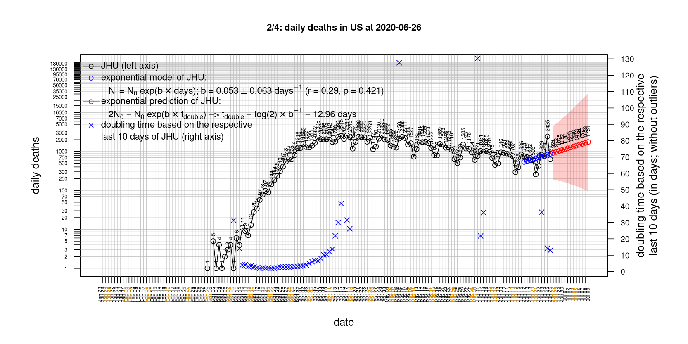

# International Covid-19 death predictions based on CSSEGISandData/COVID-19

  * upstream repo: https://github.com/CSSEGISandData/COVID-19  
  * time of last pull of upstream repo: **2020-03-23 07:39:28 CET** (timestamp of file `.git/refs/remotes/upstream`)  
  * hash of last pulled commit of upstream repo: `76b91e989f36488034ded399c09acf3196e93c18` (`git rev-parse upstream/master`)  
  * last date of `COVID-19/csse_covid_19_data/time_series_covid19_*_global.csv` data: **2020-03-22**

# Select country

in alphabetical order (days when number of cumulative deaths doubles based on exponential model; blue line in first of the 4 plots of each respective country)

[Austria](#Austria) (2.43) [Belgium](#Belgium) (2.12) [Canada](#Canada) (2.5) [China](#China) (2.55) [Denmark](#Denmark) (2.25) [France](#France) (2.55) [Germany](#Germany) (2.13) [Iran](#Iran) (3.34) [Italy](#Italy) (2.52) [Japan](#Japan) (6.67) [Netherlands](#Netherlands) (2.1) [Russia](#Russia) (NA) [Sweden](#Sweden) (2.15) [Switzerland](#Switzerland) (2.42) [US](#US) (3.48) [United Kingdom](#United-Kingdom) (2.08) 

# Austria
[top](#Select-country)

 

 

 

 
 

# Belgium
[top](#Select-country)

 

 

 

 
 

# Canada
[top](#Select-country)

 

 

 

 
 

# China
[top](#Select-country)

 

 

 

 
 

# Denmark
[top](#Select-country)

 

 

 

 
 

# France
[top](#Select-country)

 

 

 

 
 

# Germany
[top](#Select-country)

 

 

 

 
 

# Iran
[top](#Select-country)

 

 

 

 
 

# Italy
[top](#Select-country)

  * national response 1 on 2020-03-04: https://www.theguardian.com/world/2020/mar/04/italy-orders-closure-of-schools-and-universities-due-to-coronavirus
  * national response 2 on 2020-03-09: https://www.bbc.co.uk/sport/51808683
  * national response 3 on 2020-03-11: https://www.washingtonpost.com/world/europe/merkel-coronavirus-germany/2020/03/11/e276252a-6399-11ea-8a8e-5c5336b32760_story.html

 

 

 

 
 

# Japan
[top](#Select-country)

 

 

 

 
 

# Netherlands
[top](#Select-country)

 

 

 

 
 

# Russia
[top](#Select-country)

 

 

 

 
 

# Sweden
[top](#Select-country)

 

 

 

 
 

# Switzerland
[top](#Select-country)

 

 

 

 
 

# US
[top](#Select-country)

 

 

 

 
 

# United Kingdom
[top](#Select-country)

 

 

 

 
 

