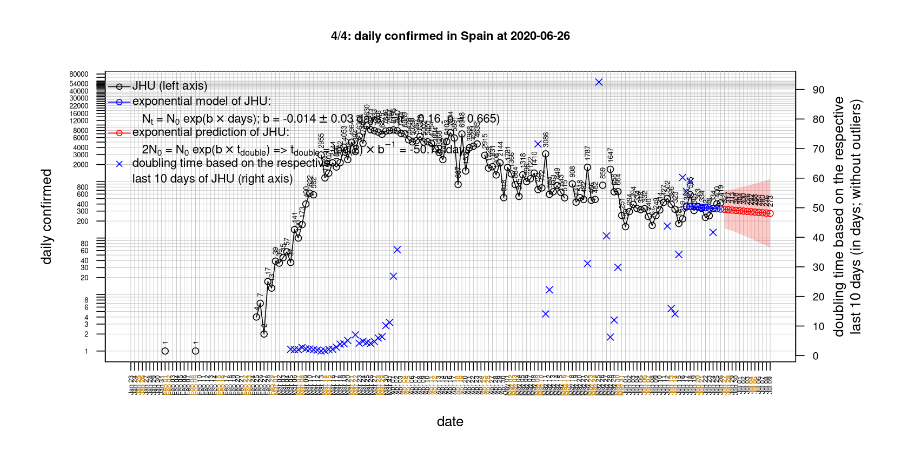

# International Covid-19 death predictions based on CSSEGISandData/COVID-19

  * upstream repo: https://github.com/CSSEGISandData/COVID-19  
  * time of last fetch of upstream repo: **2020-04-05 18:11:28 CET** (timestamp of file `.git/refs/remotes/upstream`)  
  * hash of last fetched commit of upstream repo: `f7c2384622806d5297d16c314a7bc0b9cde24937` (`git rev-parse upstream/master`)  
  * last date of `COVID-19/csse_covid_19_data/time_series_covid19_*_global.csv` data: **2020-04-04**

# death rate evolution

# Select country

ordererd by time when cumulative number of deaths doubles (increasing)
country | cumulative number of deaths doubles in | period of estimation | rsq | p | cumulative deaths | cumulative confirmed
--- | --- | --- | --- | --- | --- | ---
[Russia](#Russia) | 2.16 days | 2020-03-26 to 2020-04-04 (10 days) | 0.97 | < 1e-3 | 43 | 4731
[United Kingdom](#United-Kingdom) | 3.14 days | 2020-03-26 to 2020-04-04 (10 days) | 1 | < 1e-3 | 4320 | 42477
[Turkey](#Turkey) | 3.15 days | 2020-03-26 to 2020-04-04 (10 days) | 1 | < 1e-3 | 501 | 23934
[Romania](#Romania) | 3.16 days | 2020-03-26 to 2020-04-04 (10 days) | 0.98 | < 1e-3 | 146 | 3613
[US](#US) | 3.22 days | 2020-03-26 to 2020-04-04 (10 days) | 1 | < 1e-3 | 8407 | 308850
[Belgium](#Belgium) | 3.46 days | 2020-03-26 to 2020-04-04 (10 days) | 0.99 | < 1e-3 | 1283 | 18431
[Poland](#Poland) | 3.5 days | 2020-03-26 to 2020-04-04 (10 days) | 0.98 | < 1e-3 | 79 | 3627
[Germany](#Germany) | 3.7 days | 2020-03-26 to 2020-04-04 (10 days) | 0.99 | < 1e-3 | 1444 | 96092
[Sweden](#Sweden) | 3.72 days | 2020-03-26 to 2020-04-04 (10 days) | 0.97 | < 1e-3 | 373 | 6443
[Canada](#Canada) | 3.8 days | 2020-03-26 to 2020-04-04 (10 days) | 0.99 | < 1e-3 | 218 | 12978
[France](#France) | 4.17 days | 2020-03-26 to 2020-04-04 (10 days) | 0.99 | < 1e-3 | 7574 | 90848
[Norway](#Norway) | 4.22 days | 2020-03-26 to 2020-04-04 (10 days) | 0.98 | < 1e-3 | 62 | 5550
[Portugal](#Portugal) | 4.27 days | 2020-03-26 to 2020-04-04 (10 days) | 0.98 | < 1e-3 | 266 | 10524
[Austria](#Austria) | 4.5 days | 2020-03-26 to 2020-04-04 (10 days) | 0.97 | < 1e-3 | 186 | 11781
[Netherlands](#Netherlands) | 4.73 days | 2020-03-26 to 2020-04-04 (10 days) | 0.99 | < 1e-3 | 1656 | 16727
[Denmark](#Denmark) | 4.84 days | 2020-03-26 to 2020-04-04 (10 days) | 0.99 | < 1e-3 | 161 | 4269
[Switzerland](#Switzerland) | 4.97 days | 2020-03-26 to 2020-04-04 (10 days) | 0.99 | < 1e-3 | 666 | 20505
[Hungary](#Hungary) | 5.26 days | 2020-03-26 to 2020-04-04 (10 days) | 0.98 | < 1e-3 | 32 | 678
[Spain](#Spain) | 6.24 days | 2020-03-26 to 2020-04-04 (10 days) | 0.98 | < 1e-3 | 11947 | 126168
[Australia](#Australia) | 7.01 days | 2020-03-26 to 2020-04-04 (10 days) | 0.97 | < 1e-3 | 30 | 5550
[Italy](#Italy) | 10.15 days | 2020-03-26 to 2020-04-04 (10 days) | 0.99 | < 1e-3 | 15362 | 124632
[Iran](#Iran) | 14.66 days | 2020-03-26 to 2020-04-04 (10 days) | 1 | < 1e-3 | 3452 | 55743
[Japan](#Japan) | 15.71 days | 2020-03-26 to 2020-04-04 (10 days) | 0.88 | < 1e-3 | 77 | 3139
[China](#China) | 531.04 days | 2020-03-26 to 2020-04-04 (10 days) | 0.99 | < 1e-3 | 3330 | 82543
[Nepal](#Nepal) | NA | NA | NA | NA | 0 | 9

# Australia
[top](#Select-country)

 

 

 

 
 

# Austria
[top](#Select-country)

 

 

 

 
 

# Belgium
[top](#Select-country)

 

 

 

 
 

# Canada
[top](#Select-country)

 

 

 

 
 

# China
[top](#Select-country)

 

 

 

 
 

# Denmark
[top](#Select-country)

 

 

 

 
 

# France
[top](#Select-country)

 

 

 

 
 

# Germany
[top](#Select-country)

 

 

 

 
 

# Hungary
[top](#Select-country)

 

 

 

 
 

# Iran
[top](#Select-country)

 

 

 

 
 

# Italy
[top](#Select-country)

national responses:
1. 2020-03-04: https://www.theguardian.com/world/2020/mar/04/italy-orders-closure-of-schools-and-universities-due-to-coronavirus
2. 2020-03-09: https://www.bbc.co.uk/sport/51808683
3. 2020-03-11: https://www.washingtonpost.com/world/europe/merkel-coronavirus-germany/2020/03/11/e276252a-6399-11ea-8a8e-5c5336b32760_story.html

 

 

 

 
 

# Japan
[top](#Select-country)

 

 

 

 
 

# Nepal
[top](#Select-country)

 

 

 

 
 

# Netherlands
[top](#Select-country)

 

 

 

 
 

# Norway
[top](#Select-country)

 

 

 

 
 

# Poland
[top](#Select-country)

 

 

 

 
 

# Portugal
[top](#Select-country)

 

 

 

 
 

# Romania
[top](#Select-country)

 

 

 

 
 

# Russia
[top](#Select-country)

 

 

 

 
 

# Spain
[top](#Select-country)

 

 

 

 
 

# Sweden
[top](#Select-country)

 

 

 

 
 

# Switzerland
[top](#Select-country)

 

 

 

 
 

# Turkey
[top](#Select-country)

 

 

 

 
 

# US
[top](#Select-country)

 

 

 

 
 

# United Kingdom
[top](#Select-country)

 

 

 

 
 

