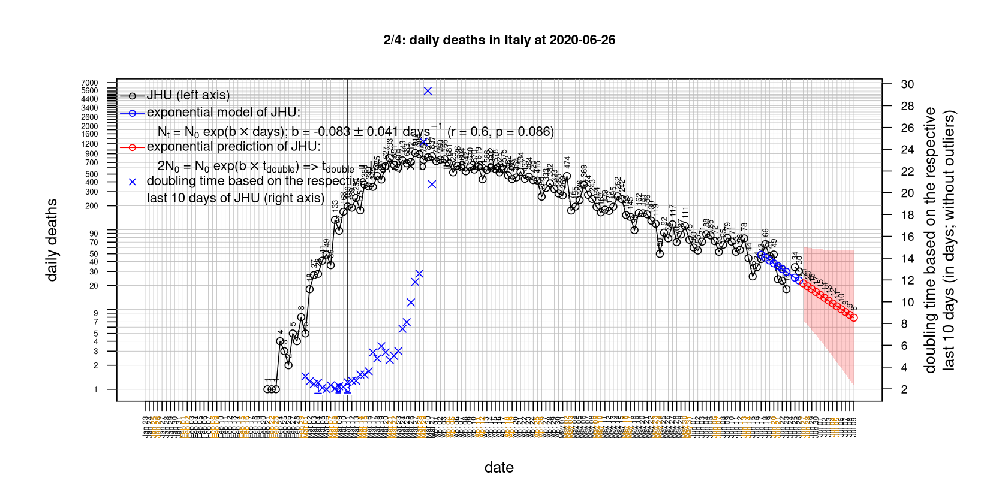
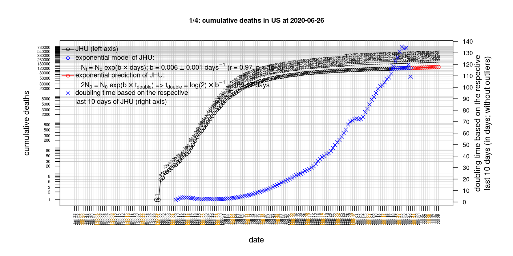

# International Covid-19 death predictions based on CSSEGISandData/COVID-19

  * upstream repo: https://github.com/CSSEGISandData/COVID-19  
  * time of last fetch of upstream repo: **2020-05-28 19:37:19 CET** (timestamp of file `.git/refs/remotes/upstream`)  
  * hash of last fetched commit of upstream repo: `b9789de1e60e67abd71ce1f937634e8ae21a1101` (`git rev-parse upstream/master`)  
  * last date of `COVID-19/csse_covid_19_data/time_series_covid19_*_global.csv` data: **2020-05-27**

# death rate evolution

# Select country

ordererd by time when cumulative number of deaths doubles (increasing)
country | cumulative number of deaths doubles in | period of estimation | rsq | p | cumulative deaths | cumulative confirmed
--- | --- | --- | --- | --- | --- | ---
[Spain](#Spain) | -244.43 days | 2020-05-18 to 2020-05-27 (10 days) | 0.12 | 0.325 | 27117 | 236259
[Nepal](#Nepal) | 7.86 days | 2020-05-18 to 2020-05-27 (10 days) | 0.88 | < 1e-3 | 4 | 886
[Brazil](#Brazil) | 15.38 days | 2020-05-18 to 2020-05-27 (10 days) | 0.99 | < 1e-3 | 25598 | 411821
[Russia](#Russia) | 16.58 days | 2020-05-18 to 2020-05-27 (10 days) | 1 | < 1e-3 | 3968 | 370680
[Canada](#Canada) | 43.69 days | 2020-05-18 to 2020-05-27 (10 days) | 1 | < 1e-3 | 6876 | 88989
[Japan](#Japan) | 46.4 days | 2020-05-18 to 2020-05-27 (10 days) | 0.99 | < 1e-3 | 858 | 16651
[Sweden](#Sweden) | 51.19 days | 2020-05-18 to 2020-05-27 (10 days) | 0.98 | < 1e-3 | 4220 | 35088
[US](#US) | 62.87 days | 2020-05-18 to 2020-05-27 (10 days) | 0.97 | < 1e-3 | 100417 | 1699176
[Portugal](#Portugal) | 65.61 days | 2020-05-18 to 2020-05-27 (10 days) | 1 | < 1e-3 | 1356 | 31292
[Poland](#Poland) | 67.41 days | 2020-05-18 to 2020-05-27 (10 days) | 0.99 | < 1e-3 | 1028 | 22473
[Romania](#Romania) | 70.56 days | 2020-05-18 to 2020-05-27 (10 days) | 0.99 | < 1e-3 | 1227 | 18594
[Hungary](#Hungary) | 72.51 days | 2020-05-18 to 2020-05-27 (10 days) | 0.98 | < 1e-3 | 505 | 3793
[Iran](#Iran) | 91 days | 2020-05-18 to 2020-05-27 (10 days) | 1 | < 1e-3 | 7564 | 141591
[United Kingdom](#United-Kingdom) | 93.11 days | 2020-05-18 to 2020-05-27 (10 days) | 0.95 | < 1e-3 | 37542 | 268619
[Turkey](#Turkey) | 103.14 days | 2020-05-18 to 2020-05-27 (10 days) | 1 | < 1e-3 | 4431 | 159797
[Germany](#Germany) | 135.07 days | 2020-05-18 to 2020-05-27 (10 days) | 0.97 | < 1e-3 | 8428 | 181524
[Australia](#Australia) | 162.96 days | 2020-05-18 to 2020-05-27 (10 days) | 0.95 | < 1e-3 | 103 | 7150
[Italy](#Italy) | 197.67 days | 2020-05-18 to 2020-05-27 (10 days) | 0.98 | < 1e-3 | 33072 | 231139
[Belgium](#Belgium) | 200.73 days | 2020-05-18 to 2020-05-27 (10 days) | 1 | < 1e-3 | 9364 | 57592
[Netherlands](#Netherlands) | 210.46 days | 2020-05-18 to 2020-05-27 (10 days) | 0.98 | < 1e-3 | 5890 | 45970
[Denmark](#Denmark) | 223.51 days | 2020-05-18 to 2020-05-27 (10 days) | 0.82 | < 1e-3 | 565 | 11680
[Korea, South](#Korea,-South) | 234.06 days | 2020-05-18 to 2020-05-27 (10 days) | 0.95 | < 1e-3 | 269 | 11344
[Austria](#Austria) | 254.76 days | 2020-05-18 to 2020-05-27 (10 days) | 0.98 | < 1e-3 | 645 | 16591
[France](#France) | 364.39 days | 2020-05-18 to 2020-05-27 (10 days) | 0.84 | < 1e-3 | 28599 | 183038
[Switzerland](#Switzerland) | 376.37 days | 2020-05-18 to 2020-05-27 (10 days) | 0.98 | < 1e-3 | 1917 | 30776
[Norway](#Norway) | 723.51 days | 2020-05-18 to 2020-05-27 (10 days) | 0.64 | 0.006 | 235 | 8401
[China](#China) | 2262229614422286 days | 2020-05-18 to 2020-05-27 (10 days) | 0.52 | 0.122 | 4638 | 84106

# Australia
[top](#Select-country)

 

 

 

 
 

# Austria
[top](#Select-country)

 

 

 

 
 

# Belgium
[top](#Select-country)

 

 

 

 
 

# Brazil
[top](#Select-country)

 

 

 

 
 

# Canada
[top](#Select-country)

 

 

 

 
 

# China
[top](#Select-country)

 

 

 

 
 

# Denmark
[top](#Select-country)

 

 

 

 
 

# France
[top](#Select-country)

 

 

 

 
 

# Germany
[top](#Select-country)

 

 

 

 

 
 

# Hungary
[top](#Select-country)

 

 

 

 
 

# Iran
[top](#Select-country)

 

 

 

 
 

# Italy
[top](#Select-country)

national responses:
1. 2020-03-04: https://www.theguardian.com/world/2020/mar/04/italy-orders-closure-of-schools-and-universities-due-to-coronavirus
2. 2020-03-09: https://www.bbc.co.uk/sport/51808683
3. 2020-03-11: https://www.washingtonpost.com/world/europe/merkel-coronavirus-germany/2020/03/11/e276252a-6399-11ea-8a8e-5c5336b32760_story.html

 

 

 

 
 

# Japan
[top](#Select-country)

 

 

 

 
 

# Korea, South
[top](#Select-country)

 

 

 

 
 

# Nepal
[top](#Select-country)

 

 

 

 
 

# Netherlands
[top](#Select-country)

 

 

 

 
 

# Norway
[top](#Select-country)

 

 

 

 
 

# Poland
[top](#Select-country)

 

 

 

 
 

# Portugal
[top](#Select-country)

 

 

 

 
 

# Romania
[top](#Select-country)

 

 

 

 
 

# Russia
[top](#Select-country)

 

 

 

 
 

# Spain
[top](#Select-country)

 

 

 

 
 

# Sweden
[top](#Select-country)

 

 

 

 
 

# Switzerland
[top](#Select-country)

 

 

 

 
 

# Turkey
[top](#Select-country)

 

 

 

 
 

# US
[top](#Select-country)

 

 

 

 
 

# United Kingdom
[top](#Select-country)

 

 

 

 
 

