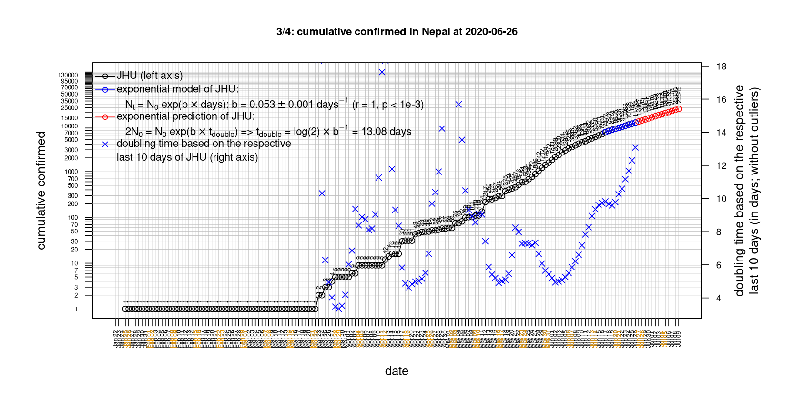

# International Covid-19 death predictions based on CSSEGISandData/COVID-19

  * upstream repo: https://github.com/CSSEGISandData/COVID-19  
  * time of last fetch of upstream repo: **2020-06-08 07:17:34 CET** (timestamp of file `.git/refs/remotes/upstream`)  
  * hash of last fetched commit of upstream repo: `dd07d05ff02d8aea12cab868e8a36c0e31cadf66` (`git rev-parse upstream/master`)  
  * last date of `COVID-19/csse_covid_19_data/time_series_covid19_*_global.csv` data: **2020-06-07**

# death rate evolution

# Select country

ordererd by time when cumulative number of deaths doubles (increasing)
country | cumulative number of deaths doubles in | period of estimation | rsq | p | cumulative deaths | cumulative confirmed
--- | --- | --- | --- | --- | --- | ---
[Australia](#Australia) | -558.23 days | 2020-05-29 to 2020-06-07 (10 days) | 0.64 | 0.006 | 102 | 7265
[Nepal](#Nepal) | 7.75 days | 2020-05-29 to 2020-06-07 (10 days) | 0.95 | < 1e-3 | 13 | 3448
[Russia](#Russia) | 21.32 days | 2020-05-29 to 2020-06-07 (10 days) | 1 | < 1e-3 | 5851 | 467073
[Brazil](#Brazil) | 21.7 days | 2020-05-29 to 2020-06-07 (10 days) | 0.99 | < 1e-3 | 36455 | 691758
[Canada](#Canada) | 56.3 days | 2020-05-29 to 2020-06-07 (10 days) | 0.97 | < 1e-3 | 7877 | 97178
[Poland](#Poland) | 59.65 days | 2020-05-29 to 2020-06-07 (10 days) | 0.98 | < 1e-3 | 1157 | 26561
[Sweden](#Sweden) | 80.86 days | 2020-05-29 to 2020-06-07 (10 days) | 0.96 | < 1e-3 | 4659 | 44730
[Iran](#Iran) | 82.17 days | 2020-05-29 to 2020-06-07 (10 days) | 1 | < 1e-3 | 8281 | 171789
[US](#US) | 83.88 days | 2020-05-29 to 2020-06-07 (10 days) | 1 | < 1e-3 | 110514 | 1942363
[Portugal](#Portugal) | 91.63 days | 2020-05-29 to 2020-06-07 (10 days) | 0.98 | < 1e-3 | 1479 | 34693
[United Kingdom](#United-Kingdom) | 94.27 days | 2020-05-29 to 2020-06-07 (10 days) | 0.98 | < 1e-3 | 40625 | 287621
[Romania](#Romania) | 95.14 days | 2020-05-29 to 2020-06-07 (10 days) | 1 | < 1e-3 | 1333 | 20479
[Hungary](#Hungary) | 115.83 days | 2020-05-29 to 2020-06-07 (10 days) | 0.98 | < 1e-3 | 546 | 4008
[Turkey](#Turkey) | 143.08 days | 2020-05-29 to 2020-06-07 (10 days) | 1 | < 1e-3 | 4692 | 170132
[Denmark](#Denmark) | 174.68 days | 2020-05-29 to 2020-06-07 (10 days) | 0.98 | < 1e-3 | 589 | 12148
[Japan](#Japan) | 189.28 days | 2020-05-29 to 2020-06-07 (10 days) | 0.96 | < 1e-3 | 917 | 17039
[Germany](#Germany) | 281 days | 2020-05-29 to 2020-06-07 (10 days) | 0.98 | < 1e-3 | 8685 | 185750
[Italy](#Italy) | 317.9 days | 2020-05-29 to 2020-06-07 (10 days) | 1 | < 1e-3 | 33899 | 234998
[Belgium](#Belgium) | 354.22 days | 2020-05-29 to 2020-06-07 (10 days) | 1 | < 1e-3 | 9595 | 59226
[France](#France) | 372.51 days | 2020-05-29 to 2020-06-07 (10 days) | 0.97 | < 1e-3 | 29158 | 191102
[Korea, South](#Korea,-South) | 443.35 days | 2020-05-29 to 2020-06-07 (10 days) | 0.74 | 0.001 | 273 | 11814
[Netherlands](#Netherlands) | 458.02 days | 2020-05-29 to 2020-06-07 (10 days) | 0.98 | < 1e-3 | 6032 | 47780
[Norway](#Norway) | 564.69 days | 2020-05-29 to 2020-06-07 (10 days) | 0.87 | < 1e-3 | 238 | 8547
[Austria](#Austria) | 841.97 days | 2020-05-29 to 2020-06-07 (10 days) | 0.89 | < 1e-3 | 672 | 16902
[Switzerland](#Switzerland) | 5356.14 days | 2020-05-29 to 2020-06-07 (10 days) | 0.84 | < 1e-3 | 1921 | 30965
[Spain](#Spain) | 11979.75 days | 2020-05-29 to 2020-06-07 (10 days) | 0.93 | < 1e-3 | 27136 | 241550
[China](#China) | 2262229614422286 days | 2020-05-29 to 2020-06-07 (10 days) | 0.52 | 0.122 | 4638 | 84191

# Australia
[top](#Select-country)

 

 

 

 
 

# Austria
[top](#Select-country)

 

 

 

 
 

# Belgium
[top](#Select-country)

 

 

 

 
 

# Brazil
[top](#Select-country)

 

 

 

 
 

# Canada
[top](#Select-country)

 

 

 

 
 

# China
[top](#Select-country)

 

 

 

 
 

# Denmark
[top](#Select-country)

 

 

 

 
 

# France
[top](#Select-country)

 

 

 

 
 

# Germany
[top](#Select-country)

 

 

 

 

 
 

# Hungary
[top](#Select-country)

 

 

 

 
 

# Iran
[top](#Select-country)

 

 

 

 
 

# Italy
[top](#Select-country)

national responses:
1. 2020-03-04: https://www.theguardian.com/world/2020/mar/04/italy-orders-closure-of-schools-and-universities-due-to-coronavirus
2. 2020-03-09: https://www.bbc.co.uk/sport/51808683
3. 2020-03-11: https://www.washingtonpost.com/world/europe/merkel-coronavirus-germany/2020/03/11/e276252a-6399-11ea-8a8e-5c5336b32760_story.html

 

 

 

 
 

# Japan
[top](#Select-country)

 

 

 

 
 

# Korea, South
[top](#Select-country)

 

 

 

 
 

# Nepal
[top](#Select-country)

 

 

 

 
 

# Netherlands
[top](#Select-country)

 

 

 

 
 

# Norway
[top](#Select-country)

 

 

 

 
 

# Poland
[top](#Select-country)

 

 

 

 
 

# Portugal
[top](#Select-country)

 

 

 

 
 

# Romania
[top](#Select-country)

 

 

 

 
 

# Russia
[top](#Select-country)

 

 

 

 
 

# Spain
[top](#Select-country)

 

 

 

 
 

# Sweden
[top](#Select-country)

 

 

 

 
 

# Switzerland
[top](#Select-country)

 

 

 

 
 

# Turkey
[top](#Select-country)

 

 

 

 
 

# US
[top](#Select-country)

 

 

 

 
 

# United Kingdom
[top](#Select-country)

 

 

 

 
 

