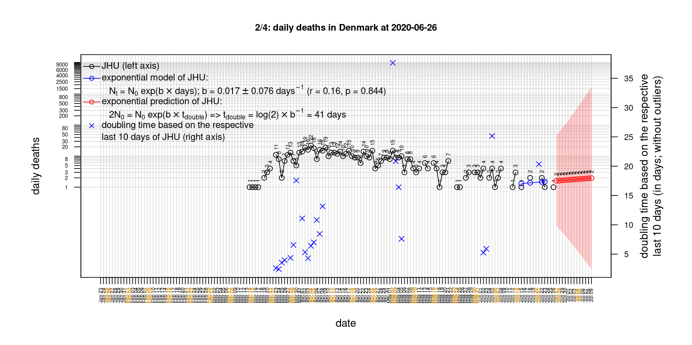
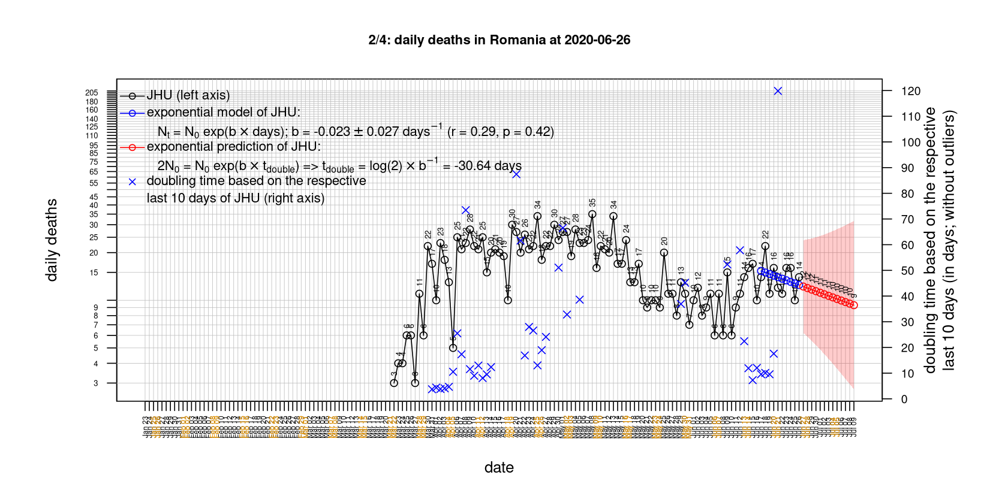

# International Covid-19 death predictions based on CSSEGISandData/COVID-19

  * upstream repo: https://github.com/CSSEGISandData/COVID-19  
  * time of last fetch of upstream repo: **2020-05-11 20:19:58 CET** (timestamp of file `.git/refs/remotes/upstream`)  
  * hash of last fetched commit of upstream repo: `5184bec76bae2c7551af028cee60340806a98224` (`git rev-parse upstream/master`)  
  * last date of `COVID-19/csse_covid_19_data/time_series_covid19_*_global.csv` data: **2020-05-10**

# death rate evolution

# Select country

ordererd by time when cumulative number of deaths doubles (increasing)
country | cumulative number of deaths doubles in | period of estimation | rsq | p | cumulative deaths | cumulative confirmed
--- | --- | --- | --- | --- | --- | ---
[Brazil](#Brazil) | 10.75 days | 2020-05-01 to 2020-05-10 (10 days) | 0.99 | < 1e-3 | 11123 | 162699
[Russia](#Russia) | 12.24 days | 2020-05-01 to 2020-05-10 (10 days) | 1 | < 1e-3 | 1915 | 209688
[Canada](#Canada) | 17.68 days | 2020-05-01 to 2020-05-10 (10 days) | 0.99 | < 1e-3 | 4991 | 70091
[Japan](#Japan) | 19.88 days | 2020-05-01 to 2020-05-10 (10 days) | 0.95 | < 1e-3 | 624 | 15777
[Romania](#Romania) | 24.16 days | 2020-05-01 to 2020-05-10 (10 days) | 1 | < 1e-3 | 961 | 15362
[Hungary](#Hungary) | 25.19 days | 2020-05-01 to 2020-05-10 (10 days) | 1 | < 1e-3 | 413 | 3263
[Sweden](#Sweden) | 27.04 days | 2020-05-01 to 2020-05-10 (10 days) | 0.97 | < 1e-3 | 3225 | 26322
[US](#US) | 28.63 days | 2020-05-01 to 2020-05-10 (10 days) | 0.99 | < 1e-3 | 79526 | 1329260
[Poland](#Poland) | 28.88 days | 2020-05-01 to 2020-05-10 (10 days) | 0.99 | < 1e-3 | 800 | 15996
[United Kingdom](#United-Kingdom) | 40.77 days | 2020-05-01 to 2020-05-10 (10 days) | 0.99 | < 1e-3 | 31930 | 220449
[Turkey](#Turkey) | 41.85 days | 2020-05-01 to 2020-05-10 (10 days) | 0.99 | < 1e-3 | 3786 | 138657
[Denmark](#Denmark) | 46.1 days | 2020-05-01 to 2020-05-10 (10 days) | 0.96 | < 1e-3 | 529 | 10627
[Germany](#Germany) | 47.21 days | 2020-05-01 to 2020-05-10 (10 days) | 0.96 | < 1e-3 | 7569 | 171879
[Belgium](#Belgium) | 47.99 days | 2020-05-01 to 2020-05-10 (10 days) | 0.97 | < 1e-3 | 8656 | 53081
[Portugal](#Portugal) | 51.8 days | 2020-05-01 to 2020-05-10 (10 days) | 0.98 | < 1e-3 | 1135 | 27581
[Netherlands](#Netherlands) | 58.29 days | 2020-05-01 to 2020-05-10 (10 days) | 0.99 | < 1e-3 | 5459 | 42826
[Iran](#Iran) | 70.24 days | 2020-05-01 to 2020-05-10 (10 days) | 1 | < 1e-3 | 6640 | 107603
[Italy](#Italy) | 79.65 days | 2020-05-01 to 2020-05-10 (10 days) | 0.99 | < 1e-3 | 30560 | 219070
[France](#France) | 80.57 days | 2020-05-01 to 2020-05-10 (10 days) | 0.98 | < 1e-3 | 26383 | 177094
[Spain](#Spain) | 82.24 days | 2020-05-01 to 2020-05-10 (10 days) | 0.98 | < 1e-3 | 26621 | 224350
[Switzerland](#Switzerland) | 129.86 days | 2020-05-01 to 2020-05-10 (10 days) | 0.97 | < 1e-3 | 1833 | 30305
[Norway](#Norway) | 134.91 days | 2020-05-01 to 2020-05-10 (10 days) | 0.96 | < 1e-3 | 219 | 8105
[Austria](#Austria) | 137.43 days | 2020-05-01 to 2020-05-10 (10 days) | 0.97 | < 1e-3 | 618 | 15871
[Australia](#Australia) | 155.78 days | 2020-05-01 to 2020-05-10 (10 days) | 0.74 | 0.001 | 97 | 6948
[Korea, South](#Korea,-South) | 235.5 days | 2020-05-01 to 2020-05-10 (10 days) | 0.8 | < 1e-3 | 256 | 10909
[China](#China) | NA | NA | NA | NA | 4637 | 84010
[Nepal](#Nepal) | NA | NA | NA | NA | 0 | 110

# Australia
[top](#Select-country)

 

 

 

 
 

# Austria
[top](#Select-country)

 

 

 

 
 

# Belgium
[top](#Select-country)

 

 

 

 
 

# Brazil
[top](#Select-country)

 

 

 

 
 

# Canada
[top](#Select-country)

 

 

 

 
 

# China
[top](#Select-country)

 

 

 

 
 

# Denmark
[top](#Select-country)

 

 

 

 
 

# France
[top](#Select-country)

 

 

 

 
 

# Germany
[top](#Select-country)

 

 

 

 

 
 

# Hungary
[top](#Select-country)

 

 

 

 
 

# Iran
[top](#Select-country)

 

 

 

 
 

# Italy
[top](#Select-country)

national responses:
1. 2020-03-04: https://www.theguardian.com/world/2020/mar/04/italy-orders-closure-of-schools-and-universities-due-to-coronavirus
2. 2020-03-09: https://www.bbc.co.uk/sport/51808683
3. 2020-03-11: https://www.washingtonpost.com/world/europe/merkel-coronavirus-germany/2020/03/11/e276252a-6399-11ea-8a8e-5c5336b32760_story.html

 

 

 

 
 

# Japan
[top](#Select-country)

 

 

 

 
 

# Korea, South
[top](#Select-country)

 

 

 

 
 

# Nepal
[top](#Select-country)

 

 

 

 
 

# Netherlands
[top](#Select-country)

 

 

 

 
 

# Norway
[top](#Select-country)

 

 

 

 
 

# Poland
[top](#Select-country)

 

 

 

 
 

# Portugal
[top](#Select-country)

 

 

 

 
 

# Romania
[top](#Select-country)

 

 

 

 
 

# Russia
[top](#Select-country)

 

 

 

 
 

# Spain
[top](#Select-country)

 

 

 

 
 

# Sweden
[top](#Select-country)

 

 

 

 
 

# Switzerland
[top](#Select-country)

 

 

 

 
 

# Turkey
[top](#Select-country)

 

 

 

 
 

# US
[top](#Select-country)

 

 

 

 
 

# United Kingdom
[top](#Select-country)

 

 

 

 
 

