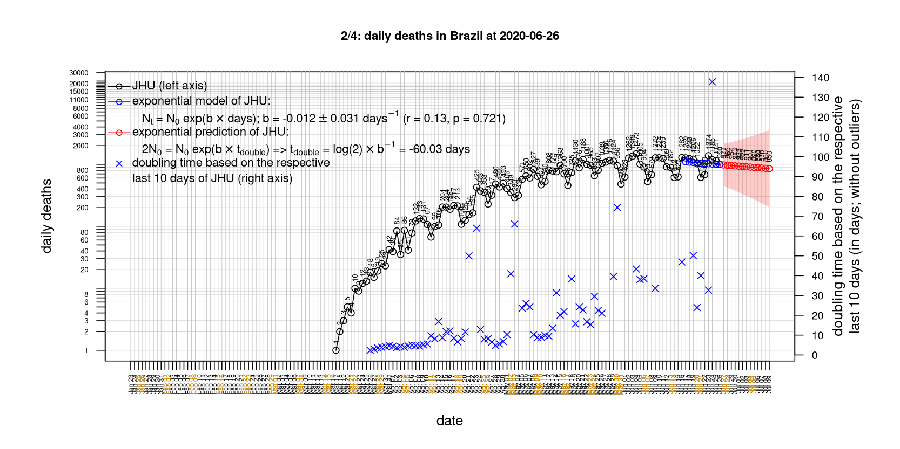
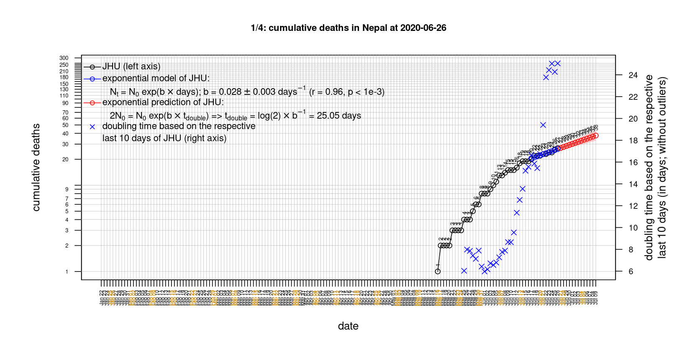

# International Covid-19 death predictions based on CSSEGISandData/COVID-19

  * upstream repo: https://github.com/CSSEGISandData/COVID-19  
  * time of last fetch of upstream repo: **2020-05-19 08:10:55 CET** (timestamp of file `.git/refs/remotes/upstream`)  
  * hash of last fetched commit of upstream repo: `8390ba65363a187557a1e0da259d775a5da41ed6` (`git rev-parse upstream/master`)  
  * last date of `COVID-19/csse_covid_19_data/time_series_covid19_*_global.csv` data: **2020-05-18**

# death rate evolution

# Select country

ordererd by time when cumulative number of deaths doubles (increasing)
country | cumulative number of deaths doubles in | period of estimation | rsq | p | cumulative deaths | cumulative confirmed
--- | --- | --- | --- | --- | --- | ---
[Brazil](#Brazil) | 12.99 days | 2020-05-09 to 2020-05-18 (10 days) | 0.99 | < 1e-3 | 16853 | 255368
[Russia](#Russia) | 15.41 days | 2020-05-09 to 2020-05-18 (10 days) | 1 | < 1e-3 | 2722 | 290678
[Japan](#Japan) | 28.07 days | 2020-05-09 to 2020-05-18 (10 days) | 0.99 | < 1e-3 | 749 | 16305
[Canada](#Canada) | 28.99 days | 2020-05-09 to 2020-05-18 (10 days) | 0.98 | < 1e-3 | 5960 | 79411
[Poland](#Poland) | 33.04 days | 2020-05-09 to 2020-05-18 (10 days) | 0.98 | < 1e-3 | 936 | 18885
[Romania](#Romania) | 34.35 days | 2020-05-09 to 2020-05-18 (10 days) | 0.99 | < 1e-3 | 1120 | 17036
[Sweden](#Sweden) | 37.15 days | 2020-05-09 to 2020-05-18 (10 days) | 0.94 | < 1e-3 | 3698 | 30377
[US](#US) | 41.68 days | 2020-05-09 to 2020-05-18 (10 days) | 0.99 | < 1e-3 | 90347 | 1508308
[Hungary](#Hungary) | 50.98 days | 2020-05-09 to 2020-05-18 (10 days) | 0.99 | < 1e-3 | 462 | 3535
[Turkey](#Turkey) | 55.34 days | 2020-05-09 to 2020-05-18 (10 days) | 0.99 | < 1e-3 | 4171 | 150593
[United Kingdom](#United-Kingdom) | 58.75 days | 2020-05-09 to 2020-05-18 (10 days) | 0.98 | < 1e-3 | 34876 | 247709
[Portugal](#Portugal) | 70.41 days | 2020-05-09 to 2020-05-18 (10 days) | 0.99 | < 1e-3 | 1231 | 29209
[France](#France) | 86.88 days | 2020-05-09 to 2020-05-18 (10 days) | 0.97 | < 1e-3 | 28242 | 180051
[Iran](#Iran) | 91.87 days | 2020-05-09 to 2020-05-18 (10 days) | 1 | < 1e-3 | 7057 | 122492
[Norway](#Norway) | 95.15 days | 2020-05-09 to 2020-05-18 (10 days) | 0.83 | < 1e-3 | 233 | 8257
[Germany](#Germany) | 101.98 days | 2020-05-09 to 2020-05-18 (10 days) | 0.94 | < 1e-3 | 8003 | 176551
[Belgium](#Belgium) | 107.5 days | 2020-05-09 to 2020-05-18 (10 days) | 0.99 | < 1e-3 | 9080 | 55559
[Netherlands](#Netherlands) | 113.44 days | 2020-05-09 to 2020-05-18 (10 days) | 0.97 | < 1e-3 | 5713 | 44341
[Italy](#Italy) | 113.62 days | 2020-05-09 to 2020-05-18 (10 days) | 0.99 | < 1e-3 | 32007 | 225886
[Spain](#Spain) | 131.36 days | 2020-05-09 to 2020-05-18 (10 days) | 0.98 | < 1e-3 | 27709 | 231606
[Denmark](#Denmark) | 150.53 days | 2020-05-09 to 2020-05-18 (10 days) | 0.89 | < 1e-3 | 548 | 11166
[Switzerland](#Switzerland) | 203.42 days | 2020-05-09 to 2020-05-18 (10 days) | 0.87 | < 1e-3 | 1886 | 30597
[Korea, South](#Korea,-South) | 210.59 days | 2020-05-09 to 2020-05-18 (10 days) | 0.96 | < 1e-3 | 263 | 11078
[Austria](#Austria) | 268.9 days | 2020-05-09 to 2020-05-18 (10 days) | 0.93 | < 1e-3 | 629 | 16269
[Australia](#Australia) | 302.7 days | 2020-05-09 to 2020-05-18 (10 days) | 0.85 | < 1e-3 | 99 | 7068
[China](#China) | 25256.55 days | 2020-05-09 to 2020-05-18 (10 days) | 0.64 | 0.006 | 4638 | 84063
[Nepal](#Nepal) | NA | NA | NA | NA | 2 | 375

# Australia
[top](#Select-country)

 

 

 

 
 

# Austria
[top](#Select-country)

 

 

 

 
 

# Belgium
[top](#Select-country)

 

 

 

 
 

# Brazil
[top](#Select-country)

 

 

 

 
 

# Canada
[top](#Select-country)

 

 

 

 
 

# China
[top](#Select-country)

 

 

 

 
 

# Denmark
[top](#Select-country)

 

 

 

 
 

# France
[top](#Select-country)

 

 

 

 
 

# Germany
[top](#Select-country)

 

 

 

 

 
 

# Hungary
[top](#Select-country)

 

 

 

 
 

# Iran
[top](#Select-country)

 

 

 

 
 

# Italy
[top](#Select-country)

national responses:
1. 2020-03-04: https://www.theguardian.com/world/2020/mar/04/italy-orders-closure-of-schools-and-universities-due-to-coronavirus
2. 2020-03-09: https://www.bbc.co.uk/sport/51808683
3. 2020-03-11: https://www.washingtonpost.com/world/europe/merkel-coronavirus-germany/2020/03/11/e276252a-6399-11ea-8a8e-5c5336b32760_story.html

 

 

 

 
 

# Japan
[top](#Select-country)

 

 

 

 
 

# Korea, South
[top](#Select-country)

 

 

 

 
 

# Nepal
[top](#Select-country)

 

 

 

 
 

# Netherlands
[top](#Select-country)

 

 

 

 
 

# Norway
[top](#Select-country)

 

 

 

 
 

# Poland
[top](#Select-country)

 

 

 

 
 

# Portugal
[top](#Select-country)

 

 

 

 
 

# Romania
[top](#Select-country)

 

 

 

 
 

# Russia
[top](#Select-country)

 

 

 

 
 

# Spain
[top](#Select-country)

 

 

 

 
 

# Sweden
[top](#Select-country)

 

 

 

 
 

# Switzerland
[top](#Select-country)

 

 

 

 
 

# Turkey
[top](#Select-country)

 

 

 

 
 

# US
[top](#Select-country)

 

 

 

 
 

# United Kingdom
[top](#Select-country)

 

 

 

 
 

