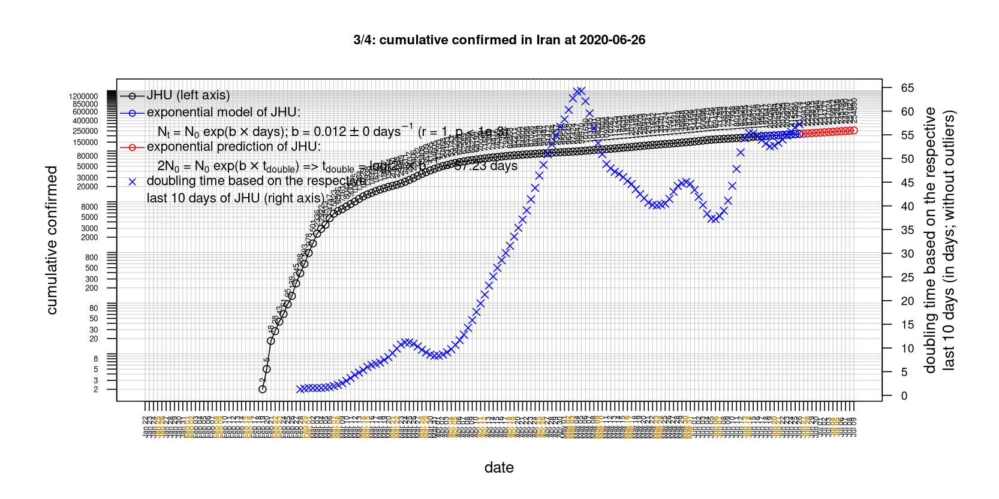
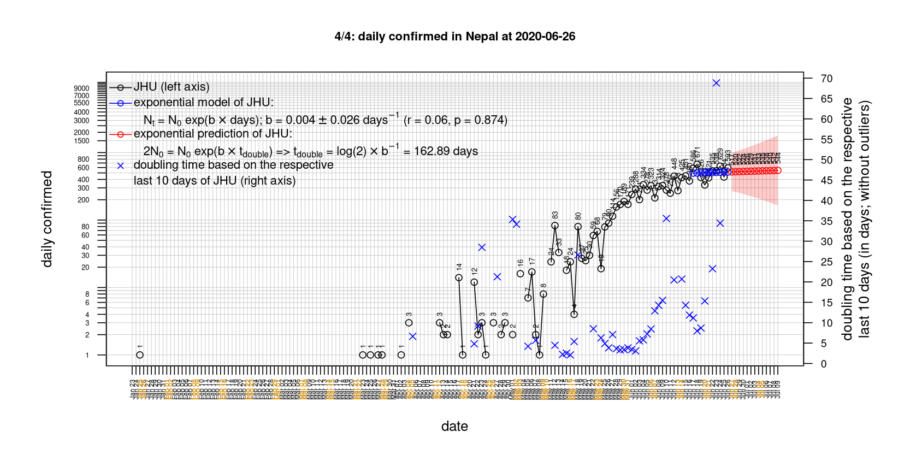

# International Covid-19 death predictions based on CSSEGISandData/COVID-19

  * upstream repo: https://github.com/CSSEGISandData/COVID-19  
  * time of last fetch of upstream repo: **2020-04-13 12:07:43 CET** (timestamp of file `.git/refs/remotes/upstream`)  
  * hash of last fetched commit of upstream repo: `2dfae42950a7a0dcc0f728799843fd313f6c2bf8` (`git rev-parse upstream/master`)  
  * last date of `COVID-19/csse_covid_19_data/time_series_covid19_*_global.csv` data: **2020-04-12**

# death rate evolution

# Select country

ordererd by time when cumulative number of deaths doubles (increasing)
country | cumulative number of deaths doubles in | period of estimation | rsq | p | cumulative deaths | cumulative confirmed
--- | --- | --- | --- | --- | --- | ---
[Canada](#Canada) | 4.53 days | 2020-04-03 to 2020-04-12 (10 days) | 0.99 | < 1e-3 | 714 | 24298
[Hungary](#Hungary) | 4.61 days | 2020-04-03 to 2020-04-12 (10 days) | 0.99 | < 1e-3 | 99 | 1410
[Russia](#Russia) | 4.85 days | 2020-04-03 to 2020-04-12 (10 days) | 0.98 | < 1e-3 | 130 | 15770
[Poland](#Poland) | 5.11 days | 2020-04-03 to 2020-04-12 (10 days) | 0.98 | < 1e-3 | 232 | 6674
[Belgium](#Belgium) | 5.17 days | 2020-04-03 to 2020-04-12 (10 days) | 0.99 | < 1e-3 | 3600 | 29647
[US](#US) | 5.41 days | 2020-04-03 to 2020-04-12 (10 days) | 0.99 | < 1e-3 | 22020 | 555313
[Sweden](#Sweden) | 5.75 days | 2020-04-03 to 2020-04-12 (10 days) | 0.95 | < 1e-3 | 899 | 10483
[United Kingdom](#United-Kingdom) | 5.77 days | 2020-04-03 to 2020-04-12 (10 days) | 0.99 | < 1e-3 | 10629 | 85206
[Turkey](#Turkey) | 6.09 days | 2020-04-03 to 2020-04-12 (10 days) | 0.99 | < 1e-3 | 1198 | 56956
[Romania](#Romania) | 6.86 days | 2020-04-03 to 2020-04-12 (10 days) | 0.99 | < 1e-3 | 316 | 6300
[Germany](#Germany) | 7.03 days | 2020-04-03 to 2020-04-12 (10 days) | 0.97 | < 1e-3 | 3022 | 127854
[Norway](#Norway) | 7.61 days | 2020-04-03 to 2020-04-12 (10 days) | 0.98 | < 1e-3 | 128 | 6525
[France](#France) | 7.72 days | 2020-04-03 to 2020-04-12 (10 days) | 0.98 | < 1e-3 | 14412 | 133670
[Australia](#Australia) | 7.97 days | 2020-04-03 to 2020-04-12 (10 days) | 0.95 | < 1e-3 | 60 | 6315
[Austria](#Austria) | 8.17 days | 2020-04-03 to 2020-04-12 (10 days) | 0.99 | < 1e-3 | 350 | 13945
[Portugal](#Portugal) | 8.6 days | 2020-04-03 to 2020-04-12 (10 days) | 1 | < 1e-3 | 504 | 16585
[Denmark](#Denmark) | 9.67 days | 2020-04-03 to 2020-04-12 (10 days) | 0.98 | < 1e-3 | 273 | 6369
[Netherlands](#Netherlands) | 10.05 days | 2020-04-03 to 2020-04-12 (10 days) | 0.98 | < 1e-3 | 2747 | 25746
[Switzerland](#Switzerland) | 10.26 days | 2020-04-03 to 2020-04-12 (10 days) | 0.99 | < 1e-3 | 1106 | 25415
[Japan](#Japan) | 13.98 days | 2020-04-03 to 2020-04-12 (10 days) | 0.89 | < 1e-3 | 108 | 6748
[Spain](#Spain) | 14.54 days | 2020-04-03 to 2020-04-12 (10 days) | 0.99 | < 1e-3 | 17209 | 166831
[Italy](#Italy) | 20.48 days | 2020-04-03 to 2020-04-12 (10 days) | 1 | < 1e-3 | 19899 | 156363
[Iran](#Iran) | 20.78 days | 2020-04-03 to 2020-04-12 (10 days) | 0.99 | < 1e-3 | 4474 | 71686
[China](#China) | 1301.96 days | 2020-04-03 to 2020-04-12 (10 days) | 0.96 | < 1e-3 | 3343 | 83134
[Nepal](#Nepal) | NA | NA | NA | NA | 0 | 12

# Australia
[top](#Select-country)

 

 

 

 
 

# Austria
[top](#Select-country)

 

 

 

 
 

# Belgium
[top](#Select-country)

 

 

 

 
 

# Canada
[top](#Select-country)

 

 

 

 
 

# China
[top](#Select-country)

 

 

 

 
 

# Denmark
[top](#Select-country)

 

 

 

 
 

# France
[top](#Select-country)

 

 

 

 
 

# Germany
[top](#Select-country)

 

 

 

 
 

# Hungary
[top](#Select-country)

 

 

 

 
 

# Iran
[top](#Select-country)

 

 

 

 
 

# Italy
[top](#Select-country)

national responses:
1. 2020-03-04: https://www.theguardian.com/world/2020/mar/04/italy-orders-closure-of-schools-and-universities-due-to-coronavirus
2. 2020-03-09: https://www.bbc.co.uk/sport/51808683
3. 2020-03-11: https://www.washingtonpost.com/world/europe/merkel-coronavirus-germany/2020/03/11/e276252a-6399-11ea-8a8e-5c5336b32760_story.html

 

 

 

 
 

# Japan
[top](#Select-country)

 

 

 

 
 

# Nepal
[top](#Select-country)

 

 

 

 
 

# Netherlands
[top](#Select-country)

 

 

 

 
 

# Norway
[top](#Select-country)

 

 

 

 
 

# Poland
[top](#Select-country)

 

 

 

 
 

# Portugal
[top](#Select-country)

 

 

 

 
 

# Romania
[top](#Select-country)

 

 

 

 
 

# Russia
[top](#Select-country)

 

 

 

 
 

# Spain
[top](#Select-country)

 

 

 

 
 

# Sweden
[top](#Select-country)

 

 

 

 
 

# Switzerland
[top](#Select-country)

 

 

 

 
 

# Turkey
[top](#Select-country)

 

 

 

 
 

# US
[top](#Select-country)

 

 

 

 
 

# United Kingdom
[top](#Select-country)

 

 

 

 
 

