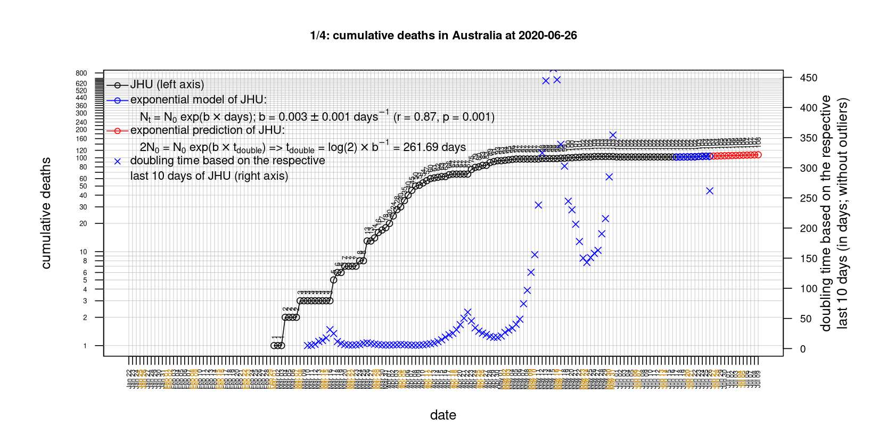
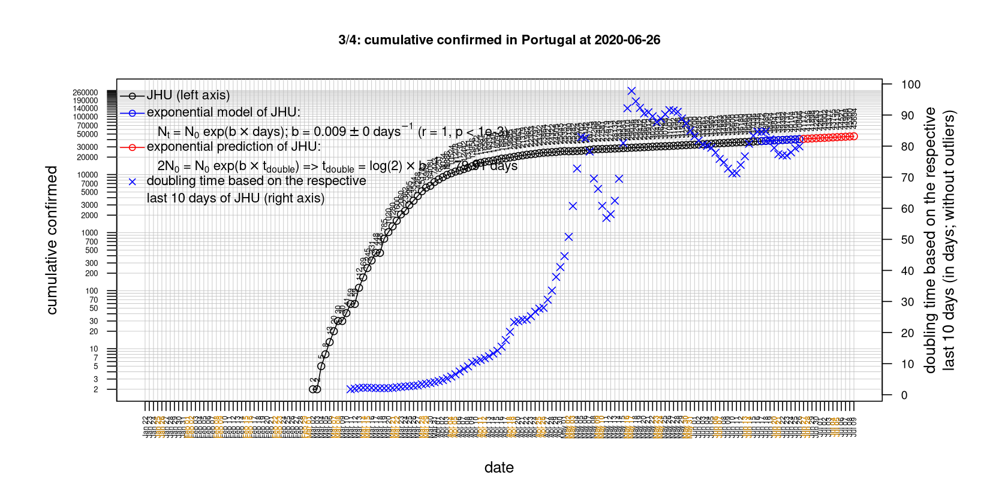
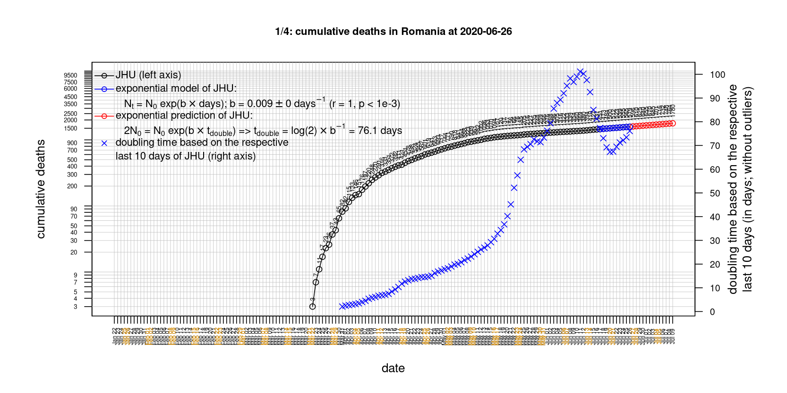
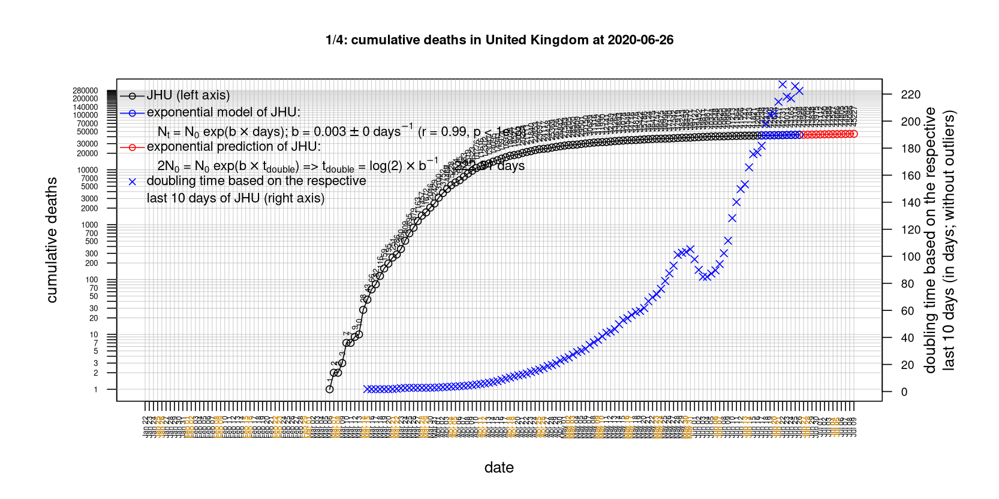

# International Covid-19 death predictions based on CSSEGISandData/COVID-19

  * upstream repo: https://github.com/CSSEGISandData/COVID-19  
  * time of last fetch of upstream repo: **2020-05-13 07:26:33 CET** (timestamp of file `.git/refs/remotes/upstream`)  
  * hash of last fetched commit of upstream repo: `25e7bc4edceaa97b28d4273aa11adbeff5a40f43` (`git rev-parse upstream/master`)  
  * last date of `COVID-19/csse_covid_19_data/time_series_covid19_*_global.csv` data: **2020-05-12**

# death rate evolution

# Select country

ordererd by time when cumulative number of deaths doubles (increasing)
country | cumulative number of deaths doubles in | period of estimation | rsq | p | cumulative deaths | cumulative confirmed
--- | --- | --- | --- | --- | --- | ---
[Brazil](#Brazil) | 10.63 days | 2020-05-03 to 2020-05-12 (10 days) | 0.99 | < 1e-3 | 12461 | 178214
[Russia](#Russia) | 12.38 days | 2020-05-03 to 2020-05-12 (10 days) | 1 | < 1e-3 | 2116 | 232243
[Canada](#Canada) | 19.29 days | 2020-05-03 to 2020-05-12 (10 days) | 0.99 | < 1e-3 | 5300 | 72419
[Japan](#Japan) | 24.22 days | 2020-05-03 to 2020-05-12 (10 days) | 0.95 | < 1e-3 | 657 | 15968
[Romania](#Romania) | 26.15 days | 2020-05-03 to 2020-05-12 (10 days) | 0.99 | < 1e-3 | 1002 | 15778
[Hungary](#Hungary) | 27.25 days | 2020-05-03 to 2020-05-12 (10 days) | 0.99 | < 1e-3 | 425 | 3313
[Sweden](#Sweden) | 28.79 days | 2020-05-03 to 2020-05-12 (10 days) | 0.95 | < 1e-3 | 3313 | 27272
[Poland](#Poland) | 30.45 days | 2020-05-03 to 2020-05-12 (10 days) | 0.99 | < 1e-3 | 839 | 16921
[US](#US) | 31.23 days | 2020-05-03 to 2020-05-12 (10 days) | 0.98 | < 1e-3 | 82356 | 1369376
[United Kingdom](#United-Kingdom) | 44.35 days | 2020-05-03 to 2020-05-12 (10 days) | 0.98 | < 1e-3 | 32769 | 227741
[Turkey](#Turkey) | 46.44 days | 2020-05-03 to 2020-05-12 (10 days) | 1 | < 1e-3 | 3894 | 141475
[Germany](#Germany) | 51.12 days | 2020-05-03 to 2020-05-12 (10 days) | 0.94 | < 1e-3 | 7738 | 173171
[Belgium](#Belgium) | 53.52 days | 2020-05-03 to 2020-05-12 (10 days) | 0.93 | < 1e-3 | 8761 | 53779
[Portugal](#Portugal) | 60.88 days | 2020-05-03 to 2020-05-12 (10 days) | 0.99 | < 1e-3 | 1163 | 27913
[Denmark](#Denmark) | 67.44 days | 2020-05-03 to 2020-05-12 (10 days) | 0.91 | < 1e-3 | 527 | 10789
[Netherlands](#Netherlands) | 68.47 days | 2020-05-03 to 2020-05-12 (10 days) | 0.97 | < 1e-3 | 5529 | 43183
[Iran](#Iran) | 76.39 days | 2020-05-03 to 2020-05-12 (10 days) | 0.99 | < 1e-3 | 6733 | 110767
[France](#France) | 84.96 days | 2020-05-03 to 2020-05-12 (10 days) | 0.97 | < 1e-3 | 26994 | 178349
[Italy](#Italy) | 88.93 days | 2020-05-03 to 2020-05-12 (10 days) | 0.99 | < 1e-3 | 30911 | 221216
[Spain](#Spain) | 95.5 days | 2020-05-03 to 2020-05-12 (10 days) | 0.99 | < 1e-3 | 26920 | 228030
[Norway](#Norway) | 99 days | 2020-05-03 to 2020-05-12 (10 days) | 0.9 | < 1e-3 | 228 | 8157
[Switzerland](#Switzerland) | 125.75 days | 2020-05-03 to 2020-05-12 (10 days) | 0.97 | < 1e-3 | 1867 | 30380
[Austria](#Austria) | 154.83 days | 2020-05-03 to 2020-05-12 (10 days) | 0.98 | < 1e-3 | 623 | 15961
[Korea, South](#Korea,-South) | 304.55 days | 2020-05-03 to 2020-05-12 (10 days) | 0.83 | < 1e-3 | 259 | 10962
[Australia](#Australia) | 324.59 days | 2020-05-03 to 2020-05-12 (10 days) | 0.62 | 0.007 | 98 | 6980
[China](#China) | NA | NA | NA | NA | 4637 | 84018
[Nepal](#Nepal) | NA | NA | NA | NA | 0 | 217

# Australia
[top](#Select-country)

 

 

 

 
 

# Austria
[top](#Select-country)

 

 

 

 
 

# Belgium
[top](#Select-country)

 

 

 

 
 

# Brazil
[top](#Select-country)

 

 

 

 
 

# Canada
[top](#Select-country)

 

 

 

 
 

# China
[top](#Select-country)

 

 

 

 
 

# Denmark
[top](#Select-country)

 

 

 

 
 

# France
[top](#Select-country)

 

 

 

 
 

# Germany
[top](#Select-country)

 

 

 

 

 
 

# Hungary
[top](#Select-country)

 

 

 

 
 

# Iran
[top](#Select-country)

 

 

 

 
 

# Italy
[top](#Select-country)

national responses:
1. 2020-03-04: https://www.theguardian.com/world/2020/mar/04/italy-orders-closure-of-schools-and-universities-due-to-coronavirus
2. 2020-03-09: https://www.bbc.co.uk/sport/51808683
3. 2020-03-11: https://www.washingtonpost.com/world/europe/merkel-coronavirus-germany/2020/03/11/e276252a-6399-11ea-8a8e-5c5336b32760_story.html

 

 

 

 
 

# Japan
[top](#Select-country)

 

 

 

 
 

# Korea, South
[top](#Select-country)

 

 

 

 
 

# Nepal
[top](#Select-country)

 

 

 

 
 

# Netherlands
[top](#Select-country)

 

 

 

 
 

# Norway
[top](#Select-country)

 

 

 

 
 

# Poland
[top](#Select-country)

 

 

 

 
 

# Portugal
[top](#Select-country)

 

 

 

 
 

# Romania
[top](#Select-country)

 

 

 

 
 

# Russia
[top](#Select-country)

 

 

 

 
 

# Spain
[top](#Select-country)

 

 

 

 
 

# Sweden
[top](#Select-country)

 

 

 

 
 

# Switzerland
[top](#Select-country)

 

 

 

 
 

# Turkey
[top](#Select-country)

 

 

 

 
 

# US
[top](#Select-country)

 

 

 

 
 

# United Kingdom
[top](#Select-country)

 

 

 

 
 

