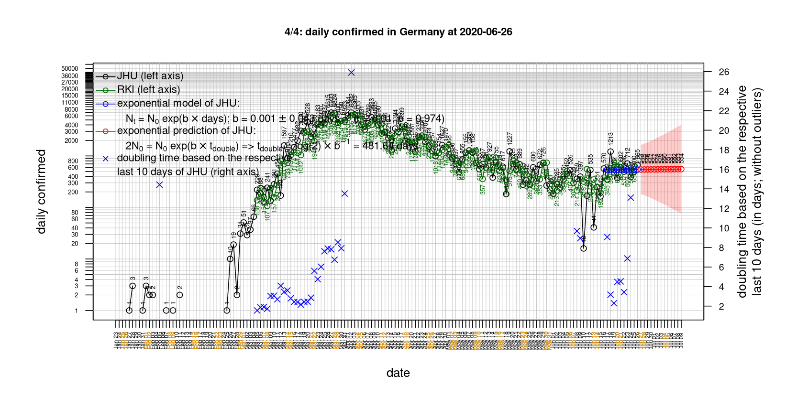
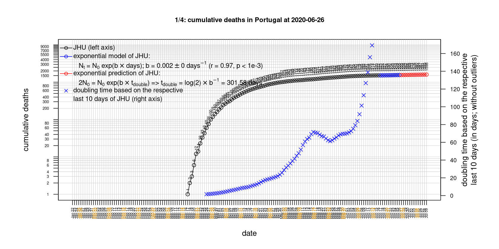

# International Covid-19 death predictions based on CSSEGISandData/COVID-19

  * upstream repo: https://github.com/CSSEGISandData/COVID-19  
  * time of last fetch of upstream repo: **2020-05-22 07:41:46 CET** (timestamp of file `.git/refs/remotes/upstream`)  
  * hash of last fetched commit of upstream repo: `daa20971c8a6e25f63b3f7d009a95bdc55943dc6` (`git rev-parse upstream/master`)  
  * last date of `COVID-19/csse_covid_19_data/time_series_covid19_*_global.csv` data: **2020-05-21**

# death rate evolution

# Select country

ordererd by time when cumulative number of deaths doubles (increasing)
country | cumulative number of deaths doubles in | period of estimation | rsq | p | cumulative deaths | cumulative confirmed
--- | --- | --- | --- | --- | --- | ---
[Brazil](#Brazil) | 13.63 days | 2020-05-12 to 2020-05-21 (10 days) | 1 | < 1e-3 | 20047 | 310087
[Russia](#Russia) | 16.5 days | 2020-05-12 to 2020-05-21 (10 days) | 1 | < 1e-3 | 3099 | 317554
[Japan](#Japan) | 37.61 days | 2020-05-12 to 2020-05-21 (10 days) | 0.96 | < 1e-3 | 777 | 16424
[Canada](#Canada) | 39.11 days | 2020-05-12 to 2020-05-21 (10 days) | 0.98 | < 1e-3 | 6267 | 82742
[Poland](#Poland) | 44.65 days | 2020-05-12 to 2020-05-21 (10 days) | 0.97 | < 1e-3 | 972 | 20143
[Romania](#Romania) | 45.17 days | 2020-05-12 to 2020-05-21 (10 days) | 0.97 | < 1e-3 | 1156 | 17585
[Sweden](#Sweden) | 46.64 days | 2020-05-12 to 2020-05-21 (10 days) | 0.91 | < 1e-3 | 3871 | 32172
[US](#US) | 46.96 days | 2020-05-12 to 2020-05-21 (10 days) | 0.99 | < 1e-3 | 94702 | 1577147
[Hungary](#Hungary) | 55.29 days | 2020-05-12 to 2020-05-21 (10 days) | 0.99 | < 1e-3 | 473 | 3641
[Portugal](#Portugal) | 66.48 days | 2020-05-12 to 2020-05-21 (10 days) | 0.99 | < 1e-3 | 1277 | 29912
[United Kingdom](#United-Kingdom) | 66.75 days | 2020-05-12 to 2020-05-21 (10 days) | 0.99 | < 1e-3 | 36124 | 252246
[Turkey](#Turkey) | 72.52 days | 2020-05-12 to 2020-05-21 (10 days) | 0.97 | < 1e-3 | 4249 | 153548
[Iran](#Iran) | 86.04 days | 2020-05-12 to 2020-05-21 (10 days) | 1 | < 1e-3 | 7249 | 129341
[Denmark](#Denmark) | 111.03 days | 2020-05-12 to 2020-05-21 (10 days) | 0.98 | < 1e-3 | 561 | 11380
[Germany](#Germany) | 121.77 days | 2020-05-12 to 2020-05-21 (10 days) | 0.96 | < 1e-3 | 8203 | 179021
[Italy](#Italy) | 129.16 days | 2020-05-12 to 2020-05-21 (10 days) | 0.98 | < 1e-3 | 32486 | 228006
[France](#France) | 131.12 days | 2020-05-12 to 2020-05-21 (10 days) | 0.87 | < 1e-3 | 28218 | 181951
[Belgium](#Belgium) | 138.71 days | 2020-05-12 to 2020-05-21 (10 days) | 0.97 | < 1e-3 | 9186 | 56235
[Netherlands](#Netherlands) | 144.83 days | 2020-05-12 to 2020-05-21 (10 days) | 0.96 | < 1e-3 | 5794 | 44900
[Spain](#Spain) | 177.47 days | 2020-05-12 to 2020-05-21 (10 days) | 0.95 | < 1e-3 | 27940 | 233037
[Australia](#Australia) | 206.29 days | 2020-05-12 to 2020-05-21 (10 days) | 0.84 | < 1e-3 | 101 | 7095
[Norway](#Norway) | 249.84 days | 2020-05-12 to 2020-05-21 (10 days) | 0.85 | < 1e-3 | 235 | 8309
[Korea, South](#Korea,-South) | 325.32 days | 2020-05-12 to 2020-05-21 (10 days) | 0.92 | < 1e-3 | 264 | 11142
[Austria](#Austria) | 386.35 days | 2020-05-12 to 2020-05-21 (10 days) | 0.95 | < 1e-3 | 633 | 16404
[Switzerland](#Switzerland) | 388.49 days | 2020-05-12 to 2020-05-21 (10 days) | 0.99 | < 1e-3 | 1898 | 30694
[China](#China) | 22099.48 days | 2020-05-12 to 2020-05-21 (10 days) | 0.73 | 0.002 | 4638 | 84063
[Nepal](#Nepal) | NA | NA | NA | NA | 3 | 457

# Australia
[top](#Select-country)

 

 

 

 
 

# Austria
[top](#Select-country)

 

 

 

 
 

# Belgium
[top](#Select-country)

 

 

 

 
 

# Brazil
[top](#Select-country)

 

 

 

 
 

# Canada
[top](#Select-country)

 

 

 

 
 

# China
[top](#Select-country)

 

 

 

 
 

# Denmark
[top](#Select-country)

 

 

 

 
 

# France
[top](#Select-country)

 

 

 

 
 

# Germany
[top](#Select-country)

 

 

 

 

 
 

# Hungary
[top](#Select-country)

 

 

 

 
 

# Iran
[top](#Select-country)

 

 

 

 
 

# Italy
[top](#Select-country)

national responses:
1. 2020-03-04: https://www.theguardian.com/world/2020/mar/04/italy-orders-closure-of-schools-and-universities-due-to-coronavirus
2. 2020-03-09: https://www.bbc.co.uk/sport/51808683
3. 2020-03-11: https://www.washingtonpost.com/world/europe/merkel-coronavirus-germany/2020/03/11/e276252a-6399-11ea-8a8e-5c5336b32760_story.html

 

 

 

 
 

# Japan
[top](#Select-country)

 

 

 

 
 

# Korea, South
[top](#Select-country)

 

 

 

 
 

# Nepal
[top](#Select-country)

 

 

 

 
 

# Netherlands
[top](#Select-country)

 

 

 

 
 

# Norway
[top](#Select-country)

 

 

 

 
 

# Poland
[top](#Select-country)

 

 

 

 
 

# Portugal
[top](#Select-country)

 

 

 

 
 

# Romania
[top](#Select-country)

 

 

 

 
 

# Russia
[top](#Select-country)

 

 

 

 
 

# Spain
[top](#Select-country)

 

 

 

 
 

# Sweden
[top](#Select-country)

 

 

 

 
 

# Switzerland
[top](#Select-country)

 

 

 

 
 

# Turkey
[top](#Select-country)

 

 

 

 
 

# US
[top](#Select-country)

 

 

 

 
 

# United Kingdom
[top](#Select-country)

 

 

 

 
 

