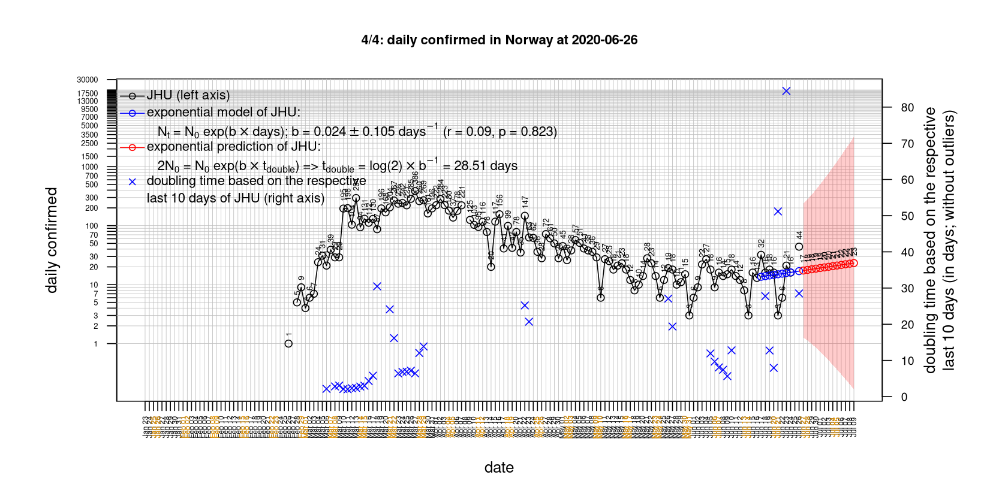
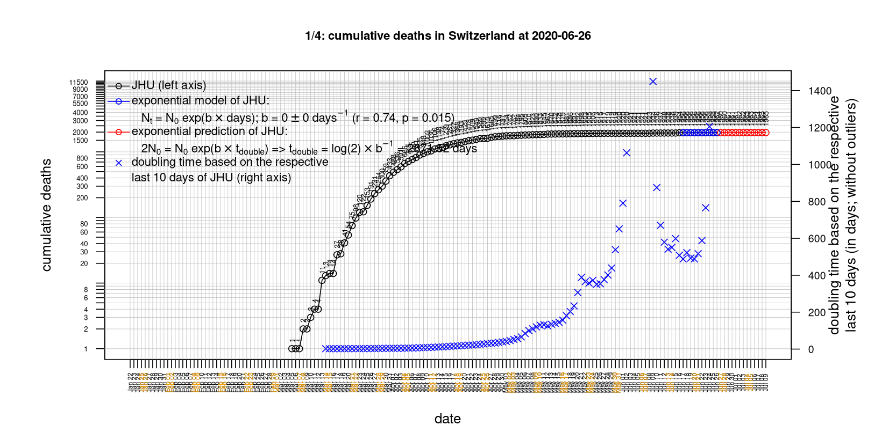

# International Covid-19 death predictions based on CSSEGISandData/COVID-19

  * upstream repo: https://github.com/CSSEGISandData/COVID-19  
  * time of last pull of upstream repo: **2020-03-25 07:32:50 CET** (timestamp of file `.git/refs/remotes/upstream`)  
  * hash of last pulled commit of upstream repo: `8d7bdf1be889c68251b75fb9b0b810346dcd2800` (`git rev-parse upstream/master`)  
  * last date of `COVID-19/csse_covid_19_data/time_series_covid19_*_global.csv` data: **2020-03-24**

# Select country

ordererd by time when cumulative number of deaths doubles (increasing)
country | 
cumulative number of deaths doubles in
 | period of a estimation | rsq | p
--- | --- | --- | --- | ---
[Romania](#Romania) | 1.07 days | 2020-03-14 to 2020-03-24 (10 days) | 0.97 | 0.111
[Portugal](#Portugal) | 1.39 days | 2020-03-14 to 2020-03-24 (10 days) | 0.98 | < 1e-3
[Belgium](#Belgium) | 1.8 days | 2020-03-14 to 2020-03-24 (10 days) | 0.98 | < 1e-3
[Canada](#Canada) | 2.05 days | 2020-03-14 to 2020-03-24 (10 days) | 0.91 | < 1e-3
[Austria](#Austria) | 2.1 days | 2020-03-14 to 2020-03-24 (10 days) | 0.96 | < 1e-3
[Denmark](#Denmark) | 2.19 days | 2020-03-14 to 2020-03-24 (10 days) | 0.98 | < 1e-3
[United Kingdom](#United-Kingdom) | 2.2 days | 2020-03-14 to 2020-03-24 (10 days) | 0.96 | < 1e-3
[Netherlands](#Netherlands) | 2.23 days | 2020-03-14 to 2020-03-24 (10 days) | 0.98 | < 1e-3
[Germany](#Germany) | 2.35 days | 2020-03-14 to 2020-03-24 (10 days) | 0.99 | < 1e-3
[France](#France) | 2.56 days | 2020-03-14 to 2020-03-24 (10 days) | 0.96 | < 1e-3
[Sweden](#Sweden) | 2.61 days | 2020-03-14 to 2020-03-24 (10 days) | 0.96 | < 1e-3
[US](#US) | 2.61 days | 2020-03-14 to 2020-03-24 (10 days) | 0.99 | < 1e-3
[Spain](#Spain) | 2.63 days | 2020-03-14 to 2020-03-24 (10 days) | 1 | < 1e-3
[Switzerland](#Switzerland) | 2.69 days | 2020-03-14 to 2020-03-24 (10 days) | 0.97 | < 1e-3
[Italy](#Italy) | 4.48 days | 2020-03-14 to 2020-03-24 (10 days) | 0.99 | < 1e-3
[Norway](#Norway) | 4.72 days | 2020-03-14 to 2020-03-24 (10 days) | 0.88 | < 1e-3
[Iran](#Iran) | 6.04 days | 2020-03-14 to 2020-03-24 (10 days) | 0.97 | < 1e-3
[Australia](#Australia) | 6.54 days | 2020-03-14 to 2020-03-24 (10 days) | 0.83 | < 1e-3
[Poland](#Poland) | 6.56 days | 2020-03-14 to 2020-03-24 (10 days) | 0.89 | < 1e-3
[Japan](#Japan) | 9.91 days | 2020-03-14 to 2020-03-24 (10 days) | 0.96 | < 1e-3
[China](#China) | 255.95 days | 2020-03-14 to 2020-03-24 (10 days) | 0.97 | < 1e-3
[Nepal](#Nepal) | NA | NA | NA | NA
[Russia](#Russia) | NA | NA | NA | NA

# Australia
[top](#Select-country)

 

 

 

 
 

# Austria
[top](#Select-country)

 

 

 

 
 

# Belgium
[top](#Select-country)

 

 

 

 
 

# Canada
[top](#Select-country)

 

 

 

 
 

# China
[top](#Select-country)

 

 

 

 
 

# Denmark
[top](#Select-country)

 

 

 

 
 

# France
[top](#Select-country)

 

 

 

 
 

# Germany
[top](#Select-country)

 

 

 

 
 

# Iran
[top](#Select-country)

 

 

 

 
 

# Italy
[top](#Select-country)

national responses:
1. 2020-03-04: https://www.theguardian.com/world/2020/mar/04/italy-orders-closure-of-schools-and-universities-due-to-coronavirus
2. 2020-03-09: https://www.bbc.co.uk/sport/51808683
3. 2020-03-11: https://www.washingtonpost.com/world/europe/merkel-coronavirus-germany/2020/03/11/e276252a-6399-11ea-8a8e-5c5336b32760_story.html

 

 

 

 
 

# Japan
[top](#Select-country)

 

 

 

 
 

# Nepal
[top](#Select-country)

 

 

 

 
 

# Netherlands
[top](#Select-country)

 

 

 

 
 

# Norway
[top](#Select-country)

 

 

 

 
 

# Poland
[top](#Select-country)

 

 

 

 
 

# Portugal
[top](#Select-country)

 

 

 

 
 

# Romania
[top](#Select-country)

 

 

 

 
 

# Russia
[top](#Select-country)

 

 

 

 
 

# Spain
[top](#Select-country)

 

 

 

 
 

# Sweden
[top](#Select-country)

 

 

 

 
 

# Switzerland
[top](#Select-country)

 

 

 

 
 

# US
[top](#Select-country)

 

 

 

 
 

# United Kingdom
[top](#Select-country)

 

 

 

 
 

