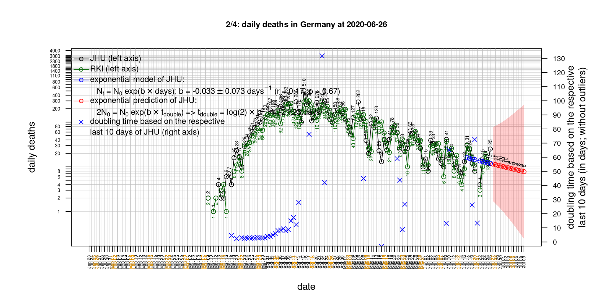
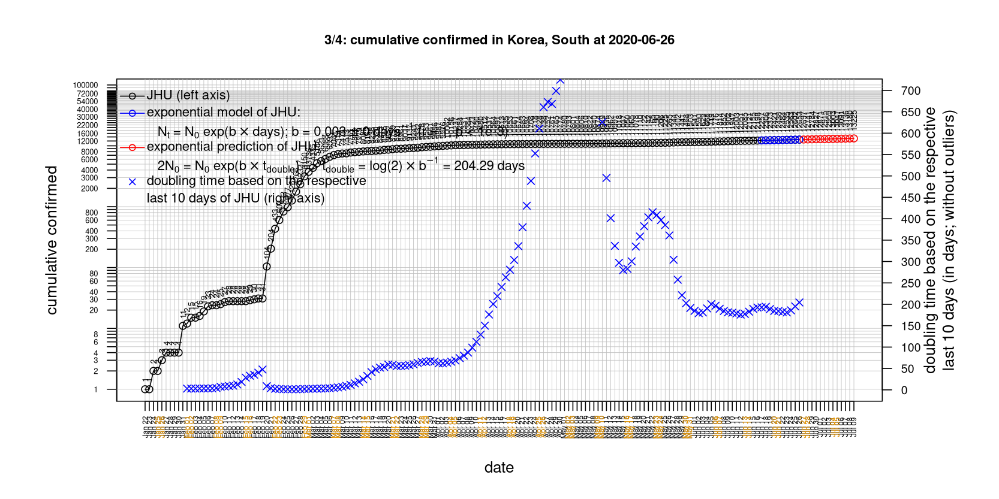
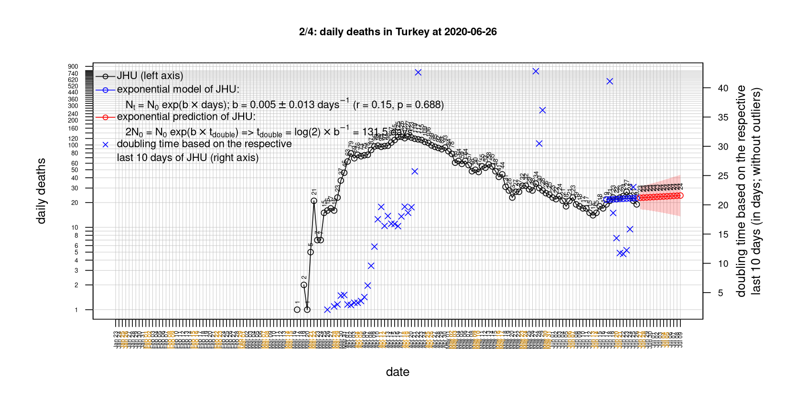

# International Covid-19 death predictions based on CSSEGISandData/COVID-19

  * upstream repo: https://github.com/CSSEGISandData/COVID-19  
  * time of last fetch of upstream repo: **2020-05-17 12:58:02 CET** (timestamp of file `.git/refs/remotes/upstream`)  
  * hash of last fetched commit of upstream repo: `c878cd0afe0bdf73746c5fd7d60d6a76944b8b25` (`git rev-parse upstream/master`)  
  * last date of `COVID-19/csse_covid_19_data/time_series_covid19_*_global.csv` data: **2020-05-16**

# death rate evolution

# Select country

ordererd by time when cumulative number of deaths doubles (increasing)
country | cumulative number of deaths doubles in | period of estimation | rsq | p | cumulative deaths | cumulative confirmed
--- | --- | --- | --- | --- | --- | ---
[Brazil](#Brazil) | 11.96 days | 2020-05-07 to 2020-05-16 (10 days) | 1 | < 1e-3 | 15662 | 233511
[Russia](#Russia) | 14.25 days | 2020-05-07 to 2020-05-16 (10 days) | 1 | < 1e-3 | 2537 | 272043
[Canada](#Canada) | 25.1 days | 2020-05-07 to 2020-05-16 (10 days) | 0.99 | < 1e-3 | 5800 | 77206
[Japan](#Japan) | 26.24 days | 2020-05-07 to 2020-05-16 (10 days) | 1 | < 1e-3 | 725 | 16237
[Romania](#Romania) | 30.66 days | 2020-05-07 to 2020-05-16 (10 days) | 0.99 | < 1e-3 | 1094 | 16704
[Poland](#Poland) | 31.21 days | 2020-05-07 to 2020-05-16 (10 days) | 0.99 | < 1e-3 | 915 | 18257
[Sweden](#Sweden) | 34.04 days | 2020-05-07 to 2020-05-16 (10 days) | 0.96 | < 1e-3 | 3674 | 29677
[US](#US) | 38.93 days | 2020-05-07 to 2020-05-16 (10 days) | 1 | < 1e-3 | 88754 | 1467820
[Hungary](#Hungary) | 41.58 days | 2020-05-07 to 2020-05-16 (10 days) | 0.97 | < 1e-3 | 448 | 3473
[Turkey](#Turkey) | 51.74 days | 2020-05-07 to 2020-05-16 (10 days) | 1 | < 1e-3 | 4096 | 148067
[United Kingdom](#United-Kingdom) | 54.2 days | 2020-05-07 to 2020-05-16 (10 days) | 0.99 | < 1e-3 | 34546 | 241461
[Portugal](#Portugal) | 71.56 days | 2020-05-07 to 2020-05-16 (10 days) | 0.99 | < 1e-3 | 1203 | 28810
[Norway](#Norway) | 77.42 days | 2020-05-07 to 2020-05-16 (10 days) | 0.93 | < 1e-3 | 232 | 8237
[Germany](#Germany) | 85.75 days | 2020-05-07 to 2020-05-16 (10 days) | 0.97 | < 1e-3 | 7938 | 175752
[Iran](#Iran) | 91.55 days | 2020-05-07 to 2020-05-16 (10 days) | 1 | < 1e-3 | 6937 | 118392
[Netherlands](#Netherlands) | 93.98 days | 2020-05-07 to 2020-05-16 (10 days) | 0.98 | < 1e-3 | 5689 | 44070
[Belgium](#Belgium) | 94.11 days | 2020-05-07 to 2020-05-16 (10 days) | 0.99 | < 1e-3 | 9005 | 54989
[France](#France) | 98.98 days | 2020-05-07 to 2020-05-16 (10 days) | 0.97 | < 1e-3 | 27532 | 179630
[Italy](#Italy) | 107.69 days | 2020-05-07 to 2020-05-16 (10 days) | 1 | < 1e-3 | 31763 | 224760
[Spain](#Spain) | 112.07 days | 2020-05-07 to 2020-05-16 (10 days) | 1 | < 1e-3 | 27563 | 230698
[Denmark](#Denmark) | 141.71 days | 2020-05-07 to 2020-05-16 (10 days) | 0.87 | < 1e-3 | 543 | 11056
[Switzerland](#Switzerland) | 156.66 days | 2020-05-07 to 2020-05-16 (10 days) | 0.94 | < 1e-3 | 1879 | 30572
[Austria](#Austria) | 200.27 days | 2020-05-07 to 2020-05-16 (10 days) | 0.98 | < 1e-3 | 629 | 16201
[Korea, South](#Korea,-South) | 229.39 days | 2020-05-07 to 2020-05-16 (10 days) | 0.93 | < 1e-3 | 262 | 11050
[Australia](#Australia) | 446.04 days | 2020-05-07 to 2020-05-16 (10 days) | 0.76 | 0.001 | 98 | 7044
[China](#China) | 58931.95 days | 2020-05-07 to 2020-05-16 (10 days) | 0.27 | 0.122 | 4638 | 84044
[Nepal](#Nepal) | NA | NA | NA | NA | 1 | 291

# Australia
[top](#Select-country)

 

 

 

 
 

# Austria
[top](#Select-country)

 

 

 

 
 

# Belgium
[top](#Select-country)

 

 

 

 
 

# Brazil
[top](#Select-country)

 

 

 

 
 

# Canada
[top](#Select-country)

 

 

 

 
 

# China
[top](#Select-country)

 

 

 

 
 

# Denmark
[top](#Select-country)

 

 

 

 
 

# France
[top](#Select-country)

 

 

 

 
 

# Germany
[top](#Select-country)

 

 

 

 

 
 

# Hungary
[top](#Select-country)

 

 

 

 
 

# Iran
[top](#Select-country)

 

 

 

 
 

# Italy
[top](#Select-country)

national responses:
1. 2020-03-04: https://www.theguardian.com/world/2020/mar/04/italy-orders-closure-of-schools-and-universities-due-to-coronavirus
2. 2020-03-09: https://www.bbc.co.uk/sport/51808683
3. 2020-03-11: https://www.washingtonpost.com/world/europe/merkel-coronavirus-germany/2020/03/11/e276252a-6399-11ea-8a8e-5c5336b32760_story.html

 

 

 

 
 

# Japan
[top](#Select-country)

 

 

 

 
 

# Korea, South
[top](#Select-country)

 

 

 

 
 

# Nepal
[top](#Select-country)

 

 

 

 
 

# Netherlands
[top](#Select-country)

 

 

 

 
 

# Norway
[top](#Select-country)

 

 

 

 
 

# Poland
[top](#Select-country)

 

 

 

 
 

# Portugal
[top](#Select-country)

 

 

 

 
 

# Romania
[top](#Select-country)

 

 

 

 
 

# Russia
[top](#Select-country)

 

 

 

 
 

# Spain
[top](#Select-country)

 

 

 

 
 

# Sweden
[top](#Select-country)

 

 

 

 
 

# Switzerland
[top](#Select-country)

 

 

 

 
 

# Turkey
[top](#Select-country)

 

 

 

 
 

# US
[top](#Select-country)

 

 

 

 
 

# United Kingdom
[top](#Select-country)

 

 

 

 
 

