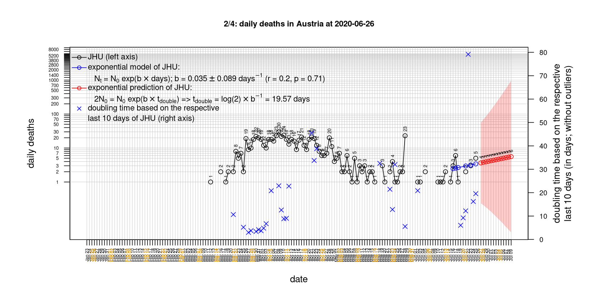
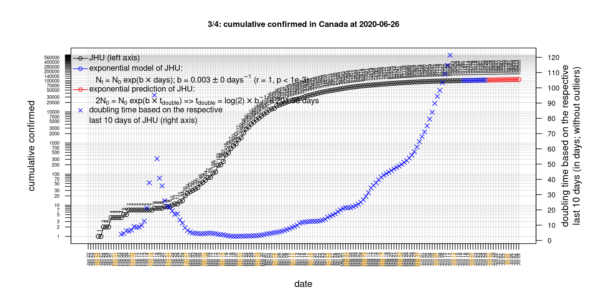
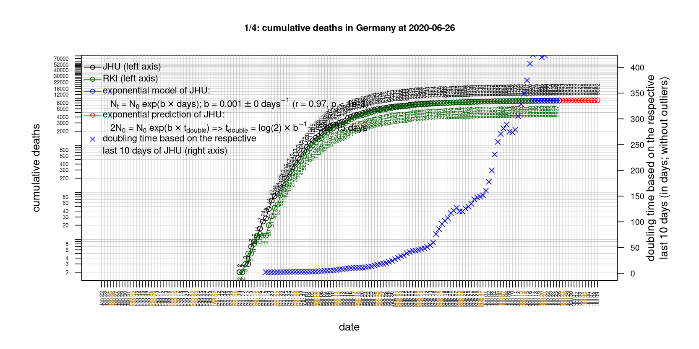
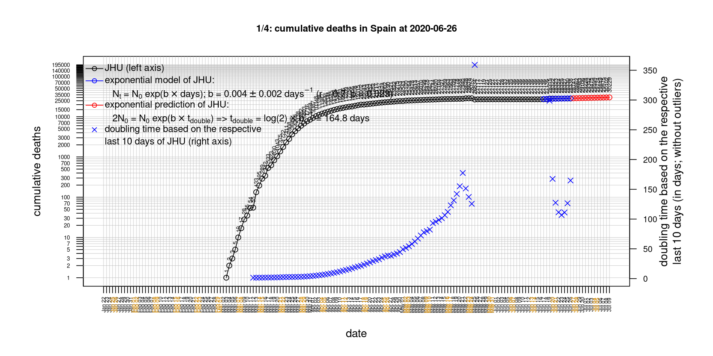
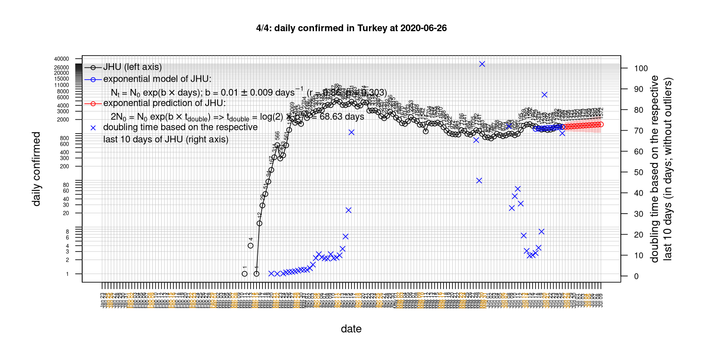
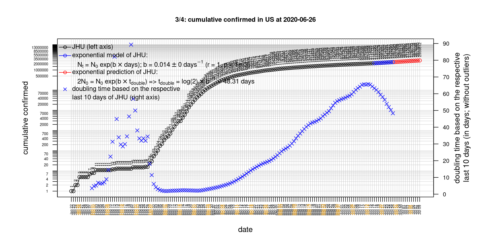

# International Covid-19 death predictions based on CSSEGISandData/COVID-19

  * upstream repo: https://github.com/CSSEGISandData/COVID-19  
  * time of last fetch of upstream repo: **2020-04-17 07:57:29 CET** (timestamp of file `.git/refs/remotes/upstream`)  
  * hash of last fetched commit of upstream repo: `897596d1f524472583cf29915041f243eabfcde9` (`git rev-parse upstream/master`)  
  * last date of `COVID-19/csse_covid_19_data/time_series_covid19_*_global.csv` data: **2020-04-16**

# death rate evolution

# Select country

ordererd by time when cumulative number of deaths doubles (increasing)
country | cumulative number of deaths doubles in | period of estimation | rsq | p | cumulative deaths | cumulative confirmed
--- | --- | --- | --- | --- | --- | ---
[Russia](#Russia) | 4.38 days | 2020-04-07 to 2020-04-16 (10 days) | 1 | < 1e-3 | 232 | 27938
[Canada](#Canada) | 5.39 days | 2020-04-07 to 2020-04-16 (10 days) | 0.99 | < 1e-3 | 1257 | 30808
[Hungary](#Hungary) | 5.7 days | 2020-04-07 to 2020-04-16 (10 days) | 0.98 | < 1e-3 | 142 | 1652
[US](#US) | 7.07 days | 2020-04-07 to 2020-04-16 (10 days) | 0.99 | < 1e-3 | 32916 | 667801
[Belgium](#Belgium) | 7.17 days | 2020-04-07 to 2020-04-16 (10 days) | 0.98 | < 1e-3 | 4857 | 34809
[Poland](#Poland) | 7.52 days | 2020-04-07 to 2020-04-16 (10 days) | 0.98 | < 1e-3 | 314 | 7918
[Turkey](#Turkey) | 7.75 days | 2020-04-07 to 2020-04-16 (10 days) | 0.99 | < 1e-3 | 1643 | 74193
[United Kingdom](#United-Kingdom) | 8.03 days | 2020-04-07 to 2020-04-16 (10 days) | 0.98 | < 1e-3 | 13759 | 104145
[Sweden](#Sweden) | 8.98 days | 2020-04-07 to 2020-04-16 (10 days) | 0.94 | < 1e-3 | 1333 | 12540
[Romania](#Romania) | 9.3 days | 2020-04-07 to 2020-04-16 (10 days) | 0.98 | < 1e-3 | 392 | 7707
[Japan](#Japan) | 9.58 days | 2020-04-07 to 2020-04-16 (10 days) | 0.89 | < 1e-3 | 178 | 8626
[Germany](#Germany) | 10.07 days | 2020-04-07 to 2020-04-16 (10 days) | 0.96 | < 1e-3 | 4052 | 137698
[Portugal](#Portugal) | 10.48 days | 2020-04-07 to 2020-04-16 (10 days) | 0.99 | < 1e-3 | 629 | 18841
[France](#France) | 11.63 days | 2020-04-07 to 2020-04-16 (10 days) | 0.98 | < 1e-3 | 17941 | 147091
[Norway](#Norway) | 12.13 days | 2020-04-07 to 2020-04-16 (10 days) | 0.98 | < 1e-3 | 152 | 6896
[Austria](#Austria) | 12.65 days | 2020-04-07 to 2020-04-16 (10 days) | 0.96 | < 1e-3 | 410 | 14476
[Denmark](#Denmark) | 13.94 days | 2020-04-07 to 2020-04-16 (10 days) | 0.99 | < 1e-3 | 321 | 7074
[Netherlands](#Netherlands) | 14.56 days | 2020-04-07 to 2020-04-16 (10 days) | 0.99 | < 1e-3 | 3327 | 29383
[Switzerland](#Switzerland) | 14.67 days | 2020-04-07 to 2020-04-16 (10 days) | 0.98 | < 1e-3 | 1281 | 26732
[Australia](#Australia) | 18.94 days | 2020-04-07 to 2020-04-16 (10 days) | 0.91 | < 1e-3 | 63 | 6462
[Spain](#Spain) | 20.33 days | 2020-04-07 to 2020-04-16 (10 days) | 0.99 | < 1e-3 | 19315 | 184948
[Italy](#Italy) | 24.22 days | 2020-04-07 to 2020-04-16 (10 days) | 1 | < 1e-3 | 22170 | 168941
[Iran](#Iran) | 27 days | 2020-04-07 to 2020-04-16 (10 days) | 0.99 | < 1e-3 | 4869 | 77995
[China](#China) | 1846.02 days | 2020-04-07 to 2020-04-16 (10 days) | 0.93 | < 1e-3 | 3346 | 83403
[Nepal](#Nepal) | NA | NA | NA | NA | 0 | 16

# Australia
[top](#Select-country)

 

 

 

 
 

# Austria
[top](#Select-country)

 

 

 

 
 

# Belgium
[top](#Select-country)

 

 

 

 
 

# Canada
[top](#Select-country)

 

 

 

 
 

# China
[top](#Select-country)

 

 

 

 
 

# Denmark
[top](#Select-country)

 

 

 

 
 

# France
[top](#Select-country)

 

 

 

 
 

# Germany
[top](#Select-country)

 

 

 

 
 

# Hungary
[top](#Select-country)

 

 

 

 
 

# Iran
[top](#Select-country)

 

 

 

 
 

# Italy
[top](#Select-country)

national responses:
1. 2020-03-04: https://www.theguardian.com/world/2020/mar/04/italy-orders-closure-of-schools-and-universities-due-to-coronavirus
2. 2020-03-09: https://www.bbc.co.uk/sport/51808683
3. 2020-03-11: https://www.washingtonpost.com/world/europe/merkel-coronavirus-germany/2020/03/11/e276252a-6399-11ea-8a8e-5c5336b32760_story.html

 

 

 

 
 

# Japan
[top](#Select-country)

 

 

 

 
 

# Nepal
[top](#Select-country)

 

 

 

 
 

# Netherlands
[top](#Select-country)

 

 

 

 
 

# Norway
[top](#Select-country)

 

 

 

 
 

# Poland
[top](#Select-country)

 

 

 

 
 

# Portugal
[top](#Select-country)

 

 

 

 
 

# Romania
[top](#Select-country)

 

 

 

 
 

# Russia
[top](#Select-country)

 

 

 

 
 

# Spain
[top](#Select-country)

 

 

 

 
 

# Sweden
[top](#Select-country)

 

 

 

 
 

# Switzerland
[top](#Select-country)

 

 

 

 
 

# Turkey
[top](#Select-country)

 

 

 

 
 

# US
[top](#Select-country)

 

 

 

 
 

# United Kingdom
[top](#Select-country)

 

 

 

 
 

