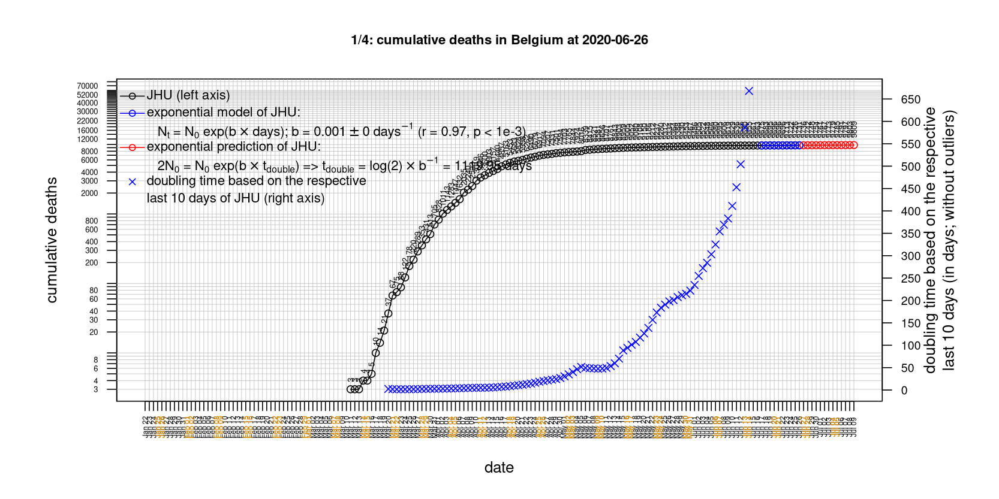
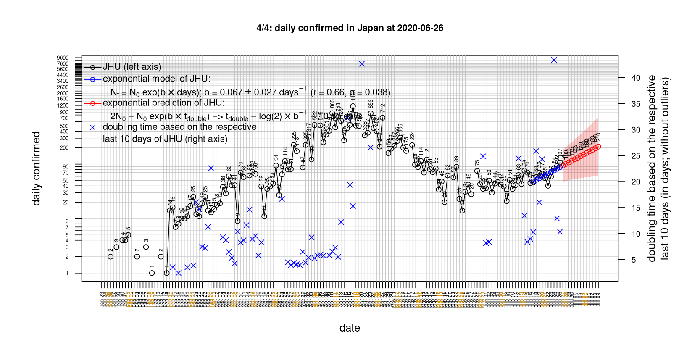

# International Covid-19 death predictions based on CSSEGISandData/COVID-19

  * upstream repo: https://github.com/CSSEGISandData/COVID-19  
  * time of last fetch of upstream repo: **2020-04-27 08:24:10 CET** (timestamp of file `.git/refs/remotes/upstream`)  
  * hash of last fetched commit of upstream repo: `8a92419283594053dcafa91e70adeda84c5d44b6` (`git rev-parse upstream/master`)  
  * last date of `COVID-19/csse_covid_19_data/time_series_covid19_*_global.csv` data: **2020-04-26**

# death rate evolution

# Select country

ordererd by time when cumulative number of deaths doubles (increasing)
country | cumulative number of deaths doubles in | period of estimation | rsq | p | cumulative deaths | cumulative confirmed
--- | --- | --- | --- | --- | --- | ---
[Russia](#Russia) | 6.27 days | 2020-04-17 to 2020-04-26 (10 days) | 0.99 | < 1e-3 | 747 | 80949
[Canada](#Canada) | 8.63 days | 2020-04-17 to 2020-04-26 (10 days) | 0.99 | < 1e-3 | 2661 | 47145
[Japan](#Japan) | 9.24 days | 2020-04-17 to 2020-04-26 (10 days) | 0.97 | < 1e-3 | 372 | 13441
[Hungary](#Hungary) | 11.23 days | 2020-04-17 to 2020-04-26 (10 days) | 0.98 | < 1e-3 | 272 | 2500
[Poland](#Poland) | 12.22 days | 2020-04-17 to 2020-04-26 (10 days) | 0.99 | < 1e-3 | 535 | 11617
[Sweden](#Sweden) | 12.5 days | 2020-04-17 to 2020-04-26 (10 days) | 0.96 | < 1e-3 | 2194 | 18640
[Turkey](#Turkey) | 13.56 days | 2020-04-17 to 2020-04-26 (10 days) | 0.99 | < 1e-3 | 2805 | 110130
[Romania](#Romania) | 14.73 days | 2020-04-17 to 2020-04-26 (10 days) | 0.99 | < 1e-3 | 619 | 11036
[US](#US) | 14.87 days | 2020-04-17 to 2020-04-26 (10 days) | 0.99 | < 1e-3 | 54881 | 965785
[United Kingdom](#United-Kingdom) | 17.6 days | 2020-04-17 to 2020-04-26 (10 days) | 1 | < 1e-3 | 20794 | 154037
[Germany](#Germany) | 17.91 days | 2020-04-17 to 2020-04-26 (10 days) | 0.99 | < 1e-3 | 5976 | 157770
[Portugal](#Portugal) | 19.55 days | 2020-04-17 to 2020-04-26 (10 days) | 1 | < 1e-3 | 903 | 23864
[Belgium](#Belgium) | 20.07 days | 2020-04-17 to 2020-04-26 (10 days) | 0.99 | < 1e-3 | 7094 | 46134
[Netherlands](#Netherlands) | 23.56 days | 2020-04-17 to 2020-04-26 (10 days) | 0.99 | < 1e-3 | 4491 | 38040
[Norway](#Norway) | 24.9 days | 2020-04-17 to 2020-04-26 (10 days) | 0.94 | < 1e-3 | 201 | 7527
[Austria](#Austria) | 25.16 days | 2020-04-17 to 2020-04-26 (10 days) | 0.97 | < 1e-3 | 542 | 15225
[Australia](#Australia) | 25.61 days | 2020-04-17 to 2020-04-26 (10 days) | 0.81 | < 1e-3 | 83 | 6714
[Denmark](#Denmark) | 26.7 days | 2020-04-17 to 2020-04-26 (10 days) | 1 | < 1e-3 | 422 | 8773
[France](#France) | 30.27 days | 2020-04-17 to 2020-04-26 (10 days) | 0.99 | < 1e-3 | 22890 | 162220
[Switzerland](#Switzerland) | 30.47 days | 2020-04-17 to 2020-04-26 (10 days) | 0.98 | < 1e-3 | 1610 | 29061
[Italy](#Italy) | 38.47 days | 2020-04-17 to 2020-04-26 (10 days) | 0.99 | < 1e-3 | 26644 | 197675
[Spain](#Spain) | 38.78 days | 2020-04-17 to 2020-04-26 (10 days) | 0.99 | < 1e-3 | 23190 | 226629
[Iran](#Iran) | 42.67 days | 2020-04-17 to 2020-04-26 (10 days) | 1 | < 1e-3 | 5710 | 90481
[China](#China) | 58919.24 days | 2020-04-17 to 2020-04-26 (10 days) | 0.27 | 0.122 | 4637 | 83912
[Nepal](#Nepal) | NA | NA | NA | NA | 0 | 52

# Australia
[top](#Select-country)

 

 

 

 
 

# Austria
[top](#Select-country)

 

 

 

 
 

# Belgium
[top](#Select-country)

 

 

 

 
 

# Canada
[top](#Select-country)

 

 

 

 
 

# China
[top](#Select-country)

 

 

 

 
 

# Denmark
[top](#Select-country)

 

 

 

 
 

# France
[top](#Select-country)

 

 

 

 
 

# Germany
[top](#Select-country)

 

 

 

 
 

# Hungary
[top](#Select-country)

 

 

 

 
 

# Iran
[top](#Select-country)

 

 

 

 
 

# Italy
[top](#Select-country)

national responses:
1. 2020-03-04: https://www.theguardian.com/world/2020/mar/04/italy-orders-closure-of-schools-and-universities-due-to-coronavirus
2. 2020-03-09: https://www.bbc.co.uk/sport/51808683
3. 2020-03-11: https://www.washingtonpost.com/world/europe/merkel-coronavirus-germany/2020/03/11/e276252a-6399-11ea-8a8e-5c5336b32760_story.html

 

 

 

 
 

# Japan
[top](#Select-country)

 

 

 

 
 

# Nepal
[top](#Select-country)

 

 

 

 
 

# Netherlands
[top](#Select-country)

 

 

 

 
 

# Norway
[top](#Select-country)

 

 

 

 
 

# Poland
[top](#Select-country)

 

 

 

 
 

# Portugal
[top](#Select-country)

 

 

 

 
 

# Romania
[top](#Select-country)

 

 

 

 
 

# Russia
[top](#Select-country)

 

 

 

 
 

# Spain
[top](#Select-country)

 

 

 

 
 

# Sweden
[top](#Select-country)

 

 

 

 
 

# Switzerland
[top](#Select-country)

 

 

 

 
 

# Turkey
[top](#Select-country)

 

 

 

 
 

# US
[top](#Select-country)

 

 

 

 
 

# United Kingdom
[top](#Select-country)

 

 

 

 
 

