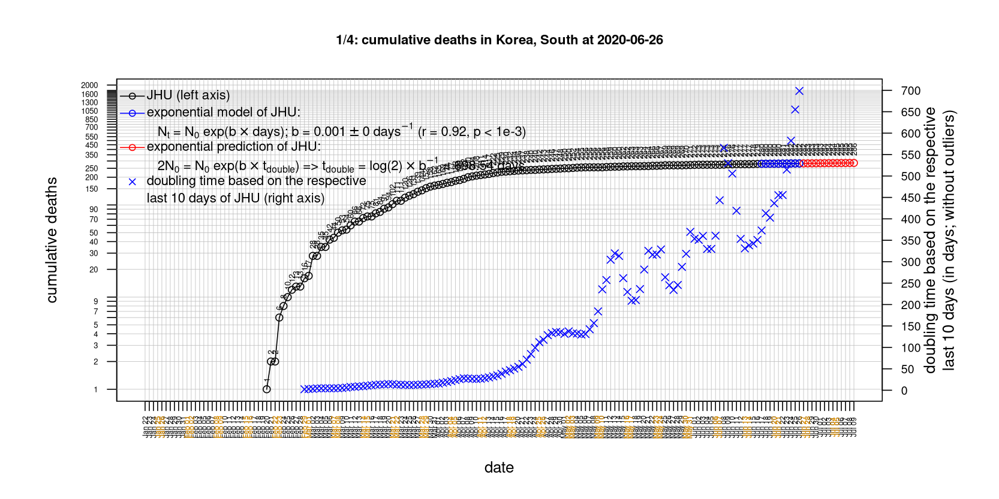
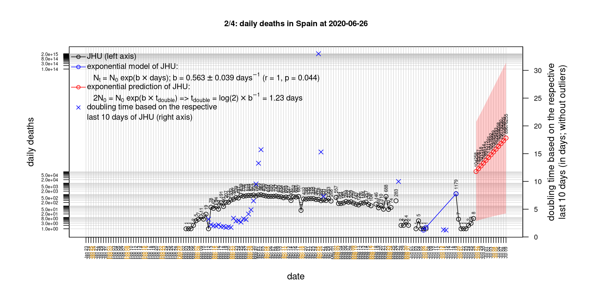

# International Covid-19 death predictions based on CSSEGISandData/COVID-19

  * upstream repo: https://github.com/CSSEGISandData/COVID-19  
  * time of last fetch of upstream repo: **2020-05-08 20:07:24 CET** (timestamp of file `.git/refs/remotes/upstream`)  
  * hash of last fetched commit of upstream repo: `9fbca1dc80e6b3cca7f2bf08eefeb7759664222a` (`git rev-parse upstream/master`)  
  * last date of `COVID-19/csse_covid_19_data/time_series_covid19_*_global.csv` data: **2020-05-07**

# death rate evolution

# Select country

ordererd by time when cumulative number of deaths doubles (increasing)
country | cumulative number of deaths doubles in | period of estimation | rsq | p | cumulative deaths | cumulative confirmed
--- | --- | --- | --- | --- | --- | ---
[Russia](#Russia) | 10.53 days | 2020-04-28 to 2020-05-07 (10 days) | 0.98 | < 1e-3 | 1625 | 177160
[Canada](#Canada) | 14.98 days | 2020-04-28 to 2020-05-07 (10 days) | 1 | < 1e-3 | 4541 | 66201
[Japan](#Japan) | 15.63 days | 2020-04-28 to 2020-05-07 (10 days) | 0.98 | < 1e-3 | 577 | 15477
[Romania](#Romania) | 21.66 days | 2020-04-28 to 2020-05-07 (10 days) | 0.99 | < 1e-3 | 888 | 14499
[Hungary](#Hungary) | 22.79 days | 2020-04-28 to 2020-05-07 (10 days) | 1 | < 1e-3 | 383 | 3150
[US](#US) | 25.76 days | 2020-04-28 to 2020-05-07 (10 days) | 0.99 | < 1e-3 | 75662 | 1257023
[Sweden](#Sweden) | 27.44 days | 2020-04-28 to 2020-05-07 (10 days) | 0.96 | < 1e-3 | 3040 | 24623
[Poland](#Poland) | 28.48 days | 2020-04-28 to 2020-05-07 (10 days) | 0.99 | < 1e-3 | 755 | 15047
[Turkey](#Turkey) | 32.29 days | 2020-04-28 to 2020-05-07 (10 days) | 0.99 | < 1e-3 | 3641 | 133721
[United Kingdom](#United-Kingdom) | 34.46 days | 2020-04-28 to 2020-05-07 (10 days) | 0.98 | < 1e-3 | 30689 | 207977
[Denmark](#Denmark) | 35.58 days | 2020-04-28 to 2020-05-07 (10 days) | 0.99 | < 1e-3 | 514 | 10281
[Portugal](#Portugal) | 41.41 days | 2020-04-28 to 2020-05-07 (10 days) | 0.99 | < 1e-3 | 1105 | 26715
[Germany](#Germany) | 43.41 days | 2020-04-28 to 2020-05-07 (10 days) | 0.97 | < 1e-3 | 7392 | 169430
[Netherlands](#Netherlands) | 45.43 days | 2020-04-28 to 2020-05-07 (10 days) | 0.97 | < 1e-3 | 5306 | 41973
[Belgium](#Belgium) | 48.71 days | 2020-04-28 to 2020-05-07 (10 days) | 0.97 | < 1e-3 | 8415 | 51420
[Iran](#Iran) | 65.01 days | 2020-04-28 to 2020-05-07 (10 days) | 1 | < 1e-3 | 6486 | 103135
[France](#France) | 69.82 days | 2020-04-28 to 2020-05-07 (10 days) | 0.99 | < 1e-3 | 25990 | 174918
[Italy](#Italy) | 69.94 days | 2020-04-28 to 2020-05-07 (10 days) | 0.99 | < 1e-3 | 29958 | 215858
[Spain](#Spain) | 72.4 days | 2020-04-28 to 2020-05-07 (10 days) | 0.98 | < 1e-3 | 26070 | 221447
[Australia](#Australia) | 74.36 days | 2020-04-28 to 2020-05-07 (10 days) | 0.92 | < 1e-3 | 97 | 6913
[Austria](#Austria) | 96.5 days | 2020-04-28 to 2020-05-07 (10 days) | 0.95 | < 1e-3 | 609 | 15752
[Switzerland](#Switzerland) | 100.44 days | 2020-04-28 to 2020-05-07 (10 days) | 0.97 | < 1e-3 | 1810 | 30126
[Norway](#Norway) | 121.62 days | 2020-04-28 to 2020-05-07 (10 days) | 0.97 | < 1e-3 | 217 | 8034
[Korea, South](#Korea,-South) | 142.27 days | 2020-04-28 to 2020-05-07 (10 days) | 0.98 | < 1e-3 | 256 | 10822
[China](#China) | NA | NA | NA | NA | 4637 | 83975
[Nepal](#Nepal) | NA | NA | NA | NA | 0 | 101

# Australia
[top](#Select-country)

 

 

 

 
 

# Austria
[top](#Select-country)

 

 

 

 
 

# Belgium
[top](#Select-country)

 

 

 

 
 

# Canada
[top](#Select-country)

 

 

 

 
 

# China
[top](#Select-country)

 

 

 

 
 

# Denmark
[top](#Select-country)

 

 

 

 
 

# France
[top](#Select-country)

 

 

 

 
 

# Germany
[top](#Select-country)

 

 

 

 
 

# Hungary
[top](#Select-country)

 

 

 

 
 

# Iran
[top](#Select-country)

 

 

 

 
 

# Italy
[top](#Select-country)

national responses:
1. 2020-03-04: https://www.theguardian.com/world/2020/mar/04/italy-orders-closure-of-schools-and-universities-due-to-coronavirus
2. 2020-03-09: https://www.bbc.co.uk/sport/51808683
3. 2020-03-11: https://www.washingtonpost.com/world/europe/merkel-coronavirus-germany/2020/03/11/e276252a-6399-11ea-8a8e-5c5336b32760_story.html

 

 

 

 
 

# Japan
[top](#Select-country)

 

 

 

 
 

# Korea, South
[top](#Select-country)

 

 

 

 
 

# Nepal
[top](#Select-country)

 

 

 

 
 

# Netherlands
[top](#Select-country)

 

 

 

 
 

# Norway
[top](#Select-country)

 

 

 

 
 

# Poland
[top](#Select-country)

 

 

 

 
 

# Portugal
[top](#Select-country)

 

 

 

 
 

# Romania
[top](#Select-country)

 

 

 

 
 

# Russia
[top](#Select-country)

 

 

 

 
 

# Spain
[top](#Select-country)

 

 

 

 
 

# Sweden
[top](#Select-country)

 

 

 

 
 

# Switzerland
[top](#Select-country)

 

 

 

 
 

# Turkey
[top](#Select-country)

 

 

 

 
 

# US
[top](#Select-country)

 

 

 

 
 

# United Kingdom
[top](#Select-country)

 

 

 

 
 

