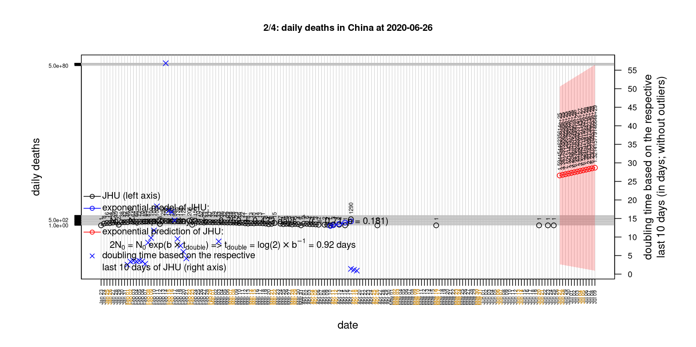
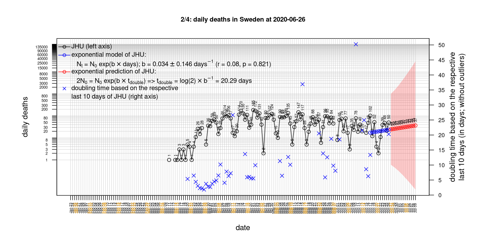

# International Covid-19 death predictions based on CSSEGISandData/COVID-19

  * upstream repo: https://github.com/CSSEGISandData/COVID-19  
  * time of last fetch of upstream repo: **2020-06-26 11:44:54 CET** (timestamp of file `.git/refs/remotes/upstream`)  
  * hash of last fetched commit of upstream repo: `999a788f32f4bec173baef68ca2c39a606cf912c` (`git rev-parse upstream/master`)  
  * last date of `COVID-19/csse_covid_19_data/time_series_covid19_*_global.csv` data: **2020-06-25**

# death rate evolution

# Select country

ordererd by time when cumulative number of deaths doubles (increasing)
country | cumulative number of deaths doubles in | period of estimation | rsq | p | cumulative deaths | cumulative confirmed
--- | --- | --- | --- | --- | --- | ---
[Nepal](#Nepal) | 24.27 days | 2020-06-16 to 2020-06-25 (10 days) | 0.91 | < 1e-3 | 26 | 11162
[Brazil](#Brazil) | 33.49 days | 2020-06-16 to 2020-06-25 (10 days) | 0.99 | < 1e-3 | 54971 | 1228114
[Russia](#Russia) | 38.16 days | 2020-06-16 to 2020-06-25 (10 days) | 0.99 | < 1e-3 | 8594 | 613148
[Iran](#Iran) | 56.54 days | 2020-06-16 to 2020-06-25 (10 days) | 1 | < 1e-3 | 10130 | 215096
[Poland](#Poland) | 63.66 days | 2020-06-16 to 2020-06-25 (10 days) | 0.97 | < 1e-3 | 1412 | 33119
[Romania](#Romania) | 73.43 days | 2020-06-16 to 2020-06-25 (10 days) | 0.99 | < 1e-3 | 1565 | 25286
[US](#US) | 119.66 days | 2020-06-16 to 2020-06-25 (10 days) | 0.94 | < 1e-3 | 124410 | 2422299
[Spain](#Spain) | 126.57 days | 2020-06-16 to 2020-06-25 (10 days) | 0.64 | 0.005 | 28330 | 247486
[Sweden](#Sweden) | 132.86 days | 2020-06-16 to 2020-06-25 (10 days) | 0.91 | < 1e-3 | 5230 | 63890
[Turkey](#Turkey) | 148.4 days | 2020-06-16 to 2020-06-25 (10 days) | 1 | < 1e-3 | 5046 | 193115
[Japan](#Japan) | 151.34 days | 2020-06-16 to 2020-06-25 (10 days) | 0.93 | < 1e-3 | 971 | 18055
[Canada](#Canada) | 181.23 days | 2020-06-16 to 2020-06-25 (10 days) | 0.95 | < 1e-3 | 8567 | 104463
[Norway](#Norway) | 205.16 days | 2020-06-16 to 2020-06-25 (10 days) | 0.88 | < 1e-3 | 249 | 8788
[United Kingdom](#United-Kingdom) | 225.84 days | 2020-06-16 to 2020-06-25 (10 days) | 0.98 | < 1e-3 | 43314 | 309455
[Hungary](#Hungary) | 313.98 days | 2020-06-16 to 2020-06-25 (10 days) | 0.96 | < 1e-3 | 577 | 4123
[Australia](#Australia) | 318.16 days | 2020-06-16 to 2020-06-25 (10 days) | 0.64 | 0.006 | 104 | 7595
[Austria](#Austria) | 345.95 days | 2020-06-16 to 2020-06-25 (10 days) | 0.86 | < 1e-3 | 698 | 17477
[Portugal](#Portugal) | 360.98 days | 2020-06-16 to 2020-06-25 (10 days) | 0.93 | < 1e-3 | 1549 | 40415
[Germany](#Germany) | 549.25 days | 2020-06-16 to 2020-06-25 (10 days) | 0.92 | < 1e-3 | 8940 | 193371
[Korea, South](#Korea,-South) | 655.03 days | 2020-06-16 to 2020-06-25 (10 days) | 0.86 | < 1e-3 | 282 | 12602
[Denmark](#Denmark) | 680.19 days | 2020-06-16 to 2020-06-25 (10 days) | 0.91 | < 1e-3 | 603 | 12836
[Italy](#Italy) | 799.05 days | 2020-06-16 to 2020-06-25 (10 days) | 0.87 | < 1e-3 | 34678 | 239706
[France](#France) | 924.9 days | 2020-06-16 to 2020-06-25 (10 days) | 0.97 | < 1e-3 | 29755 | 197885
[Belgium](#Belgium) | 1057.15 days | 2020-06-16 to 2020-06-25 (10 days) | 0.94 | < 1e-3 | 9726 | 61007
[Netherlands](#Netherlands) | 1283.38 days | 2020-06-16 to 2020-06-25 (10 days) | 0.97 | < 1e-3 | 6119 | 50122
[Switzerland](#Switzerland) | 4474.77 days | 2020-06-16 to 2020-06-25 (10 days) | 0.65 | 0.005 | 1958 | 31428
[China](#China) | 9825.64 days | 2020-06-16 to 2020-06-25 (10 days) | 0.88 | < 1e-3 | 4641 | 84701

# Australia
[top](#Select-country)

 

 

 

 
 

# Austria
[top](#Select-country)

 

 

 

 
 

# Belgium
[top](#Select-country)

 

 

 

 
 

# Brazil
[top](#Select-country)

 

 

 

 
 

# Canada
[top](#Select-country)

 

 

 

 
 

# China
[top](#Select-country)

 

 

 

 
 

# Denmark
[top](#Select-country)

 

 

 

 
 

# France
[top](#Select-country)

 

 

 

 
 

# Germany
[top](#Select-country)

 

 

 

 

 
 

# Hungary
[top](#Select-country)

 

 

 

 
 

# Iran
[top](#Select-country)

 

 

 

 
 

# Italy
[top](#Select-country)

national responses:
1. 2020-03-04: https://www.theguardian.com/world/2020/mar/04/italy-orders-closure-of-schools-and-universities-due-to-coronavirus
2. 2020-03-09: https://www.bbc.co.uk/sport/51808683
3. 2020-03-11: https://www.washingtonpost.com/world/europe/merkel-coronavirus-germany/2020/03/11/e276252a-6399-11ea-8a8e-5c5336b32760_story.html

 

 

 

 
 

# Japan
[top](#Select-country)

 

 

 

 
 

# Korea, South
[top](#Select-country)

 

 

 

 
 

# Nepal
[top](#Select-country)

 

 

 

 
 

# Netherlands
[top](#Select-country)

 

 

 

 
 

# Norway
[top](#Select-country)

 

 

 

 
 

# Poland
[top](#Select-country)

 

 

 

 
 

# Portugal
[top](#Select-country)

 

 

 

 
 

# Romania
[top](#Select-country)

 

 

 

 
 

# Russia
[top](#Select-country)

 

 

 

 
 

# Spain
[top](#Select-country)

 

 

 

 
 

# Sweden
[top](#Select-country)

 

 

 

 
 

# Switzerland
[top](#Select-country)

 

 

 

 
 

# Turkey
[top](#Select-country)

 

 

 

 
 

# US
[top](#Select-country)

 

 

 

 
 

# United Kingdom
[top](#Select-country)

 

 

 

 
 

