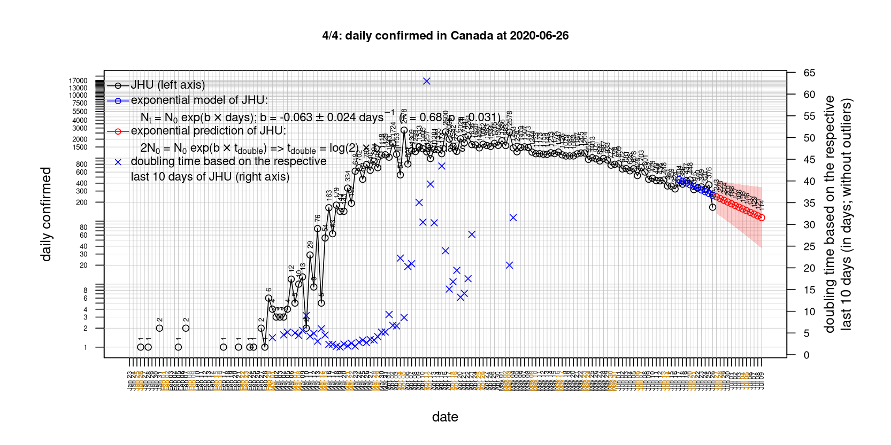
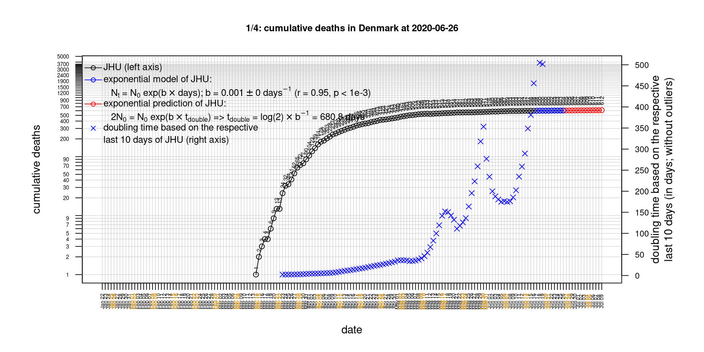
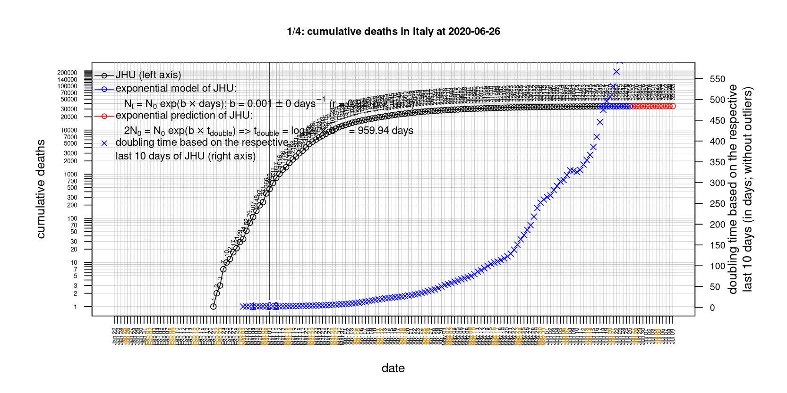

# CSSEGISandData/COVID-19 data

* [Belgium](#Belgium)
* [Canada](#Canada)
* [China](#China)
* [Denmark](#Denmark)
* [France](#France)
* [France](#France)
* [Germany](#Germany)
* [Italy](#Italy)
* [Netherlands](#Netherlands)
* [US](#US)
* [United Kingdom](#United-Kingdom)

# Belgium
 

 

 

 

 
 

# Canada
 

 

 

 

 
 

# China
 

 

 

 

 
 

# Denmark
 

 

 

 

 
 

# France
 

 

 

 

 
 

# France
 

 

 

 

 
 

# Germany
 

 

 

 

 
 

# Italy
 

 
national response 1 on 2020-03-04: [https://www.theguardian.com/world/2020/mar/04/italy-orders-closure-of-schools-and-universities-due-to-coronavirus](https://www.theguardian.com/world/2020/mar/04/italy-orders-closure-of-schools-and-universities-due-to-coronavirus)
 
national response 2 on 2020-03-09: [https://www.bbc.co.uk/sport/51808683](https://www.bbc.co.uk/sport/51808683)
 
national response 3 on 2020-03-11: [https://www.washingtonpost.com/world/europe/merkel-coronavirus-germany/2020/03/11/e276252a-6399-11ea-8a8e-5c5336b32760_story.html](https://www.washingtonpost.com/world/europe/merkel-coronavirus-germany/2020/03/11/e276252a-6399-11ea-8a8e-5c5336b32760_story.html)
 

 
national response 1 on 2020-03-04: [https://www.theguardian.com/world/2020/mar/04/italy-orders-closure-of-schools-and-universities-due-to-coronavirus](https://www.theguardian.com/world/2020/mar/04/italy-orders-closure-of-schools-and-universities-due-to-coronavirus)
 
national response 2 on 2020-03-09: [https://www.bbc.co.uk/sport/51808683](https://www.bbc.co.uk/sport/51808683)
 
national response 3 on 2020-03-11: [https://www.washingtonpost.com/world/europe/merkel-coronavirus-germany/2020/03/11/e276252a-6399-11ea-8a8e-5c5336b32760_story.html](https://www.washingtonpost.com/world/europe/merkel-coronavirus-germany/2020/03/11/e276252a-6399-11ea-8a8e-5c5336b32760_story.html)
 

 
national response 1 on 2020-03-04: [https://www.theguardian.com/world/2020/mar/04/italy-orders-closure-of-schools-and-universities-due-to-coronavirus](https://www.theguardian.com/world/2020/mar/04/italy-orders-closure-of-schools-and-universities-due-to-coronavirus)
 
national response 2 on 2020-03-09: [https://www.bbc.co.uk/sport/51808683](https://www.bbc.co.uk/sport/51808683)
 
national response 3 on 2020-03-11: [https://www.washingtonpost.com/world/europe/merkel-coronavirus-germany/2020/03/11/e276252a-6399-11ea-8a8e-5c5336b32760_story.html](https://www.washingtonpost.com/world/europe/merkel-coronavirus-germany/2020/03/11/e276252a-6399-11ea-8a8e-5c5336b32760_story.html)
 

 
national response 1 on 2020-03-04: [https://www.theguardian.com/world/2020/mar/04/italy-orders-closure-of-schools-and-universities-due-to-coronavirus](https://www.theguardian.com/world/2020/mar/04/italy-orders-closure-of-schools-and-universities-due-to-coronavirus)
 
national response 2 on 2020-03-09: [https://www.bbc.co.uk/sport/51808683](https://www.bbc.co.uk/sport/51808683)
 
national response 3 on 2020-03-11: [https://www.washingtonpost.com/world/europe/merkel-coronavirus-germany/2020/03/11/e276252a-6399-11ea-8a8e-5c5336b32760_story.html](https://www.washingtonpost.com/world/europe/merkel-coronavirus-germany/2020/03/11/e276252a-6399-11ea-8a8e-5c5336b32760_story.html)
 
 

# Netherlands
 

 

 

 

 
 

# US
 

 

 

 

 
 

# United Kingdom
 

 

 

 

 
 

