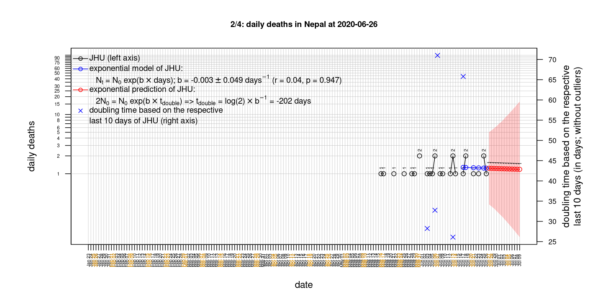

# International Covid-19 death predictions based on CSSEGISandData/COVID-19

  * upstream repo: https://github.com/CSSEGISandData/COVID-19  
  * time of last fetch of upstream repo: **2020-04-30 07:17:56 CET** (timestamp of file `.git/refs/remotes/upstream`)  
  * hash of last fetched commit of upstream repo: `05622493043e3ac23b5a00569328bf8900fc2bbf` (`git rev-parse upstream/master`)  
  * last date of `COVID-19/csse_covid_19_data/time_series_covid19_*_global.csv` data: **2020-04-29**

# death rate evolution

# Select country

ordererd by time when cumulative number of deaths doubles (increasing)
country | cumulative number of deaths doubles in | period of estimation | rsq | p | cumulative deaths | cumulative confirmed
--- | --- | --- | --- | --- | --- | ---
[Russia](#Russia) | 7.35 days | 2020-04-20 to 2020-04-29 (10 days) | 1 | < 1e-3 | 972 | 99399
[Canada](#Canada) | 10.67 days | 2020-04-20 to 2020-04-29 (10 days) | 0.99 | < 1e-3 | 3155 | 52865
[Japan](#Japan) | 11.6 days | 2020-04-20 to 2020-04-29 (10 days) | 0.92 | < 1e-3 | 413 | 13895
[Poland](#Poland) | 12.47 days | 2020-04-20 to 2020-04-29 (10 days) | 0.99 | < 1e-3 | 624 | 12640
[Hungary](#Hungary) | 15.54 days | 2020-04-20 to 2020-04-29 (10 days) | 0.96 | < 1e-3 | 300 | 2727
[Sweden](#Sweden) | 16.16 days | 2020-04-20 to 2020-04-29 (10 days) | 0.91 | < 1e-3 | 2462 | 20302
[United Kingdom](#United-Kingdom) | 16.81 days | 2020-04-20 to 2020-04-29 (10 days) | 0.91 | < 1e-3 | 26166 | 166441
[Romania](#Romania) | 16.83 days | 2020-04-20 to 2020-04-29 (10 days) | 1 | < 1e-3 | 693 | 11978
[Turkey](#Turkey) | 17.22 days | 2020-04-20 to 2020-04-29 (10 days) | 0.99 | < 1e-3 | 3081 | 117589
[US](#US) | 18.4 days | 2020-04-20 to 2020-04-29 (10 days) | 0.99 | < 1e-3 | 60967 | 1039909
[Australia](#Australia) | 18.66 days | 2020-04-20 to 2020-04-29 (10 days) | 0.95 | < 1e-3 | 91 | 6752
[Portugal](#Portugal) | 21.95 days | 2020-04-20 to 2020-04-29 (10 days) | 0.99 | < 1e-3 | 973 | 24505
[Germany](#Germany) | 22.31 days | 2020-04-20 to 2020-04-29 (10 days) | 0.97 | < 1e-3 | 6467 | 161539
[Belgium](#Belgium) | 24.43 days | 2020-04-20 to 2020-04-29 (10 days) | 0.98 | < 1e-3 | 7501 | 47859
[Netherlands](#Netherlands) | 29.3 days | 2020-04-20 to 2020-04-29 (10 days) | 0.96 | < 1e-3 | 4727 | 38998
[Denmark](#Denmark) | 31.27 days | 2020-04-20 to 2020-04-29 (10 days) | 0.98 | < 1e-3 | 443 | 9206
[Austria](#Austria) | 33.47 days | 2020-04-20 to 2020-04-29 (10 days) | 0.96 | < 1e-3 | 580 | 15402
[Switzerland](#Switzerland) | 35.34 days | 2020-04-20 to 2020-04-29 (10 days) | 0.98 | < 1e-3 | 1716 | 29407
[France](#France) | 37.55 days | 2020-04-20 to 2020-04-29 (10 days) | 0.99 | < 1e-3 | 24121 | 166543
[Spain](#Spain) | 42.21 days | 2020-04-20 to 2020-04-29 (10 days) | 0.99 | < 1e-3 | 24275 | 236899
[Norway](#Norway) | 43.14 days | 2020-04-20 to 2020-04-29 (10 days) | 0.92 | < 1e-3 | 207 | 7710
[Italy](#Italy) | 46.16 days | 2020-04-20 to 2020-04-29 (10 days) | 0.99 | < 1e-3 | 27682 | 203591
[Iran](#Iran) | 46.83 days | 2020-04-20 to 2020-04-29 (10 days) | 1 | < 1e-3 | 5957 | 93657
[China](#China) | 22094.72 days | 2020-04-20 to 2020-04-29 (10 days) | 0.73 | 0.002 | 4637 | 83944
[Nepal](#Nepal) | NA | NA | NA | NA | 0 | 57

# Australia
[top](#Select-country)

 

 

 

 
 

# Austria
[top](#Select-country)

 

 

 

 
 

# Belgium
[top](#Select-country)

 

 

 

 
 

# Canada
[top](#Select-country)

 

 

 

 
 

# China
[top](#Select-country)

 

 

 

 
 

# Denmark
[top](#Select-country)

 

 

 

 
 

# France
[top](#Select-country)

 

 

 

 
 

# Germany
[top](#Select-country)

 

 

 

 
 

# Hungary
[top](#Select-country)

 

 

 

 
 

# Iran
[top](#Select-country)

 

 

 

 
 

# Italy
[top](#Select-country)

national responses:
1. 2020-03-04: https://www.theguardian.com/world/2020/mar/04/italy-orders-closure-of-schools-and-universities-due-to-coronavirus
2. 2020-03-09: https://www.bbc.co.uk/sport/51808683
3. 2020-03-11: https://www.washingtonpost.com/world/europe/merkel-coronavirus-germany/2020/03/11/e276252a-6399-11ea-8a8e-5c5336b32760_story.html

 

 

 

 
 

# Japan
[top](#Select-country)

 

 

 

 
 

# Nepal
[top](#Select-country)

 

 

 

 
 

# Netherlands
[top](#Select-country)

 

 

 

 
 

# Norway
[top](#Select-country)

 

 

 

 
 

# Poland
[top](#Select-country)

 

 

 

 
 

# Portugal
[top](#Select-country)

 

 

 

 
 

# Romania
[top](#Select-country)

 

 

 

 
 

# Russia
[top](#Select-country)

 

 

 

 
 

# Spain
[top](#Select-country)

 

 

 

 
 

# Sweden
[top](#Select-country)

 

 

 

 
 

# Switzerland
[top](#Select-country)

 

 

 

 
 

# Turkey
[top](#Select-country)

 

 

 

 
 

# US
[top](#Select-country)

 

 

 

 
 

# United Kingdom
[top](#Select-country)

 

 

 

 
 

