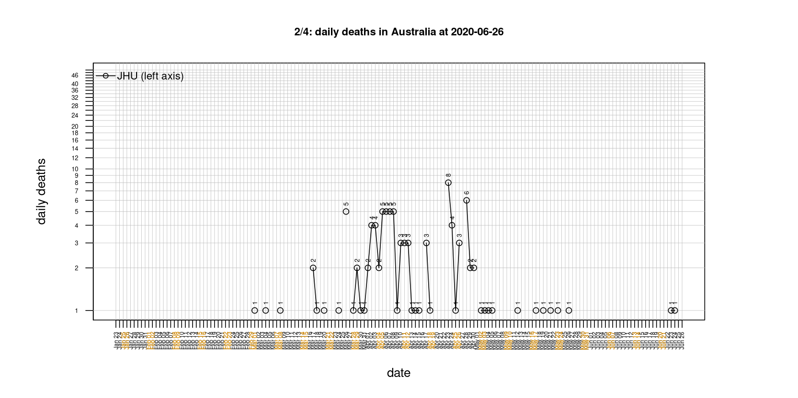
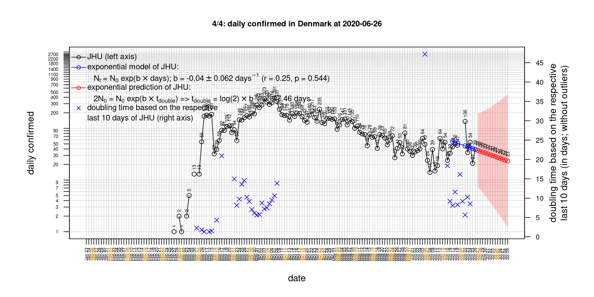
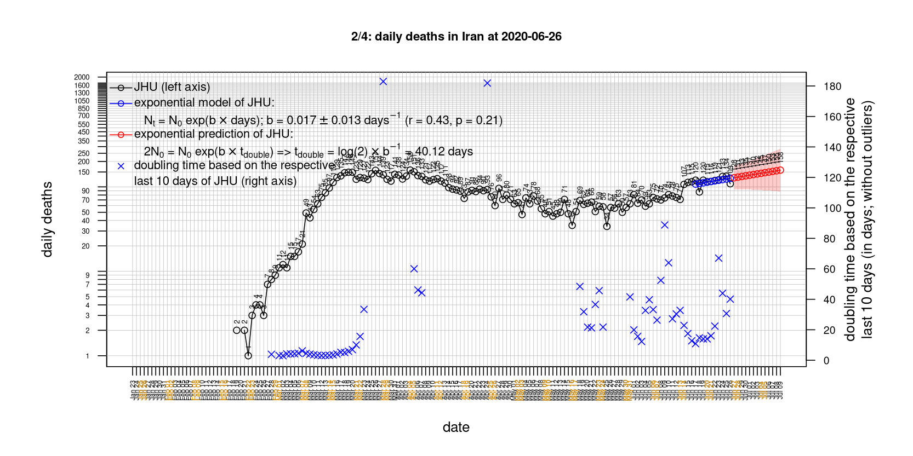
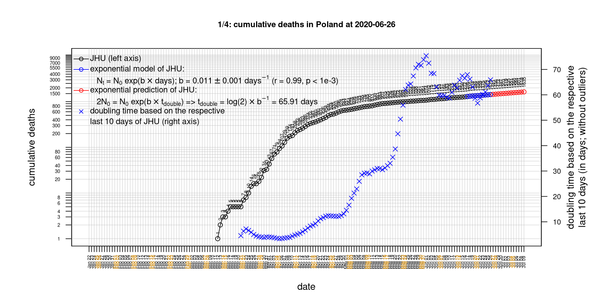

# International Covid-19 death predictions based on CSSEGISandData/COVID-19

  * upstream repo: https://github.com/CSSEGISandData/COVID-19  
  * time of last fetch of upstream repo: **2020-05-26 09:07:10 CET** (timestamp of file `.git/refs/remotes/upstream`)  
  * hash of last fetched commit of upstream repo: `8747ab05ac9c1f13647146097d6801ae0a3f6984` (`git rev-parse upstream/master`)  
  * last date of `COVID-19/csse_covid_19_data/time_series_covid19_*_global.csv` data: **2020-05-25**

# death rate evolution

# Select country

ordererd by time when cumulative number of deaths doubles (increasing)
country | cumulative number of deaths doubles in | period of estimation | rsq | p | cumulative deaths | cumulative confirmed
--- | --- | --- | --- | --- | --- | ---
[Nepal](#Nepal) | 6.03 days | 2020-05-16 to 2020-05-25 (10 days) | 0.8 | < 1e-3 | 4 | 682
[Brazil](#Brazil) | 14.48 days | 2020-05-16 to 2020-05-25 (10 days) | 0.99 | < 1e-3 | 23473 | 374898
[Russia](#Russia) | 16.69 days | 2020-05-16 to 2020-05-25 (10 days) | 1 | < 1e-3 | 3633 | 353427
[Canada](#Canada) | 45.1 days | 2020-05-16 to 2020-05-25 (10 days) | 1 | < 1e-3 | 6655 | 87119
[Japan](#Japan) | 47.73 days | 2020-05-16 to 2020-05-25 (10 days) | 0.99 | < 1e-3 | 830 | 16581
[US](#US) | 56.48 days | 2020-05-16 to 2020-05-25 (10 days) | 0.98 | < 1e-3 | 98220 | 1662302
[Sweden](#Sweden) | 58.73 days | 2020-05-16 to 2020-05-25 (10 days) | 0.97 | < 1e-3 | 4029 | 33843
[Portugal](#Portugal) | 62.3 days | 2020-05-16 to 2020-05-25 (10 days) | 1 | < 1e-3 | 1330 | 30788
[Poland](#Poland) | 63.84 days | 2020-05-16 to 2020-05-25 (10 days) | 0.99 | < 1e-3 | 1007 | 21631
[Romania](#Romania) | 68.33 days | 2020-05-16 to 2020-05-25 (10 days) | 0.99 | < 1e-3 | 1205 | 18283
[Hungary](#Hungary) | 70.44 days | 2020-05-16 to 2020-05-25 (10 days) | 0.97 | < 1e-3 | 491 | 3756
[United Kingdom](#United-Kingdom) | 81.76 days | 2020-05-16 to 2020-05-25 (10 days) | 0.98 | < 1e-3 | 36996 | 262547
[Iran](#Iran) | 84.45 days | 2020-05-16 to 2020-05-25 (10 days) | 1 | < 1e-3 | 7451 | 137724
[Turkey](#Turkey) | 100.9 days | 2020-05-16 to 2020-05-25 (10 days) | 1 | < 1e-3 | 4369 | 157814
[Germany](#Germany) | 126 days | 2020-05-16 to 2020-05-25 (10 days) | 0.97 | < 1e-3 | 8309 | 180600
[Australia](#Australia) | 150.87 days | 2020-05-16 to 2020-05-25 (10 days) | 0.95 | < 1e-3 | 102 | 7126
[Denmark](#Denmark) | 163.7 days | 2020-05-16 to 2020-05-25 (10 days) | 0.92 | < 1e-3 | 563 | 11586
[Italy](#Italy) | 173.63 days | 2020-05-16 to 2020-05-25 (10 days) | 0.99 | < 1e-3 | 32877 | 230158
[Belgium](#Belgium) | 190.76 days | 2020-05-16 to 2020-05-25 (10 days) | 1 | < 1e-3 | 9312 | 57342
[Netherlands](#Netherlands) | 202.1 days | 2020-05-16 to 2020-05-25 (10 days) | 0.98 | < 1e-3 | 5849 | 45647
[Korea, South](#Korea,-South) | 263.7 days | 2020-05-16 to 2020-05-25 (10 days) | 0.91 | < 1e-3 | 269 | 11225
[Austria](#Austria) | 297.44 days | 2020-05-16 to 2020-05-25 (10 days) | 0.94 | < 1e-3 | 641 | 16539
[France](#France) | 299.52 days | 2020-05-16 to 2020-05-25 (10 days) | 0.61 | 0.008 | 28460 | 183067
[Switzerland](#Switzerland) | 350.74 days | 2020-05-16 to 2020-05-25 (10 days) | 0.99 | < 1e-3 | 1913 | 30746
[Spain](#Spain) | 359.04 days | 2020-05-16 to 2020-05-25 (10 days) | 0.07 | 0.449 | 26834 | 235400
[Norway](#Norway) | 411.09 days | 2020-05-16 to 2020-05-25 (10 days) | 0.86 | < 1e-3 | 235 | 8364
[China](#China) | 2262229614422286 days | 2020-05-16 to 2020-05-25 (10 days) | 0.52 | 0.122 | 4638 | 84102

# Australia
[top](#Select-country)

 

 

 

 
 

# Austria
[top](#Select-country)

 

 

 

 
 

# Belgium
[top](#Select-country)

 

 

 

 
 

# Brazil
[top](#Select-country)

 

 

 

 
 

# Canada
[top](#Select-country)

 

 

 

 
 

# China
[top](#Select-country)

 

 

 

 
 

# Denmark
[top](#Select-country)

 

 

 

 
 

# France
[top](#Select-country)

 

 

 

 
 

# Germany
[top](#Select-country)

 

 

 

 

 
 

# Hungary
[top](#Select-country)

 

 

 

 
 

# Iran
[top](#Select-country)

 

 

 

 
 

# Italy
[top](#Select-country)

national responses:
1. 2020-03-04: https://www.theguardian.com/world/2020/mar/04/italy-orders-closure-of-schools-and-universities-due-to-coronavirus
2. 2020-03-09: https://www.bbc.co.uk/sport/51808683
3. 2020-03-11: https://www.washingtonpost.com/world/europe/merkel-coronavirus-germany/2020/03/11/e276252a-6399-11ea-8a8e-5c5336b32760_story.html

 

 

 

 
 

# Japan
[top](#Select-country)

 

 

 

 
 

# Korea, South
[top](#Select-country)

 

 

 

 
 

# Nepal
[top](#Select-country)

 

 

 

 
 

# Netherlands
[top](#Select-country)

 

 

 

 
 

# Norway
[top](#Select-country)

 

 

 

 
 

# Poland
[top](#Select-country)

 

 

 

 
 

# Portugal
[top](#Select-country)

 

 

 

 
 

# Romania
[top](#Select-country)

 

 

 

 
 

# Russia
[top](#Select-country)

 

 

 

 
 

# Spain
[top](#Select-country)

 

 

 

 
 

# Sweden
[top](#Select-country)

 

 

 

 
 

# Switzerland
[top](#Select-country)

 

 

 

 
 

# Turkey
[top](#Select-country)

 

 

 

 
 

# US
[top](#Select-country)

 

 

 

 
 

# United Kingdom
[top](#Select-country)

 

 

 

 
 

