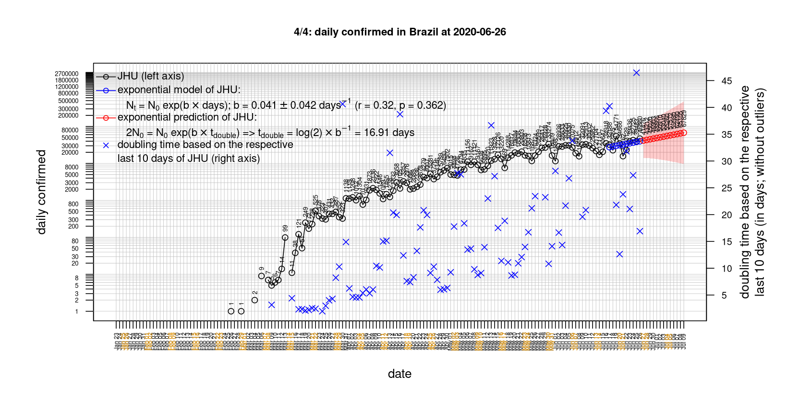

# International Covid-19 death predictions based on CSSEGISandData/COVID-19

  * upstream repo: https://github.com/CSSEGISandData/COVID-19  
  * time of last fetch of upstream repo: **2020-05-15 23:03:14 CET** (timestamp of file `.git/refs/remotes/upstream`)  
  * hash of last fetched commit of upstream repo: `514787d240d403e3c0c6b164dfe2bc5b492ab5f2` (`git rev-parse upstream/master`)  
  * last date of `COVID-19/csse_covid_19_data/time_series_covid19_*_global.csv` data: **2020-05-14**

# death rate evolution

# Select country

ordererd by time when cumulative number of deaths doubles (increasing)
country | cumulative number of deaths doubles in | period of estimation | rsq | p | cumulative deaths | cumulative confirmed
--- | --- | --- | --- | --- | --- | ---
[Brazil](#Brazil) | 11.26 days | 2020-05-05 to 2020-05-14 (10 days) | 0.99 | < 1e-3 | 13999 | 203165
[Russia](#Russia) | 13.39 days | 2020-05-05 to 2020-05-14 (10 days) | 1 | < 1e-3 | 2305 | 252245
[Canada](#Canada) | 22.08 days | 2020-05-05 to 2020-05-14 (10 days) | 1 | < 1e-3 | 5592 | 74781
[Japan](#Japan) | 26.53 days | 2020-05-05 to 2020-05-14 (10 days) | 0.99 | < 1e-3 | 697 | 16120
[Romania](#Romania) | 27.85 days | 2020-05-05 to 2020-05-14 (10 days) | 0.99 | < 1e-3 | 1053 | 16247
[Poland](#Poland) | 30.98 days | 2020-05-05 to 2020-05-14 (10 days) | 0.99 | < 1e-3 | 883 | 17615
[Sweden](#Sweden) | 32.17 days | 2020-05-05 to 2020-05-14 (10 days) | 0.95 | < 1e-3 | 3529 | 28582
[Hungary](#Hungary) | 33.65 days | 2020-05-05 to 2020-05-14 (10 days) | 0.97 | < 1e-3 | 436 | 3380
[US](#US) | 35.5 days | 2020-05-05 to 2020-05-14 (10 days) | 0.98 | < 1e-3 | 85898 | 1417774
[Turkey](#Turkey) | 49.3 days | 2020-05-05 to 2020-05-14 (10 days) | 1 | < 1e-3 | 4007 | 144749
[United Kingdom](#United-Kingdom) | 49.77 days | 2020-05-05 to 2020-05-14 (10 days) | 0.98 | < 1e-3 | 33693 | 234440
[Germany](#Germany) | 59.79 days | 2020-05-05 to 2020-05-14 (10 days) | 0.92 | < 1e-3 | 7884 | 174478
[Portugal](#Portugal) | 65.24 days | 2020-05-05 to 2020-05-14 (10 days) | 0.99 | < 1e-3 | 1184 | 28319
[Belgium](#Belgium) | 70.15 days | 2020-05-05 to 2020-05-14 (10 days) | 0.91 | < 1e-3 | 8903 | 54288
[Netherlands](#Netherlands) | 79.56 days | 2020-05-05 to 2020-05-14 (10 days) | 0.97 | < 1e-3 | 5609 | 43680
[Norway](#Norway) | 80.39 days | 2020-05-05 to 2020-05-14 (10 days) | 0.92 | < 1e-3 | 232 | 8196
[Iran](#Iran) | 84.8 days | 2020-05-05 to 2020-05-14 (10 days) | 0.99 | < 1e-3 | 6854 | 114533
[France](#France) | 93.99 days | 2020-05-05 to 2020-05-14 (10 days) | 0.98 | < 1e-3 | 27428 | 178994
[Italy](#Italy) | 99.3 days | 2020-05-05 to 2020-05-14 (10 days) | 0.98 | < 1e-3 | 31368 | 223096
[Denmark](#Denmark) | 99.82 days | 2020-05-05 to 2020-05-14 (10 days) | 0.87 | < 1e-3 | 537 | 10911
[Spain](#Spain) | 101.5 days | 2020-05-05 to 2020-05-14 (10 days) | 0.99 | < 1e-3 | 27321 | 229540
[Switzerland](#Switzerland) | 139.76 days | 2020-05-05 to 2020-05-14 (10 days) | 0.98 | < 1e-3 | 1872 | 30463
[Austria](#Austria) | 183.95 days | 2020-05-05 to 2020-05-14 (10 days) | 0.99 | < 1e-3 | 626 | 16058
[Korea, South](#Korea,-South) | 313.43 days | 2020-05-05 to 2020-05-14 (10 days) | 0.85 | < 1e-3 | 260 | 11018
[Australia](#Australia) | 531 days | 2020-05-05 to 2020-05-14 (10 days) | 0.64 | 0.006 | 98 | 7019
[China](#China) | NA | NA | NA | NA | 4637 | 84029
[Nepal](#Nepal) | NA | NA | NA | NA | 0 | 249

# Australia
[top](#Select-country)

 

 

 

 
 

# Austria
[top](#Select-country)

 

 

 

 
 

# Belgium
[top](#Select-country)

 

 

 

 
 

# Brazil
[top](#Select-country)

 

 

 

 
 

# Canada
[top](#Select-country)

 

 

 

 
 

# China
[top](#Select-country)

 

 

 

 
 

# Denmark
[top](#Select-country)

 

 

 

 
 

# France
[top](#Select-country)

 

 

 

 
 

# Germany
[top](#Select-country)

 

 

 

 

 
 

# Hungary
[top](#Select-country)

 

 

 

 
 

# Iran
[top](#Select-country)

 

 

 

 
 

# Italy
[top](#Select-country)

national responses:
1. 2020-03-04: https://www.theguardian.com/world/2020/mar/04/italy-orders-closure-of-schools-and-universities-due-to-coronavirus
2. 2020-03-09: https://www.bbc.co.uk/sport/51808683
3. 2020-03-11: https://www.washingtonpost.com/world/europe/merkel-coronavirus-germany/2020/03/11/e276252a-6399-11ea-8a8e-5c5336b32760_story.html

 

 

 

 
 

# Japan
[top](#Select-country)

 

 

 

 
 

# Korea, South
[top](#Select-country)

 

 

 

 
 

# Nepal
[top](#Select-country)

 

 

 

 
 

# Netherlands
[top](#Select-country)

 

 

 

 
 

# Norway
[top](#Select-country)

 

 

 

 
 

# Poland
[top](#Select-country)

 

 

 

 
 

# Portugal
[top](#Select-country)

 

 

 

 
 

# Romania
[top](#Select-country)

 

 

 

 
 

# Russia
[top](#Select-country)

 

 

 

 
 

# Spain
[top](#Select-country)

 

 

 

 
 

# Sweden
[top](#Select-country)

 

 

 

 
 

# Switzerland
[top](#Select-country)

 

 

 

 
 

# Turkey
[top](#Select-country)

 

 

 

 
 

# US
[top](#Select-country)

 

 

 

 
 

# United Kingdom
[top](#Select-country)

 

 

 

 
 

