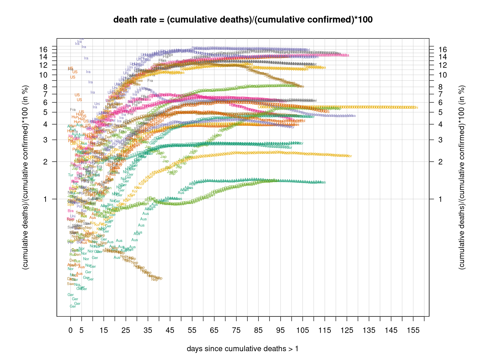

# International Covid-19 death predictions based on CSSEGISandData/COVID-19

  * upstream repo: https://github.com/CSSEGISandData/COVID-19  
  * time of last fetch of upstream repo: **2020-04-21 06:52:48 CET** (timestamp of file `.git/refs/remotes/upstream`)  
  * hash of last fetched commit of upstream repo: `ca11cb6e451fa5f4c89e063accc9a7a3b0b6e3e6` (`git rev-parse upstream/master`)  
  * last date of `COVID-19/csse_covid_19_data/time_series_covid19_*_global.csv` data: **2020-04-20**

# death rate evolution

# Select country

ordererd by time when cumulative number of deaths doubles (increasing)
country | cumulative number of deaths doubles in | period of estimation | rsq | p | cumulative deaths | cumulative confirmed
--- | --- | --- | --- | --- | --- | ---
[Russia](#Russia) | 4.66 days | 2020-04-11 to 2020-04-20 (10 days) | 1 | < 1e-3 | 405 | 47121
[Canada](#Canada) | 6.15 days | 2020-04-11 to 2020-04-20 (10 days) | 0.98 | < 1e-3 | 1725 | 37657
[Japan](#Japan) | 6.61 days | 2020-04-11 to 2020-04-20 (10 days) | 0.98 | < 1e-3 | 236 | 10797
[Hungary](#Hungary) | 7.5 days | 2020-04-11 to 2020-04-20 (10 days) | 0.99 | < 1e-3 | 199 | 1984
[US](#US) | 7.9 days | 2020-04-11 to 2020-04-20 (10 days) | 0.98 | < 1e-3 | 42094 | 784326
[Sweden](#Sweden) | 9.18 days | 2020-04-11 to 2020-04-20 (10 days) | 0.95 | < 1e-3 | 1580 | 14777
[Turkey](#Turkey) | 9.31 days | 2020-04-11 to 2020-04-20 (10 days) | 1 | < 1e-3 | 2140 | 90980
[Poland](#Poland) | 10.37 days | 2020-04-11 to 2020-04-20 (10 days) | 0.98 | < 1e-3 | 380 | 9593
[Germany](#Germany) | 10.73 days | 2020-04-11 to 2020-04-20 (10 days) | 0.97 | < 1e-3 | 4862 | 147065
[Belgium](#Belgium) | 10.79 days | 2020-04-11 to 2020-04-20 (10 days) | 0.99 | < 1e-3 | 5828 | 39983
[United Kingdom](#United-Kingdom) | 11.77 days | 2020-04-11 to 2020-04-20 (10 days) | 0.99 | < 1e-3 | 16550 | 125856
[Romania](#Romania) | 13.17 days | 2020-04-11 to 2020-04-20 (10 days) | 0.99 | < 1e-3 | 478 | 8936
[Portugal](#Portugal) | 13.94 days | 2020-04-11 to 2020-04-20 (10 days) | 0.99 | < 1e-3 | 735 | 20863
[China](#China) | 14.58 days | 2020-04-11 to 2020-04-20 (10 days) | 0.73 | 0.002 | 4636 | 83817
[France](#France) | 15.3 days | 2020-04-11 to 2020-04-20 (10 days) | 0.98 | < 1e-3 | 20292 | 156480
[Norway](#Norway) | 16.3 days | 2020-04-11 to 2020-04-20 (10 days) | 0.97 | < 1e-3 | 181 | 7156
[Netherlands](#Netherlands) | 16.38 days | 2020-04-11 to 2020-04-20 (10 days) | 0.99 | < 1e-3 | 3764 | 33588
[Denmark](#Denmark) | 18.37 days | 2020-04-11 to 2020-04-20 (10 days) | 0.99 | < 1e-3 | 364 | 7711
[Austria](#Austria) | 18.75 days | 2020-04-11 to 2020-04-20 (10 days) | 0.99 | < 1e-3 | 470 | 14795
[Switzerland](#Switzerland) | 19.62 days | 2020-04-11 to 2020-04-20 (10 days) | 0.98 | < 1e-3 | 1429 | 27944
[Spain](#Spain) | 27.21 days | 2020-04-11 to 2020-04-20 (10 days) | 0.98 | < 1e-3 | 20852 | 200210
[Italy](#Italy) | 28.42 days | 2020-04-11 to 2020-04-20 (10 days) | 1 | < 1e-3 | 24114 | 181228
[Iran](#Iran) | 35.7 days | 2020-04-11 to 2020-04-20 (10 days) | 0.99 | < 1e-3 | 5209 | 83505
[Australia](#Australia) | 39.66 days | 2020-04-11 to 2020-04-20 (10 days) | 0.93 | < 1e-3 | 67 | 6547
[Nepal](#Nepal) | NA | NA | NA | NA | 0 | 31

# Australia
[top](#Select-country)

 

 

 

 
 

# Austria
[top](#Select-country)

 

 

 

 
 

# Belgium
[top](#Select-country)

 

 

 

 
 

# Canada
[top](#Select-country)

 

 

 

 
 

# China
[top](#Select-country)

 

 

 

 
 

# Denmark
[top](#Select-country)

 

 

 

 
 

# France
[top](#Select-country)

 

 

 

 
 

# Germany
[top](#Select-country)

 

 

 

 
 

# Hungary
[top](#Select-country)

 

 

 

 
 

# Iran
[top](#Select-country)

 

 

 

 
 

# Italy
[top](#Select-country)

national responses:
1. 2020-03-04: https://www.theguardian.com/world/2020/mar/04/italy-orders-closure-of-schools-and-universities-due-to-coronavirus
2. 2020-03-09: https://www.bbc.co.uk/sport/51808683
3. 2020-03-11: https://www.washingtonpost.com/world/europe/merkel-coronavirus-germany/2020/03/11/e276252a-6399-11ea-8a8e-5c5336b32760_story.html

 

 

 

 
 

# Japan
[top](#Select-country)

 

 

 

 
 

# Nepal
[top](#Select-country)

 

 

 

 
 

# Netherlands
[top](#Select-country)

 

 

 

 
 

# Norway
[top](#Select-country)

 

 

 

 
 

# Poland
[top](#Select-country)

 

 

 

 
 

# Portugal
[top](#Select-country)

 

 

 

 
 

# Romania
[top](#Select-country)

 

 

 

 
 

# Russia
[top](#Select-country)

 

 

 

 
 

# Spain
[top](#Select-country)

 

 

 

 
 

# Sweden
[top](#Select-country)

 

 

 

 
 

# Switzerland
[top](#Select-country)

 

 

 

 
 

# Turkey
[top](#Select-country)

 

 

 

 
 

# US
[top](#Select-country)

 

 

 

 
 

# United Kingdom
[top](#Select-country)

 

 

 

 
 

