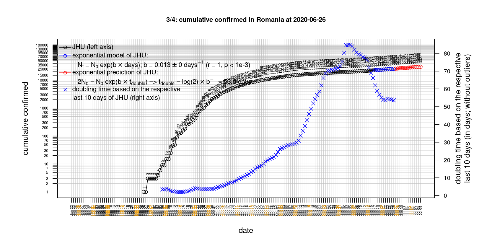
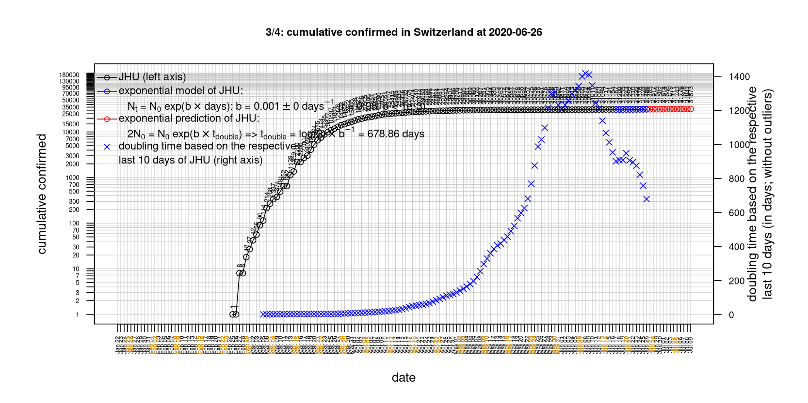

# International Covid-19 death predictions based on CSSEGISandData/COVID-19

  * upstream repo: https://github.com/CSSEGISandData/COVID-19  
  * time of last fetch of upstream repo: **2020-04-02 11:14:18 CET** (timestamp of file `.git/refs/remotes/upstream`)  
  * hash of last fetched commit of upstream repo: `33640a584cfe72958910c0a9620f4d0bcf36b159` (`git rev-parse upstream/master`)  
  * last date of `COVID-19/csse_covid_19_data/time_series_covid19_*_global.csv` data: **2020-04-01**

# death rate evolution

# Select country

ordererd by time when cumulative number of deaths doubles (increasing)
country | cumulative number of deaths doubles in | period of estimation | rsq | p | cumulative deaths | cumulative confirmed
--- | --- | --- | --- | --- | --- | ---
[Russia](#Russia) | 2.01 days | 2020-03-23 to 2020-04-01 (10 days) | 0.96 | < 1e-3 | 24 | 2777
[Romania](#Romania) | 2.48 days | 2020-03-23 to 2020-04-01 (10 days) | 0.98 | < 1e-3 | 92 | 2460
[Belgium](#Belgium) | 2.86 days | 2020-03-23 to 2020-04-01 (10 days) | 0.99 | < 1e-3 | 828 | 13964
[US](#US) | 2.91 days | 2020-03-23 to 2020-04-01 (10 days) | 1 | < 1e-3 | 4757 | 213372
[Portugal](#Portugal) | 3 days | 2020-03-23 to 2020-04-01 (10 days) | 0.98 | < 1e-3 | 187 | 8251
[Germany](#Germany) | 3.07 days | 2020-03-23 to 2020-04-01 (10 days) | 0.99 | < 1e-3 | 920 | 77872
[Sweden](#Sweden) | 3.1 days | 2020-03-23 to 2020-04-01 (10 days) | 0.94 | < 1e-3 | 239 | 4947
[Austria](#Austria) | 3.15 days | 2020-03-23 to 2020-04-01 (10 days) | 0.99 | < 1e-3 | 146 | 10711
[Turkey](#Turkey) | 3.15 days | 2020-03-23 to 2020-04-01 (10 days) | 1 | < 1e-3 | 277 | 15679
[United Kingdom](#United-Kingdom) | 3.2 days | 2020-03-23 to 2020-04-01 (10 days) | 0.99 | < 1e-3 | 2357 | 29865
[Netherlands](#Netherlands) | 3.7 days | 2020-03-23 to 2020-04-01 (10 days) | 0.99 | < 1e-3 | 1175 | 13696
[Canada](#Canada) | 3.9 days | 2020-03-23 to 2020-04-01 (10 days) | 0.98 | < 1e-3 | 109 | 9560
[Poland](#Poland) | 4.01 days | 2020-03-23 to 2020-04-01 (10 days) | 0.97 | < 1e-3 | 43 | 2554
[Norway](#Norway) | 4.14 days | 2020-03-23 to 2020-04-01 (10 days) | 0.99 | < 1e-3 | 44 | 4863
[France](#France) | 4.14 days | 2020-03-23 to 2020-04-01 (10 days) | 0.99 | < 1e-3 | 4043 | 57749
[Switzerland](#Switzerland) | 4.2 days | 2020-03-23 to 2020-04-01 (10 days) | 0.99 | < 1e-3 | 488 | 17768
[Denmark](#Denmark) | 4.33 days | 2020-03-23 to 2020-04-01 (10 days) | 0.98 | < 1e-3 | 104 | 3290
[Spain](#Spain) | 4.47 days | 2020-03-23 to 2020-04-01 (10 days) | 0.98 | < 1e-3 | 9387 | 104118
[Australia](#Australia) | 5.84 days | 2020-03-23 to 2020-04-01 (10 days) | 0.92 | < 1e-3 | 20 | 4862
[Hungary](#Hungary) | 6.98 days | 2020-03-23 to 2020-04-01 (10 days) | 0.94 | < 1e-3 | 20 | 525
[Italy](#Italy) | 8.04 days | 2020-03-23 to 2020-04-01 (10 days) | 0.99 | < 1e-3 | 13155 | 110574
[Iran](#Iran) | 12.1 days | 2020-03-23 to 2020-04-01 (10 days) | 0.99 | < 1e-3 | 3036 | 47593
[Japan](#Japan) | 19.11 days | 2020-03-23 to 2020-04-01 (10 days) | 0.98 | < 1e-3 | 57 | 2178
[China](#China) | 515.58 days | 2020-03-23 to 2020-04-01 (10 days) | 0.99 | < 1e-3 | 3316 | 82361
[Nepal](#Nepal) | NA | NA | NA | NA | 0 | 5

# Australia
[top](#Select-country)

 

 

 

 
 

# Austria
[top](#Select-country)

 

 

 

 
 

# Belgium
[top](#Select-country)

 

 

 

 
 

# Canada
[top](#Select-country)

 

 

 

 
 

# China
[top](#Select-country)

 

 

 

 
 

# Denmark
[top](#Select-country)

 

 

 

 
 

# France
[top](#Select-country)

 

 

 

 
 

# Germany
[top](#Select-country)

 

 

 

 
 

# Hungary
[top](#Select-country)

 

 

 

 
 

# Iran
[top](#Select-country)

 

 

 

 
 

# Italy
[top](#Select-country)

national responses:
1. 2020-03-04: https://www.theguardian.com/world/2020/mar/04/italy-orders-closure-of-schools-and-universities-due-to-coronavirus
2. 2020-03-09: https://www.bbc.co.uk/sport/51808683
3. 2020-03-11: https://www.washingtonpost.com/world/europe/merkel-coronavirus-germany/2020/03/11/e276252a-6399-11ea-8a8e-5c5336b32760_story.html

 

 

 

 
 

# Japan
[top](#Select-country)

 

 

 

 
 

# Nepal
[top](#Select-country)

 

 

 

 
 

# Netherlands
[top](#Select-country)

 

 

 

 
 

# Norway
[top](#Select-country)

 

 

 

 
 

# Poland
[top](#Select-country)

 

 

 

 
 

# Portugal
[top](#Select-country)

 

 

 

 
 

# Romania
[top](#Select-country)

 

 

 

 
 

# Russia
[top](#Select-country)

 

 

 

 
 

# Spain
[top](#Select-country)

 

 

 

 
 

# Sweden
[top](#Select-country)

 

 

 

 
 

# Switzerland
[top](#Select-country)

 

 

 

 
 

# Turkey
[top](#Select-country)

 

 

 

 
 

# US
[top](#Select-country)

 

 

 

 
 

# United Kingdom
[top](#Select-country)

 

 

 

 
 

