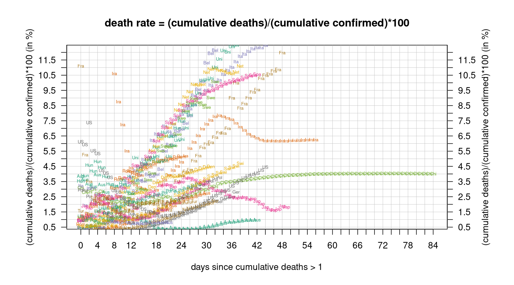
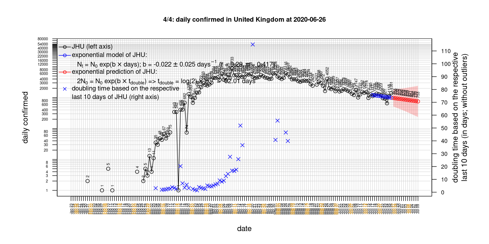

# International Covid-19 death predictions based on CSSEGISandData/COVID-19

  * upstream repo: https://github.com/CSSEGISandData/COVID-19  
  * time of last fetch of upstream repo: **2020-04-03 08:12:35 CET** (timestamp of file `.git/refs/remotes/upstream`)  
  * hash of last fetched commit of upstream repo: `6af1fed774d43186145c59942285c2b9fad83510` (`git rev-parse upstream/master`)  
  * last date of `COVID-19/csse_covid_19_data/time_series_covid19_*_global.csv` data: **2020-04-02**

# death rate evolution

# Select country

ordererd by time when cumulative number of deaths doubles (increasing)
country | cumulative number of deaths doubles in | period of estimation | rsq | p | cumulative deaths | cumulative confirmed
--- | --- | --- | --- | --- | --- | ---
[Russia](#Russia) | 2.01 days | 2020-03-24 to 2020-04-02 (10 days) | 0.96 | < 1e-3 | 30 | 3548
[Romania](#Romania) | 2.71 days | 2020-03-24 to 2020-04-02 (10 days) | 0.99 | < 1e-3 | 115 | 2738
[US](#US) | 2.98 days | 2020-03-24 to 2020-04-02 (10 days) | 1 | < 1e-3 | 5926 | 243453
[Belgium](#Belgium) | 3.05 days | 2020-03-24 to 2020-04-02 (10 days) | 0.99 | < 1e-3 | 1011 | 15348
[Turkey](#Turkey) | 3.1 days | 2020-03-24 to 2020-04-02 (10 days) | 1 | < 1e-3 | 356 | 18135
[United Kingdom](#United-Kingdom) | 3.14 days | 2020-03-24 to 2020-04-02 (10 days) | 0.99 | < 1e-3 | 2926 | 34173
[Germany](#Germany) | 3.22 days | 2020-03-24 to 2020-04-02 (10 days) | 0.99 | < 1e-3 | 1107 | 84794
[Sweden](#Sweden) | 3.36 days | 2020-03-24 to 2020-04-02 (10 days) | 0.96 | < 1e-3 | 308 | 5568
[Portugal](#Portugal) | 3.38 days | 2020-03-24 to 2020-04-02 (10 days) | 0.97 | < 1e-3 | 209 | 9034
[Austria](#Austria) | 3.41 days | 2020-03-24 to 2020-04-02 (10 days) | 0.98 | < 1e-3 | 158 | 11129
[Canada](#Canada) | 3.78 days | 2020-03-24 to 2020-04-02 (10 days) | 0.98 | < 1e-3 | 139 | 11284
[Poland](#Poland) | 3.9 days | 2020-03-24 to 2020-04-02 (10 days) | 0.97 | < 1e-3 | 57 | 2946
[Netherlands](#Netherlands) | 4.02 days | 2020-03-24 to 2020-04-02 (10 days) | 0.99 | < 1e-3 | 1341 | 14788
[Norway](#Norway) | 4.14 days | 2020-03-24 to 2020-04-02 (10 days) | 0.99 | < 1e-3 | 50 | 5147
[France](#France) | 4.22 days | 2020-03-24 to 2020-04-02 (10 days) | 0.99 | < 1e-3 | 5398 | 59929
[Switzerland](#Switzerland) | 4.24 days | 2020-03-24 to 2020-04-02 (10 days) | 0.99 | < 1e-3 | 536 | 18827
[Denmark](#Denmark) | 4.55 days | 2020-03-24 to 2020-04-02 (10 days) | 0.99 | < 1e-3 | 123 | 3573
[Spain](#Spain) | 4.97 days | 2020-03-24 to 2020-04-02 (10 days) | 0.98 | < 1e-3 | 10348 | 112065
[Australia](#Australia) | 6.06 days | 2020-03-24 to 2020-04-02 (10 days) | 0.92 | < 1e-3 | 24 | 5116
[Hungary](#Hungary) | 7.05 days | 2020-03-24 to 2020-04-02 (10 days) | 0.94 | < 1e-3 | 21 | 585
[Italy](#Italy) | 8.66 days | 2020-03-24 to 2020-04-02 (10 days) | 0.99 | < 1e-3 | 13915 | 115242
[Iran](#Iran) | 12.9 days | 2020-03-24 to 2020-04-02 (10 days) | 0.99 | < 1e-3 | 3160 | 50468
[Japan](#Japan) | 18.59 days | 2020-03-24 to 2020-04-02 (10 days) | 0.97 | < 1e-3 | 62 | 2495
[China](#China) | 526.55 days | 2020-03-24 to 2020-04-02 (10 days) | 0.99 | < 1e-3 | 3322 | 82432
[Nepal](#Nepal) | NA | NA | NA | NA | 0 | 6

# Australia
[top](#Select-country)

 

 

 

 
 

# Austria
[top](#Select-country)

 

 

 

 
 

# Belgium
[top](#Select-country)

 

 

 

 
 

# Canada
[top](#Select-country)

 

 

 

 
 

# China
[top](#Select-country)

 

 

 

 
 

# Denmark
[top](#Select-country)

 

 

 

 
 

# France
[top](#Select-country)

 

 

 

 
 

# Germany
[top](#Select-country)

 

 

 

 
 

# Hungary
[top](#Select-country)

 

 

 

 
 

# Iran
[top](#Select-country)

 

 

 

 
 

# Italy
[top](#Select-country)

national responses:
1. 2020-03-04: https://www.theguardian.com/world/2020/mar/04/italy-orders-closure-of-schools-and-universities-due-to-coronavirus
2. 2020-03-09: https://www.bbc.co.uk/sport/51808683
3. 2020-03-11: https://www.washingtonpost.com/world/europe/merkel-coronavirus-germany/2020/03/11/e276252a-6399-11ea-8a8e-5c5336b32760_story.html

 

 

 

 
 

# Japan
[top](#Select-country)

 

 

 

 
 

# Nepal
[top](#Select-country)

 

 

 

 
 

# Netherlands
[top](#Select-country)

 

 

 

 
 

# Norway
[top](#Select-country)

 

 

 

 
 

# Poland
[top](#Select-country)

 

 

 

 
 

# Portugal
[top](#Select-country)

 

 

 

 
 

# Romania
[top](#Select-country)

 

 

 

 
 

# Russia
[top](#Select-country)

 

 

 

 
 

# Spain
[top](#Select-country)

 

 

 

 
 

# Sweden
[top](#Select-country)

 

 

 

 
 

# Switzerland
[top](#Select-country)

 

 

 

 
 

# Turkey
[top](#Select-country)

 

 

 

 
 

# US
[top](#Select-country)

 

 

 

 
 

# United Kingdom
[top](#Select-country)

 

 

 

 
 

