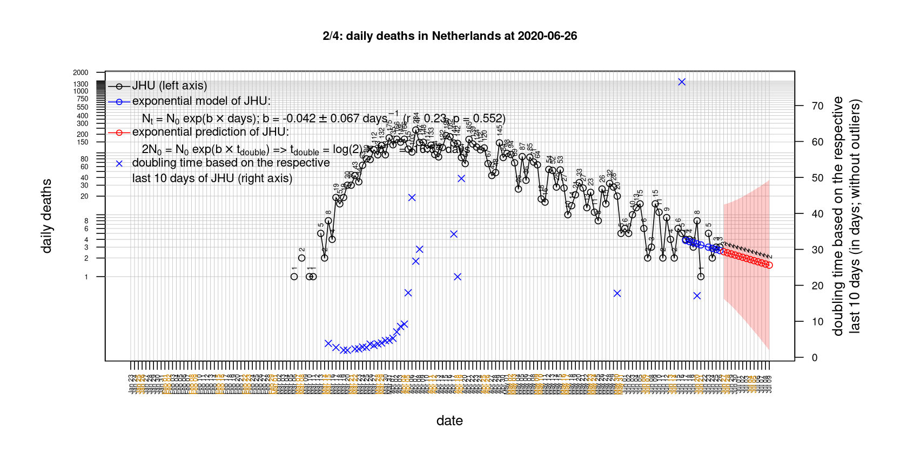
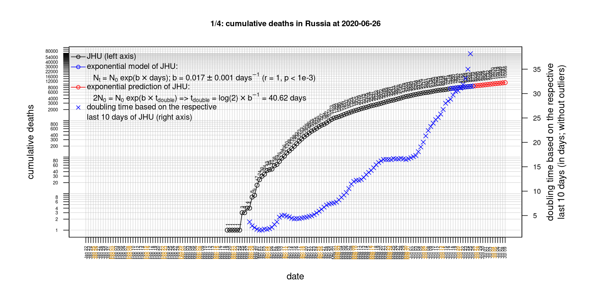

# International Covid-19 death predictions based on CSSEGISandData/COVID-19

  * upstream repo: https://github.com/CSSEGISandData/COVID-19  
  * time of last fetch of upstream repo: **2020-04-15 07:55:03 CET** (timestamp of file `.git/refs/remotes/upstream`)  
  * hash of last fetched commit of upstream repo: `c7a5b79a613b976f13ee453e4f6cb067419c5f2d` (`git rev-parse upstream/master`)  
  * last date of `COVID-19/csse_covid_19_data/time_series_covid19_*_global.csv` data: **2020-04-14**

# death rate evolution

# Select country

ordererd by time when cumulative number of deaths doubles (increasing)
country | cumulative number of deaths doubles in | period of estimation | rsq | p | cumulative deaths | cumulative confirmed
--- | --- | --- | --- | --- | --- | ---
[Russia](#Russia) | 4.43 days | 2020-04-05 to 2020-04-14 (10 days) | 0.99 | < 1e-3 | 170 | 21102
[Hungary](#Hungary) | 4.79 days | 2020-04-05 to 2020-04-14 (10 days) | 0.99 | < 1e-3 | 122 | 1512
[Canada](#Canada) | 5.25 days | 2020-04-05 to 2020-04-14 (10 days) | 0.99 | < 1e-3 | 899 | 27034
[Belgium](#Belgium) | 5.77 days | 2020-04-05 to 2020-04-14 (10 days) | 0.98 | < 1e-3 | 4157 | 31119
[Poland](#Poland) | 6.07 days | 2020-04-05 to 2020-04-14 (10 days) | 0.97 | < 1e-3 | 263 | 7202
[US](#US) | 6.28 days | 2020-04-05 to 2020-04-14 (10 days) | 0.98 | < 1e-3 | 25832 | 607670
[United Kingdom](#United-Kingdom) | 6.68 days | 2020-04-05 to 2020-04-14 (10 days) | 0.98 | < 1e-3 | 12129 | 94845
[Turkey](#Turkey) | 6.97 days | 2020-04-05 to 2020-04-14 (10 days) | 0.99 | < 1e-3 | 1403 | 65111
[Sweden](#Sweden) | 7.12 days | 2020-04-05 to 2020-04-14 (10 days) | 0.89 | < 1e-3 | 1033 | 11445
[Romania](#Romania) | 7.48 days | 2020-04-05 to 2020-04-14 (10 days) | 0.98 | < 1e-3 | 351 | 6879
[Germany](#Germany) | 8.73 days | 2020-04-05 to 2020-04-14 (10 days) | 0.94 | < 1e-3 | 3294 | 131359
[Norway](#Norway) | 9.25 days | 2020-04-05 to 2020-04-14 (10 days) | 0.95 | < 1e-3 | 139 | 6623
[Portugal](#Portugal) | 9.32 days | 2020-04-05 to 2020-04-14 (10 days) | 0.99 | < 1e-3 | 567 | 17448
[France](#France) | 9.47 days | 2020-04-05 to 2020-04-14 (10 days) | 0.96 | < 1e-3 | 15748 | 131361
[Austria](#Austria) | 9.67 days | 2020-04-05 to 2020-04-14 (10 days) | 0.97 | < 1e-3 | 384 | 14226
[Australia](#Australia) | 11.45 days | 2020-04-05 to 2020-04-14 (10 days) | 0.92 | < 1e-3 | 62 | 6415
[Denmark](#Denmark) | 11.89 days | 2020-04-05 to 2020-04-14 (10 days) | 0.99 | < 1e-3 | 299 | 6706
[Netherlands](#Netherlands) | 12.22 days | 2020-04-05 to 2020-04-14 (10 days) | 0.97 | < 1e-3 | 2955 | 27580
[Switzerland](#Switzerland) | 12.39 days | 2020-04-05 to 2020-04-14 (10 days) | 0.98 | < 1e-3 | 1174 | 25936
[Japan](#Japan) | 12.43 days | 2020-04-05 to 2020-04-14 (10 days) | 0.89 | < 1e-3 | 143 | 7645
[Spain](#Spain) | 17.29 days | 2020-04-05 to 2020-04-14 (10 days) | 0.98 | < 1e-3 | 18056 | 172541
[Italy](#Italy) | 22.38 days | 2020-04-05 to 2020-04-14 (10 days) | 1 | < 1e-3 | 21067 | 162488
[Iran](#Iran) | 23.82 days | 2020-04-05 to 2020-04-14 (10 days) | 1 | < 1e-3 | 4683 | 74877
[China](#China) | 1611.48 days | 2020-04-05 to 2020-04-14 (10 days) | 0.98 | < 1e-3 | 3345 | 83306
[Nepal](#Nepal) | NA | NA | NA | NA | 0 | 16

# Australia
[top](#Select-country)

 

 

 

 
 

# Austria
[top](#Select-country)

 

 

 

 
 

# Belgium
[top](#Select-country)

 

 

 

 
 

# Canada
[top](#Select-country)

 

 

 

 
 

# China
[top](#Select-country)

 

 

 

 
 

# Denmark
[top](#Select-country)

 

 

 

 
 

# France
[top](#Select-country)

 

 

 

 
 

# Germany
[top](#Select-country)

 

 

 

 
 

# Hungary
[top](#Select-country)

 

 

 

 
 

# Iran
[top](#Select-country)

 

 

 

 
 

# Italy
[top](#Select-country)

national responses:
1. 2020-03-04: https://www.theguardian.com/world/2020/mar/04/italy-orders-closure-of-schools-and-universities-due-to-coronavirus
2. 2020-03-09: https://www.bbc.co.uk/sport/51808683
3. 2020-03-11: https://www.washingtonpost.com/world/europe/merkel-coronavirus-germany/2020/03/11/e276252a-6399-11ea-8a8e-5c5336b32760_story.html

 

 

 

 
 

# Japan
[top](#Select-country)

 

 

 

 
 

# Nepal
[top](#Select-country)

 

 

 

 
 

# Netherlands
[top](#Select-country)

 

 

 

 
 

# Norway
[top](#Select-country)

 

 

 

 
 

# Poland
[top](#Select-country)

 

 

 

 
 

# Portugal
[top](#Select-country)

 

 

 

 
 

# Romania
[top](#Select-country)

 

 

 

 
 

# Russia
[top](#Select-country)

 

 

 

 
 

# Spain
[top](#Select-country)

 

 

 

 
 

# Sweden
[top](#Select-country)

 

 

 

 
 

# Switzerland
[top](#Select-country)

 

 

 

 
 

# Turkey
[top](#Select-country)

 

 

 

 
 

# US
[top](#Select-country)

 

 

 

 
 

# United Kingdom
[top](#Select-country)

 

 

 

 
 

