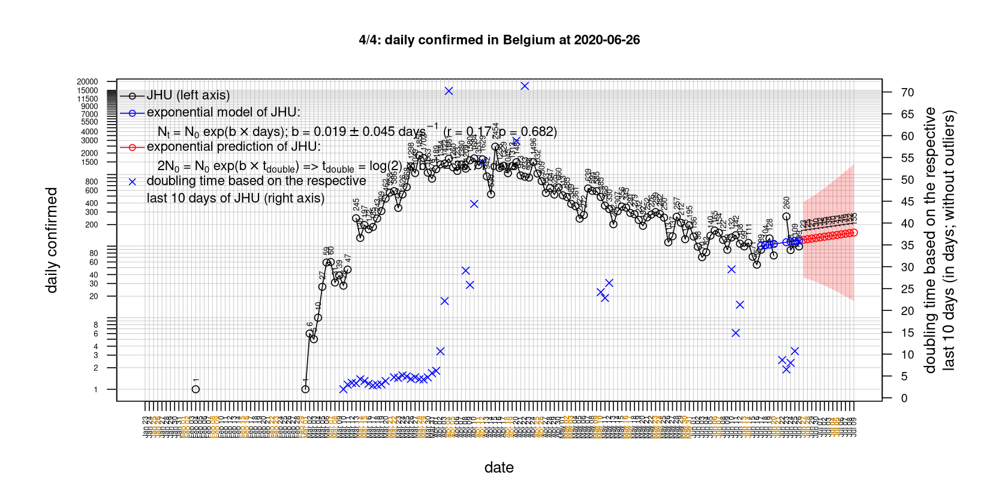
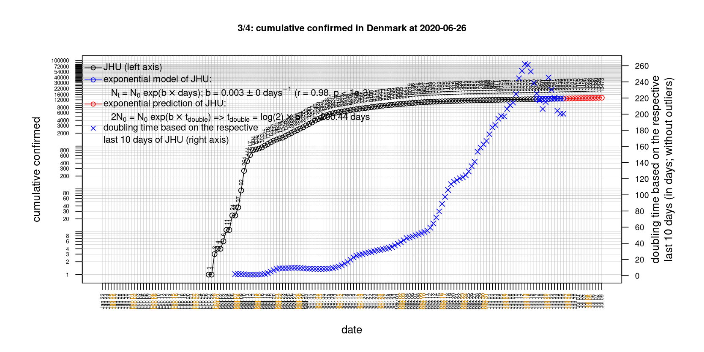
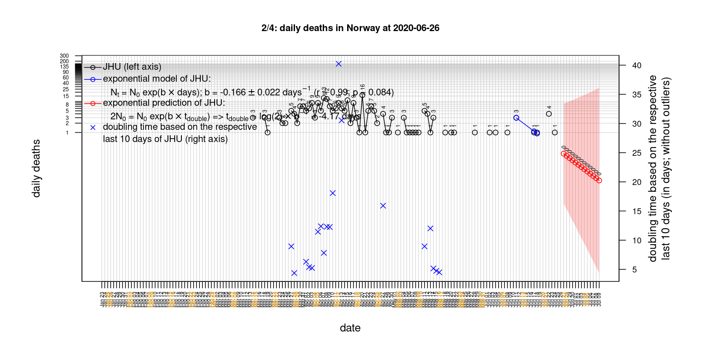
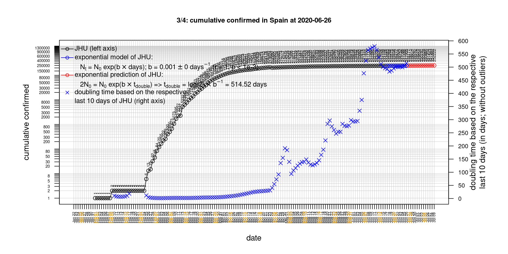

# International Covid-19 death predictions based on CSSEGISandData/COVID-19

  * upstream repo: https://github.com/CSSEGISandData/COVID-19  
  * time of last fetch of upstream repo: **2020-05-01 20:35:56 CET** (timestamp of file `.git/refs/remotes/upstream`)  
  * hash of last fetched commit of upstream repo: `25aac6356b14c84112a87fff1488aa4cf927a7ab` (`git rev-parse upstream/master`)  
  * last date of `COVID-19/csse_covid_19_data/time_series_covid19_*_global.csv` data: **2020-04-30**

# death rate evolution

# Select country

ordererd by time when cumulative number of deaths doubles (increasing)
country | cumulative number of deaths doubles in | period of estimation | rsq | p | cumulative deaths | cumulative confirmed
--- | --- | --- | --- | --- | --- | ---
[Russia](#Russia) | 7.49 days | 2020-04-21 to 2020-04-30 (10 days) | 1 | < 1e-3 | 1073 | 106498
[Canada](#Canada) | 11.61 days | 2020-04-21 to 2020-04-30 (10 days) | 0.99 | < 1e-3 | 3310 | 54457
[Poland](#Poland) | 13.14 days | 2020-04-21 to 2020-04-30 (10 days) | 0.99 | < 1e-3 | 644 | 12877
[Japan](#Japan) | 13.62 days | 2020-04-21 to 2020-04-30 (10 days) | 0.93 | < 1e-3 | 430 | 14088
[Hungary](#Hungary) | 17.15 days | 2020-04-21 to 2020-04-30 (10 days) | 0.96 | < 1e-3 | 312 | 2775
[Romania](#Romania) | 17.29 days | 2020-04-21 to 2020-04-30 (10 days) | 1 | < 1e-3 | 717 | 12240
[Turkey](#Turkey) | 18.57 days | 2020-04-21 to 2020-04-30 (10 days) | 0.99 | < 1e-3 | 3174 | 120204
[Australia](#Australia) | 18.64 days | 2020-04-21 to 2020-04-30 (10 days) | 0.95 | < 1e-3 | 93 | 6766
[Sweden](#Sweden) | 18.91 days | 2020-04-21 to 2020-04-30 (10 days) | 0.95 | < 1e-3 | 2586 | 21092
[US](#US) | 19.53 days | 2020-04-21 to 2020-04-30 (10 days) | 0.99 | < 1e-3 | 62996 | 1069424
[United Kingdom](#United-Kingdom) | 22.86 days | 2020-04-21 to 2020-04-30 (10 days) | 0.99 | < 1e-3 | 26842 | 172481
[Portugal](#Portugal) | 23.58 days | 2020-04-21 to 2020-04-30 (10 days) | 0.98 | < 1e-3 | 989 | 25045
[Germany](#Germany) | 24.25 days | 2020-04-21 to 2020-04-30 (10 days) | 0.97 | < 1e-3 | 6623 | 163009
[Belgium](#Belgium) | 26.91 days | 2020-04-21 to 2020-04-30 (10 days) | 0.97 | < 1e-3 | 7594 | 48519
[Netherlands](#Netherlands) | 32.77 days | 2020-04-21 to 2020-04-30 (10 days) | 0.97 | < 1e-3 | 4811 | 39512
[Denmark](#Denmark) | 32.97 days | 2020-04-21 to 2020-04-30 (10 days) | 0.97 | < 1e-3 | 452 | 9356
[Austria](#Austria) | 38.01 days | 2020-04-21 to 2020-04-30 (10 days) | 0.98 | < 1e-3 | 584 | 15452
[Switzerland](#Switzerland) | 38.61 days | 2020-04-21 to 2020-04-30 (10 days) | 0.98 | < 1e-3 | 1737 | 29586
[France](#France) | 40.57 days | 2020-04-21 to 2020-04-30 (10 days) | 0.99 | < 1e-3 | 24410 | 167299
[Spain](#Spain) | 44.55 days | 2020-04-21 to 2020-04-30 (10 days) | 0.99 | < 1e-3 | 24543 | 213435
[Norway](#Norway) | 47.89 days | 2020-04-21 to 2020-04-30 (10 days) | 0.9 | < 1e-3 | 210 | 7738
[Iran](#Iran) | 48.79 days | 2020-04-21 to 2020-04-30 (10 days) | 1 | < 1e-3 | 6028 | 94640
[Italy](#Italy) | 49.88 days | 2020-04-21 to 2020-04-30 (10 days) | 0.99 | < 1e-3 | 27967 | 205463
[China](#China) | 21210.93 days | 2020-04-21 to 2020-04-30 (10 days) | 0.76 | 0.001 | 4637 | 83956
[Nepal](#Nepal) | NA | NA | NA | NA | 0 | 57

# Australia
[top](#Select-country)

 

 

 

 
 

# Austria
[top](#Select-country)

 

 

 

 
 

# Belgium
[top](#Select-country)

 

 

 

 
 

# Canada
[top](#Select-country)

 

 

 

 
 

# China
[top](#Select-country)

 

 

 

 
 

# Denmark
[top](#Select-country)

 

 

 

 
 

# France
[top](#Select-country)

 

 

 

 
 

# Germany
[top](#Select-country)

 

 

 

 
 

# Hungary
[top](#Select-country)

 

 

 

 
 

# Iran
[top](#Select-country)

 

 

 

 
 

# Italy
[top](#Select-country)

national responses:
1. 2020-03-04: https://www.theguardian.com/world/2020/mar/04/italy-orders-closure-of-schools-and-universities-due-to-coronavirus
2. 2020-03-09: https://www.bbc.co.uk/sport/51808683
3. 2020-03-11: https://www.washingtonpost.com/world/europe/merkel-coronavirus-germany/2020/03/11/e276252a-6399-11ea-8a8e-5c5336b32760_story.html

 

 

 

 
 

# Japan
[top](#Select-country)

 

 

 

 
 

# Nepal
[top](#Select-country)

 

 

 

 
 

# Netherlands
[top](#Select-country)

 

 

 

 
 

# Norway
[top](#Select-country)

 

 

 

 
 

# Poland
[top](#Select-country)

 

 

 

 
 

# Portugal
[top](#Select-country)

 

 

 

 
 

# Romania
[top](#Select-country)

 

 

 

 
 

# Russia
[top](#Select-country)

 

 

 

 
 

# Spain
[top](#Select-country)

 

 

 

 
 

# Sweden
[top](#Select-country)

 

 

 

 
 

# Switzerland
[top](#Select-country)

 

 

 

 
 

# Turkey
[top](#Select-country)

 

 

 

 
 

# US
[top](#Select-country)

 

 

 

 
 

# United Kingdom
[top](#Select-country)

 

 

 

 
 

