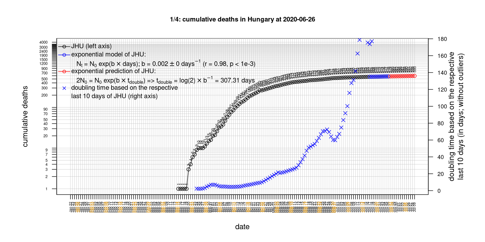
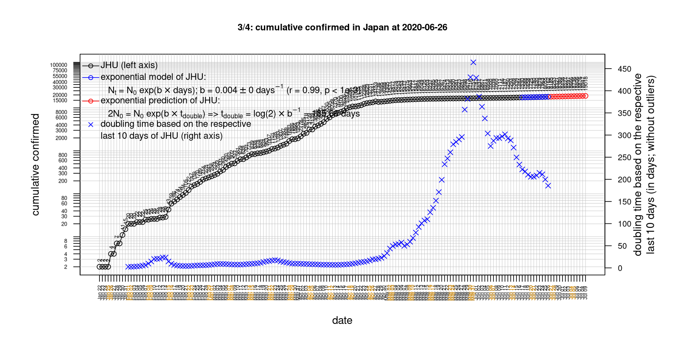
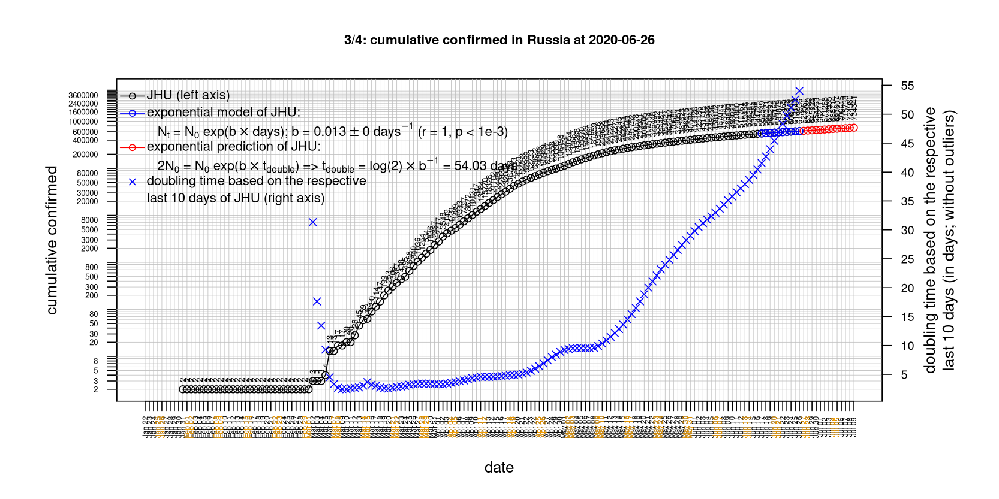

# International Covid-19 death predictions based on CSSEGISandData/COVID-19

  * upstream repo: https://github.com/CSSEGISandData/COVID-19  
  * time of last fetch of upstream repo: **2020-05-14 08:19:40 CET** (timestamp of file `.git/refs/remotes/upstream`)  
  * hash of last fetched commit of upstream repo: `5c2b5ff905e86a656b9d2bb97e268e5844aea35b` (`git rev-parse upstream/master`)  
  * last date of `COVID-19/csse_covid_19_data/time_series_covid19_*_global.csv` data: **2020-05-13**

# death rate evolution

# Select country

ordererd by time when cumulative number of deaths doubles (increasing)
country | cumulative number of deaths doubles in | period of estimation | rsq | p | cumulative deaths | cumulative confirmed
--- | --- | --- | --- | --- | --- | ---
[Brazil](#Brazil) | 10.8 days | 2020-05-04 to 2020-05-13 (10 days) | 0.99 | < 1e-3 | 13240 | 190137
[Russia](#Russia) | 12.8 days | 2020-05-04 to 2020-05-13 (10 days) | 1 | < 1e-3 | 2212 | 242271
[Canada](#Canada) | 20.86 days | 2020-05-04 to 2020-05-13 (10 days) | 0.99 | < 1e-3 | 5425 | 73568
[Romania](#Romania) | 26.93 days | 2020-05-04 to 2020-05-13 (10 days) | 0.99 | < 1e-3 | 1036 | 16002
[Japan](#Japan) | 27.26 days | 2020-05-04 to 2020-05-13 (10 days) | 0.99 | < 1e-3 | 678 | 16049
[Hungary](#Hungary) | 30.14 days | 2020-05-04 to 2020-05-13 (10 days) | 0.98 | < 1e-3 | 430 | 3341
[Sweden](#Sweden) | 30.51 days | 2020-05-04 to 2020-05-13 (10 days) | 0.95 | < 1e-3 | 3460 | 27909
[Poland](#Poland) | 31 days | 2020-05-04 to 2020-05-13 (10 days) | 0.99 | < 1e-3 | 861 | 17204
[US](#US) | 33.01 days | 2020-05-04 to 2020-05-13 (10 days) | 0.97 | < 1e-3 | 84119 | 1390406
[United Kingdom](#United-Kingdom) | 46.13 days | 2020-05-04 to 2020-05-13 (10 days) | 0.98 | < 1e-3 | 33264 | 230985
[Turkey](#Turkey) | 48.1 days | 2020-05-04 to 2020-05-13 (10 days) | 1 | < 1e-3 | 3952 | 143114
[Germany](#Germany) | 54.56 days | 2020-05-04 to 2020-05-13 (10 days) | 0.94 | < 1e-3 | 7861 | 174098
[Belgium](#Belgium) | 59.65 days | 2020-05-04 to 2020-05-13 (10 days) | 0.91 | < 1e-3 | 8843 | 53981
[Portugal](#Portugal) | 63.67 days | 2020-05-04 to 2020-05-13 (10 days) | 0.99 | < 1e-3 | 1175 | 28132
[Netherlands](#Netherlands) | 71.53 days | 2020-05-04 to 2020-05-13 (10 days) | 0.97 | < 1e-3 | 5581 | 43410
[Iran](#Iran) | 81.68 days | 2020-05-04 to 2020-05-13 (10 days) | 0.99 | < 1e-3 | 6783 | 112725
[Denmark](#Denmark) | 82.74 days | 2020-05-04 to 2020-05-13 (10 days) | 0.88 | < 1e-3 | 533 | 10865
[France](#France) | 92.19 days | 2020-05-04 to 2020-05-13 (10 days) | 0.98 | < 1e-3 | 27077 | 178184
[Norway](#Norway) | 92.64 days | 2020-05-04 to 2020-05-13 (10 days) | 0.9 | < 1e-3 | 229 | 8175
[Italy](#Italy) | 93.88 days | 2020-05-04 to 2020-05-13 (10 days) | 0.98 | < 1e-3 | 31106 | 222104
[Spain](#Spain) | 98.51 days | 2020-05-04 to 2020-05-13 (10 days) | 0.99 | < 1e-3 | 27104 | 228691
[Switzerland](#Switzerland) | 134.5 days | 2020-05-04 to 2020-05-13 (10 days) | 0.98 | < 1e-3 | 1870 | 30413
[Austria](#Austria) | 165.75 days | 2020-05-04 to 2020-05-13 (10 days) | 0.98 | < 1e-3 | 624 | 15997
[Korea, South](#Korea,-South) | 319.48 days | 2020-05-04 to 2020-05-13 (10 days) | 0.84 | < 1e-3 | 260 | 10991
[Australia](#Australia) | 444.38 days | 2020-05-04 to 2020-05-13 (10 days) | 0.65 | 0.005 | 98 | 6989
[China](#China) | NA | NA | NA | NA | 4637 | 84024
[Nepal](#Nepal) | NA | NA | NA | NA | 0 | 250

# Australia
[top](#Select-country)

 

 

 

 
 

# Austria
[top](#Select-country)

 

 

 

 
 

# Belgium
[top](#Select-country)

 

 

 

 
 

# Brazil
[top](#Select-country)

 

 

 

 
 

# Canada
[top](#Select-country)

 

 

 

 
 

# China
[top](#Select-country)

 

 

 

 
 

# Denmark
[top](#Select-country)

 

 

 

 
 

# France
[top](#Select-country)

 

 

 

 
 

# Germany
[top](#Select-country)

 

 

 

 

 
 

# Hungary
[top](#Select-country)

 

 

 

 
 

# Iran
[top](#Select-country)

 

 

 

 
 

# Italy
[top](#Select-country)

national responses:
1. 2020-03-04: https://www.theguardian.com/world/2020/mar/04/italy-orders-closure-of-schools-and-universities-due-to-coronavirus
2. 2020-03-09: https://www.bbc.co.uk/sport/51808683
3. 2020-03-11: https://www.washingtonpost.com/world/europe/merkel-coronavirus-germany/2020/03/11/e276252a-6399-11ea-8a8e-5c5336b32760_story.html

 

 

 

 
 

# Japan
[top](#Select-country)

 

 

 

 
 

# Korea, South
[top](#Select-country)

 

 

 

 
 

# Nepal
[top](#Select-country)

 

 

 

 
 

# Netherlands
[top](#Select-country)

 

 

 

 
 

# Norway
[top](#Select-country)

 

 

 

 
 

# Poland
[top](#Select-country)

 

 

 

 
 

# Portugal
[top](#Select-country)

 

 

 

 
 

# Romania
[top](#Select-country)

 

 

 

 
 

# Russia
[top](#Select-country)

 

 

 

 
 

# Spain
[top](#Select-country)

 

 

 

 
 

# Sweden
[top](#Select-country)

 

 

 

 
 

# Switzerland
[top](#Select-country)

 

 

 

 
 

# Turkey
[top](#Select-country)

 

 

 

 
 

# US
[top](#Select-country)

 

 

 

 
 

# United Kingdom
[top](#Select-country)

 

 

 

 
 

