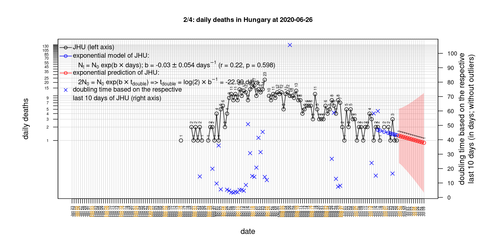
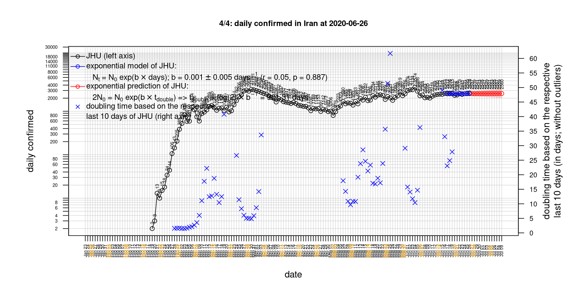

# International Covid-19 death predictions based on CSSEGISandData/COVID-19

  * upstream repo: https://github.com/CSSEGISandData/COVID-19  
  * time of last fetch of upstream repo: **2020-04-08 07:06:27 CET** (timestamp of file `.git/refs/remotes/upstream`)  
  * hash of last fetched commit of upstream repo: `1a68338bddea934490f772051121adad47bf543e` (`git rev-parse upstream/master`)  
  * last date of `COVID-19/csse_covid_19_data/time_series_covid19_*_global.csv` data: **2020-04-07**

# death rate evolution

# Select country

ordererd by time when cumulative number of deaths doubles (increasing)
country | cumulative number of deaths doubles in | period of estimation | rsq | p | cumulative deaths | cumulative confirmed
--- | --- | --- | --- | --- | --- | ---
[Russia](#Russia) | 3.16 days | 2020-03-29 to 2020-04-07 (10 days) | 0.91 | < 1e-3 | 58 | 7497
[Canada](#Canada) | 3.46 days | 2020-03-29 to 2020-04-07 (10 days) | 1 | < 1e-3 | 375 | 17872
[Poland](#Poland) | 3.59 days | 2020-03-29 to 2020-04-07 (10 days) | 0.99 | < 1e-3 | 129 | 4848
[Turkey](#Turkey) | 3.6 days | 2020-03-29 to 2020-04-07 (10 days) | 0.98 | < 1e-3 | 725 | 34109
[United Kingdom](#United-Kingdom) | 3.69 days | 2020-03-29 to 2020-04-07 (10 days) | 0.98 | < 1e-3 | 6171 | 55949
[US](#US) | 3.79 days | 2020-03-29 to 2020-04-07 (10 days) | 0.99 | < 1e-3 | 12722 | 396223
[Sweden](#Sweden) | 3.96 days | 2020-03-29 to 2020-04-07 (10 days) | 0.96 | < 1e-3 | 591 | 7693
[Belgium](#Belgium) | 4.22 days | 2020-03-29 to 2020-04-07 (10 days) | 0.98 | < 1e-3 | 2035 | 22194
[France](#France) | 4.37 days | 2020-03-29 to 2020-04-07 (10 days) | 0.98 | < 1e-3 | 10343 | 110065
[Romania](#Romania) | 4.53 days | 2020-03-29 to 2020-04-07 (10 days) | 0.94 | < 1e-3 | 197 | 4417
[Germany](#Germany) | 4.71 days | 2020-03-29 to 2020-04-07 (10 days) | 0.99 | < 1e-3 | 2016 | 107663
[Hungary](#Hungary) | 4.87 days | 2020-03-29 to 2020-04-07 (10 days) | 0.99 | < 1e-3 | 47 | 817
[Norway](#Norway) | 5.28 days | 2020-03-29 to 2020-04-07 (10 days) | 0.98 | < 1e-3 | 89 | 6086
[Denmark](#Denmark) | 5.6 days | 2020-03-29 to 2020-04-07 (10 days) | 0.98 | < 1e-3 | 203 | 5266
[Australia](#Australia) | 5.72 days | 2020-03-29 to 2020-04-07 (10 days) | 0.99 | < 1e-3 | 45 | 5895
[Portugal](#Portugal) | 5.88 days | 2020-03-29 to 2020-04-07 (10 days) | 0.98 | < 1e-3 | 345 | 12442
[Netherlands](#Netherlands) | 6.27 days | 2020-03-29 to 2020-04-07 (10 days) | 0.98 | < 1e-3 | 2108 | 19709
[Switzerland](#Switzerland) | 6.39 days | 2020-03-29 to 2020-04-07 (10 days) | 0.97 | < 1e-3 | 821 | 22253
[Austria](#Austria) | 6.56 days | 2020-03-29 to 2020-04-07 (10 days) | 0.97 | < 1e-3 | 243 | 12639
[Spain](#Spain) | 8.69 days | 2020-03-29 to 2020-04-07 (10 days) | 0.98 | < 1e-3 | 14045 | 141942
[Japan](#Japan) | 10.91 days | 2020-03-29 to 2020-04-07 (10 days) | 0.93 | < 1e-3 | 92 | 3906
[Italy](#Italy) | 13.62 days | 2020-03-29 to 2020-04-07 (10 days) | 0.98 | < 1e-3 | 17127 | 135586
[Iran](#Iran) | 16.12 days | 2020-03-29 to 2020-04-07 (10 days) | 1 | < 1e-3 | 3872 | 62589
[China](#China) | 599.02 days | 2020-03-29 to 2020-04-07 (10 days) | 0.96 | < 1e-3 | 3335 | 82718
[Nepal](#Nepal) | NA | NA | NA | NA | 0 | 9

# Australia
[top](#Select-country)

 

 

 

 
 

# Austria
[top](#Select-country)

 

 

 

 
 

# Belgium
[top](#Select-country)

 

 

 

 
 

# Canada
[top](#Select-country)

 

 

 

 
 

# China
[top](#Select-country)

 

 

 

 
 

# Denmark
[top](#Select-country)

 

 

 

 
 

# France
[top](#Select-country)

 

 

 

 
 

# Germany
[top](#Select-country)

 

 

 

 
 

# Hungary
[top](#Select-country)

 

 

 

 
 

# Iran
[top](#Select-country)

 

 

 

 
 

# Italy
[top](#Select-country)

national responses:
1. 2020-03-04: https://www.theguardian.com/world/2020/mar/04/italy-orders-closure-of-schools-and-universities-due-to-coronavirus
2. 2020-03-09: https://www.bbc.co.uk/sport/51808683
3. 2020-03-11: https://www.washingtonpost.com/world/europe/merkel-coronavirus-germany/2020/03/11/e276252a-6399-11ea-8a8e-5c5336b32760_story.html

 

 

 

 
 

# Japan
[top](#Select-country)

 

 

 

 
 

# Nepal
[top](#Select-country)

 

 

 

 
 

# Netherlands
[top](#Select-country)

 

 

 

 
 

# Norway
[top](#Select-country)

 

 

 

 
 

# Poland
[top](#Select-country)

 

 

 

 
 

# Portugal
[top](#Select-country)

 

 

 

 
 

# Romania
[top](#Select-country)

 

 

 

 
 

# Russia
[top](#Select-country)

 

 

 

 
 

# Spain
[top](#Select-country)

 

 

 

 
 

# Sweden
[top](#Select-country)

 

 

 

 
 

# Switzerland
[top](#Select-country)

 

 

 

 
 

# Turkey
[top](#Select-country)

 

 

 

 
 

# US
[top](#Select-country)

 

 

 

 
 

# United Kingdom
[top](#Select-country)

 

 

 

 
 

