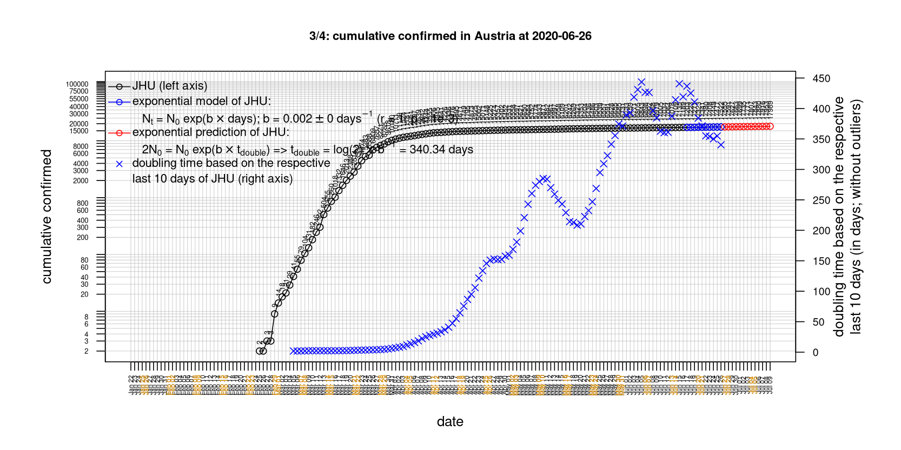

# International Covid-19 death predictions based on CSSEGISandData/COVID-19

  * upstream repo: https://github.com/CSSEGISandData/COVID-19  
  * time of last fetch of upstream repo: **2020-04-29 06:52:37 CET** (timestamp of file `.git/refs/remotes/upstream`)  
  * hash of last fetched commit of upstream repo: `4fd1f718ecaf37852ec5a1821d4a2b8a5d83823c` (`git rev-parse upstream/master`)  
  * last date of `COVID-19/csse_covid_19_data/time_series_covid19_*_global.csv` data: **2020-04-28**

# death rate evolution

# Select country

ordererd by time when cumulative number of deaths doubles (increasing)
country | cumulative number of deaths doubles in | period of estimation | rsq | p | cumulative deaths | cumulative confirmed
--- | --- | --- | --- | --- | --- | ---
[Russia](#Russia) | 7.14 days | 2020-04-19 to 2020-04-28 (10 days) | 0.99 | < 1e-3 | 867 | 93558
[Canada](#Canada) | 9.77 days | 2020-04-19 to 2020-04-28 (10 days) | 0.98 | < 1e-3 | 2983 | 51150
[Japan](#Japan) | 10.82 days | 2020-04-19 to 2020-04-28 (10 days) | 0.94 | < 1e-3 | 394 | 13736
[Poland](#Poland) | 12.14 days | 2020-04-19 to 2020-04-28 (10 days) | 0.99 | < 1e-3 | 596 | 12218
[Hungary](#Hungary) | 14.21 days | 2020-04-19 to 2020-04-28 (10 days) | 0.97 | < 1e-3 | 291 | 2649
[Sweden](#Sweden) | 14.49 days | 2020-04-19 to 2020-04-28 (10 days) | 0.92 | < 1e-3 | 2355 | 19621
[Turkey](#Turkey) | 15.9 days | 2020-04-19 to 2020-04-28 (10 days) | 0.99 | < 1e-3 | 2992 | 114653
[Romania](#Romania) | 16.2 days | 2020-04-19 to 2020-04-28 (10 days) | 0.99 | < 1e-3 | 663 | 11616
[US](#US) | 17.54 days | 2020-04-19 to 2020-04-28 (10 days) | 0.98 | < 1e-3 | 58355 | 1012582
[United Kingdom](#United-Kingdom) | 20.02 days | 2020-04-19 to 2020-04-28 (10 days) | 0.98 | < 1e-3 | 21745 | 162350
[Australia](#Australia) | 20.03 days | 2020-04-19 to 2020-04-28 (10 days) | 0.92 | < 1e-3 | 89 | 6744
[Germany](#Germany) | 20.03 days | 2020-04-19 to 2020-04-28 (10 days) | 0.97 | < 1e-3 | 6314 | 159912
[Portugal](#Portugal) | 21.12 days | 2020-04-19 to 2020-04-28 (10 days) | 0.99 | < 1e-3 | 948 | 24322
[Belgium](#Belgium) | 23.13 days | 2020-04-19 to 2020-04-28 (10 days) | 0.99 | < 1e-3 | 7331 | 47334
[Netherlands](#Netherlands) | 27.36 days | 2020-04-19 to 2020-04-28 (10 days) | 0.97 | < 1e-3 | 4582 | 38612
[Denmark](#Denmark) | 29.63 days | 2020-04-19 to 2020-04-28 (10 days) | 0.98 | < 1e-3 | 434 | 9049
[Austria](#Austria) | 29.96 days | 2020-04-19 to 2020-04-28 (10 days) | 0.94 | < 1e-3 | 569 | 15357
[Norway](#Norway) | 31.7 days | 2020-04-19 to 2020-04-28 (10 days) | 0.88 | < 1e-3 | 206 | 7660
[Switzerland](#Switzerland) | 32.83 days | 2020-04-19 to 2020-04-28 (10 days) | 0.98 | < 1e-3 | 1699 | 29264
[France](#France) | 34.87 days | 2020-04-19 to 2020-04-28 (10 days) | 0.98 | < 1e-3 | 23694 | 169053
[Spain](#Spain) | 40.55 days | 2020-04-19 to 2020-04-28 (10 days) | 0.99 | < 1e-3 | 23822 | 232128
[Italy](#Italy) | 43.16 days | 2020-04-19 to 2020-04-28 (10 days) | 0.99 | < 1e-3 | 27359 | 201505
[Iran](#Iran) | 45.08 days | 2020-04-19 to 2020-04-28 (10 days) | 1 | < 1e-3 | 5877 | 92584
[China](#China) | 25251.1 days | 2020-04-19 to 2020-04-28 (10 days) | 0.64 | 0.006 | 4637 | 83940
[Nepal](#Nepal) | NA | NA | NA | NA | 0 | 54

# Australia
[top](#Select-country)

 

 

 

 
 

# Austria
[top](#Select-country)

 

 

 

 
 

# Belgium
[top](#Select-country)

 

 

 

 
 

# Canada
[top](#Select-country)

 

 

 

 
 

# China
[top](#Select-country)

 

 

 

 
 

# Denmark
[top](#Select-country)

 

 

 

 
 

# France
[top](#Select-country)

 

 

 

 
 

# Germany
[top](#Select-country)

 

 

 

 
 

# Hungary
[top](#Select-country)

 

 

 

 
 

# Iran
[top](#Select-country)

 

 

 

 
 

# Italy
[top](#Select-country)

national responses:
1. 2020-03-04: https://www.theguardian.com/world/2020/mar/04/italy-orders-closure-of-schools-and-universities-due-to-coronavirus
2. 2020-03-09: https://www.bbc.co.uk/sport/51808683
3. 2020-03-11: https://www.washingtonpost.com/world/europe/merkel-coronavirus-germany/2020/03/11/e276252a-6399-11ea-8a8e-5c5336b32760_story.html

 

 

 

 
 

# Japan
[top](#Select-country)

 

 

 

 
 

# Nepal
[top](#Select-country)

 

 

 

 
 

# Netherlands
[top](#Select-country)

 

 

 

 
 

# Norway
[top](#Select-country)

 

 

 

 
 

# Poland
[top](#Select-country)

 

 

 

 
 

# Portugal
[top](#Select-country)

 

 

 

 
 

# Romania
[top](#Select-country)

 

 

 

 
 

# Russia
[top](#Select-country)

 

 

 

 
 

# Spain
[top](#Select-country)

 

 

 

 
 

# Sweden
[top](#Select-country)

 

 

 

 
 

# Switzerland
[top](#Select-country)

 

 

 

 
 

# Turkey
[top](#Select-country)

 

 

 

 
 

# US
[top](#Select-country)

 

 

 

 
 

# United Kingdom
[top](#Select-country)

 

 

 

 
 

