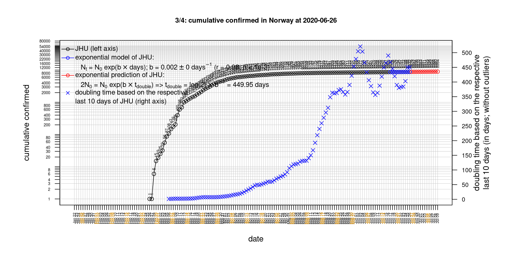
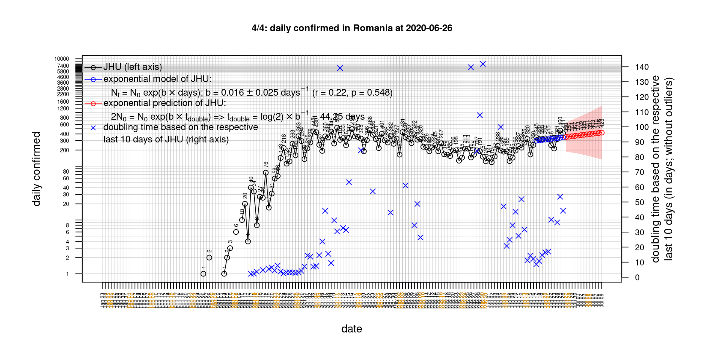
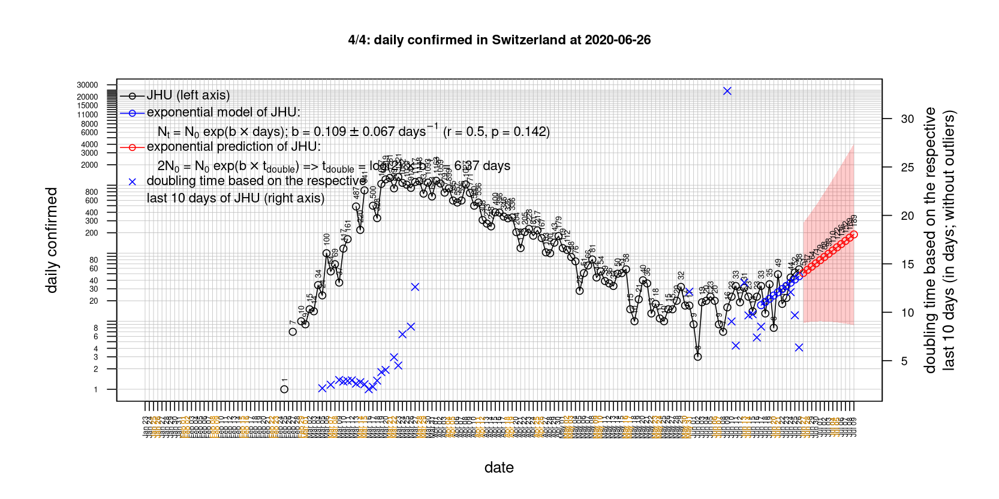

# International Covid-19 death predictions based on CSSEGISandData/COVID-19

  * upstream repo: https://github.com/CSSEGISandData/COVID-19  
  * time of last fetch of upstream repo: **2020-04-23 07:32:50 CET** (timestamp of file `.git/refs/remotes/upstream`)  
  * hash of last fetched commit of upstream repo: `8ad492e92c69bbb4d0ea0f789307107d9bb3e2fb` (`git rev-parse upstream/master`)  
  * last date of `COVID-19/csse_covid_19_data/time_series_covid19_*_global.csv` data: **2020-04-22**

# death rate evolution

# Select country

ordererd by time when cumulative number of deaths doubles (increasing)
country | cumulative number of deaths doubles in | period of estimation | rsq | p | cumulative deaths | cumulative confirmed
--- | --- | --- | --- | --- | --- | ---
[Russia](#Russia) | 4.94 days | 2020-04-13 to 2020-04-22 (10 days) | 1 | < 1e-3 | 513 | 57999
[Canada](#Canada) | 6.55 days | 2020-04-13 to 2020-04-22 (10 days) | 0.98 | < 1e-3 | 2075 | 41648
[Japan](#Japan) | 7.57 days | 2020-04-13 to 2020-04-22 (10 days) | 0.97 | < 1e-3 | 281 | 11512
[Hungary](#Hungary) | 8.56 days | 2020-04-13 to 2020-04-22 (10 days) | 0.99 | < 1e-3 | 225 | 2168
[US](#US) | 9.08 days | 2020-04-13 to 2020-04-22 (10 days) | 0.95 | < 1e-3 | 46583 | 839675
[Sweden](#Sweden) | 9.27 days | 2020-04-13 to 2020-04-22 (10 days) | 0.95 | < 1e-3 | 1937 | 16004
[Turkey](#Turkey) | 10.22 days | 2020-04-13 to 2020-04-22 (10 days) | 0.99 | < 1e-3 | 2376 | 98674
[Poland](#Poland) | 11.66 days | 2020-04-13 to 2020-04-22 (10 days) | 0.98 | < 1e-3 | 426 | 10169
[Germany](#Germany) | 12.55 days | 2020-04-13 to 2020-04-22 (10 days) | 0.96 | < 1e-3 | 5279 | 150648
[Belgium](#Belgium) | 13.14 days | 2020-04-13 to 2020-04-22 (10 days) | 0.97 | < 1e-3 | 6262 | 41889
[United Kingdom](#United-Kingdom) | 13.42 days | 2020-04-13 to 2020-04-22 (10 days) | 0.99 | < 1e-3 | 18151 | 134638
[Romania](#Romania) | 13.81 days | 2020-04-13 to 2020-04-22 (10 days) | 1 | < 1e-3 | 524 | 9710
[China](#China) | 14.6 days | 2020-04-13 to 2020-04-22 (10 days) | 0.73 | 0.002 | 4636 | 83868
[Portugal](#Portugal) | 16.41 days | 2020-04-13 to 2020-04-22 (10 days) | 0.99 | < 1e-3 | 785 | 21982
[Netherlands](#Netherlands) | 17.58 days | 2020-04-13 to 2020-04-22 (10 days) | 0.98 | < 1e-3 | 4068 | 35032
[France](#France) | 18.14 days | 2020-04-13 to 2020-04-22 (10 days) | 0.95 | < 1e-3 | 21373 | 157125
[Norway](#Norway) | 18.78 days | 2020-04-13 to 2020-04-22 (10 days) | 0.97 | < 1e-3 | 187 | 7338
[Austria](#Austria) | 19.48 days | 2020-04-13 to 2020-04-22 (10 days) | 1 | < 1e-3 | 510 | 14925
[Denmark](#Denmark) | 21.48 days | 2020-04-13 to 2020-04-22 (10 days) | 0.99 | < 1e-3 | 384 | 8108
[Switzerland](#Switzerland) | 22.22 days | 2020-04-13 to 2020-04-22 (10 days) | 0.99 | < 1e-3 | 1509 | 28268
[Italy](#Italy) | 31.02 days | 2020-04-13 to 2020-04-22 (10 days) | 0.99 | < 1e-3 | 25085 | 187327
[Spain](#Spain) | 31.08 days | 2020-04-13 to 2020-04-22 (10 days) | 0.98 | < 1e-3 | 21717 | 208389
[Iran](#Iran) | 39.21 days | 2020-04-13 to 2020-04-22 (10 days) | 1 | < 1e-3 | 5391 | 85996
[Australia](#Australia) | 60.36 days | 2020-04-13 to 2020-04-22 (10 days) | 0.83 | < 1e-3 | 67 | 6547
[Nepal](#Nepal) | NA | NA | NA | NA | 0 | 45

# Australia
[top](#Select-country)

 

 

 

 
 

# Austria
[top](#Select-country)

 

 

 

 
 

# Belgium
[top](#Select-country)

 

 

 

 
 

# Canada
[top](#Select-country)

 

 

 

 
 

# China
[top](#Select-country)

 

 

 

 
 

# Denmark
[top](#Select-country)

 

 

 

 
 

# France
[top](#Select-country)

 

 

 

 
 

# Germany
[top](#Select-country)

 

 

 

 
 

# Hungary
[top](#Select-country)

 

 

 

 
 

# Iran
[top](#Select-country)

 

 

 

 
 

# Italy
[top](#Select-country)

national responses:
1. 2020-03-04: https://www.theguardian.com/world/2020/mar/04/italy-orders-closure-of-schools-and-universities-due-to-coronavirus
2. 2020-03-09: https://www.bbc.co.uk/sport/51808683
3. 2020-03-11: https://www.washingtonpost.com/world/europe/merkel-coronavirus-germany/2020/03/11/e276252a-6399-11ea-8a8e-5c5336b32760_story.html

 

 

 

 
 

# Japan
[top](#Select-country)

 

 

 

 
 

# Nepal
[top](#Select-country)

 

 

 

 
 

# Netherlands
[top](#Select-country)

 

 

 

 
 

# Norway
[top](#Select-country)

 

 

 

 
 

# Poland
[top](#Select-country)

 

 

 

 
 

# Portugal
[top](#Select-country)

 

 

 

 
 

# Romania
[top](#Select-country)

 

 

 

 
 

# Russia
[top](#Select-country)

 

 

 

 
 

# Spain
[top](#Select-country)

 

 

 

 
 

# Sweden
[top](#Select-country)

 

 

 

 
 

# Switzerland
[top](#Select-country)

 

 

 

 
 

# Turkey
[top](#Select-country)

 

 

 

 
 

# US
[top](#Select-country)

 

 

 

 
 

# United Kingdom
[top](#Select-country)

 

 

 

 
 

